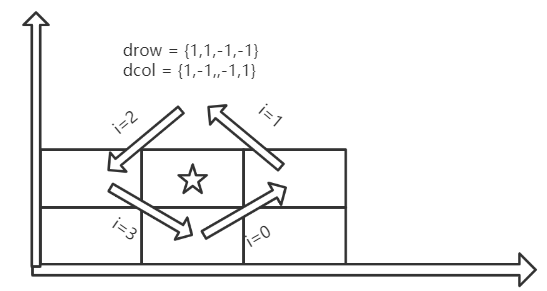

[TOC]
## 一、数组中的最长山脉

我们把数组 A 中符合下列属性的任意连续子数组 B 称为 “山脉”：

1、B.length >= 3

2、存在 0 < i < B.length - 1 ，

使得 B[0] < B[1] < ... B[i-1] < B[i] > B[i+1] > ... > B[B.length - 1]

示例1：

```
输入：[2,1,4,7,3,2,5]
输出：5
解释：最长的 “山脉” 是 [1,4,7,3,2]，长度为 5。
```

示例2：
```
输入：[2,2,2]
输出：0
解释：不含 “山脉”。
```

```java
//核心思想：枚举遍历数组，比较所有山脉的长度
public int longestMountain(int[] A) {
        //如果不满足第一条，直接返回0
        if (A == null || A.length < 3) {
            return 0;
        }
        //定义山脉的起始，最高峰，结束位置
        int start,end,top = 0;
        int max = 0;
        for (int i = 0; i < A.length - 1;) {
            start = i;
            while (i < A.length - 1 && A[i + 1] > A[i]) {
                top = i + 1;
                i++;
            }
            end = i ;
            while (i < A.length - 1 && A[i + 1] < A[i]) {
                end = i + 1;
                i++;
            }
            //如果峰顶∈（start，end）中则这条山脉有效
            if (start < top && top < end) {
                max = Math.max(max , end - start + 1);
            } else {
                //如果 start == end == top 则当前i++
                if (start == end && start == top) {
                    i++;
                }
                start = end = top = i;
            }
        }
        return max;
    }
```

## 二、距离顺序排列矩阵单元格

给出 `R` 行 `C` 列的矩阵，其中的单元格的整数坐标为 `(r, c)`，满足 `0 <= r < R` 且 `0 <= c < C`。另外，在该矩阵中给出了一个坐标为 (r0, c0) 的单元格。

返回矩阵中的所有单元格的坐标，并按到 (r0, c0) 的距离从最小到最大的顺序排，其中，两单元格(r1, c1) 和 (r2, c2) 之间的距离是曼哈顿距离，|r1 - r2| + |c1 - c2|

> 示例：
>
> 输入：R = 2, C = 2, r0 = 0, c0 = 1
> 输出：[[0,1],[0,0],[1,1],[1,0]]
> 解释：从 (r0, c0) 到其他单元格的距离为：[0,1,1,2]
> [[0,1],[1,1],[0,0],[1,0]] 也会被视作正确答案。

思路：通过观察可知==距离相等==的单元格构成斜着的正方形方框，因此按照下顶点->右顶点->上顶点->左顶点的顺序依次遍历正方形边框即可。

遍历核心代码：



```java
    int[] dr = {1, 1, -1, -1};
    int[] dc = {1, -1, -1, 1};

    for (int i = 0; i < 4; i++) {
        while ((i % 2 == 0 && row != r0) || (i % 2 != 0 && col != c0)) {
               row += dr[i];
               col += dc[i];
        }
    }
```


```java
class Solution {
    int[] dr = {1, 1, -1, -1};
    int[] dc = {1, -1, -1, 1};
    public int[][] allCellsDistOrder(int R, int C, int r0, int c0) {
        int maxDist = Math.max(r0, R - 1 - r0) + Math.max(c0, C - 1 - c0);
        int[][] ret = new int[R * C][];
        int row = r0, col = c0;
        int index = 0;
        ret[index++] = new int[]{row, col};
        for (int dist = 1; dist <= maxDist; dist++) {
            row--;
            for (int i = 0; i < 4; i++) {
                //遇到顶点就改变方向
                while ((i % 2 == 0 && row != r0) || (i % 2 != 0 && col != c0)) {
                    if (row >= 0 && row < R && col >= 0 && col < C) {
                        ret[index++] = new int[]{row, col};
                    }
                    row += dr[i];
                    col += dc[i];
                }
            }
        }
        return ret;
    }
}
```

## 三、拼接最大数

> 给定长度分别为 ==m== 和 ==n== 的两个数组，其元素由 0-9 构成，表示两个自然数各位上的数字。现在从这两个数组中选出 k (k <= m + n) 个数字拼接成一个新的数，要求从同一个数组中取出的数字保持其在原数组中的**相对顺序**。
>
> 求满足该条件的最大数。结果返回一个表示该最大数的长度为 ==k== 的数组。
>

解题思路：

> 1、从nums1中选出长度为x个序列（0≤ x ≤ m），从nums2中选出长度为y的序列（0 ≤ y ≤ n）并且x+y = k
>
> ①以nums1为标准，找出遍历的起始和终点：
>
> 假设nums1 = {1，2，3，4}，nums2 = {1,2,3}
>
> ​	start = Math.max(0，k-n) 表示nums1中**最少需要**长度为2的子序列
>
> ​	end = Math.min(k,n) 表示nums1中**最多需要**长度为4的子序列
>
> ②使用单调栈，找出数组中==序列长度为x==所能拼接的最大子序列
>
> 2、将x序列子数组与y序列子数按照==归并==的思想合并成一个数组
>
> 3、==比较==得出最大子序列
>
> 重复步骤1，2==遍历==数组中存在的所有==可行序列==

```java
		int start = Math.max(0, k - n), end = Math.min(k, m); 		//①
        for (int i = start; i <= end; i++) {
            int[] subsequence1 = maxSubsequence(nums1, i);			//找出数组1长度为i的最大子序列
            int[] subsequence2 = maxSubsequence(nums2, k - i);		//找出数组2长度为k-i的最大子序列
            int[] curMaxSubsequence = merge(subsequence1, subsequence2);//合并
            if (compare(curMaxSubsequence, 0, maxSubsequence, 0) > 0) {//当前子序列与最大子序列比较
                System.arraycopy(curMaxSubsequence, 0, maxSubsequence, 0, k);
            }
        }
```


使用单调栈找出最大子串
```java
   public int[] maxSubsequence(int[] nums, int k) {
        int length = nums.length;
        int[] stack = new int[k];
        int top = -1;
        int remain = length - k;
        for (int i = 0; i < length; i++) {
            int num = nums[i];
            while (top >= 0 && stack[top] < num && remain > 0) {
                top--;
                remain--;
            }
            if (top < k - 1) {
                stack[++top] = num;
            } else {
                remain--;
            }
        }
        return stack;
    }
```


```java
    public int[] merge(int[] subsequence1, int[] subsequence2) {
        int x = subsequence1.length, y = subsequence2.length;
        if (x == 0) {
            return subsequence2;
        }
        if (y == 0) {
            return subsequence1;
        }
        int mergeLength = x + y;
        int[] merged = new int[mergeLength];
        int index1 = 0, index2 = 0;
        for (int i = 0; i < mergeLength; i++) {
            if (compare(subsequence1, index1, subsequence2, index2) > 0) {
                merged[i] = subsequence1[index1++];
            } else {
                merged[i] = subsequence2[index2++];
            }
        }
        return merged;
    }
```


```java
    public int compare(int[] subsequence1, int index1, int[] subsequence2, int index2) {
        int x = subsequence1.length, y = subsequence2.length;
        while (index1 < x && index2 < y) {
            int difference = subsequence1[index1] - subsequence2[index2];
            if (difference != 0) {
                return difference;
            }
            index1++;
            index2++;
        }
        return (x - index1) - (y - index2);
    }
```

### 665、非递减数列

给你一个长度为 n 的整数数组，请你判断在 最多 改变 1 个元素的情况下，该数组能否变成一个非递减数列。

我们是这样定义一个非递减数列的： 对于数组中任意的 i (0 <= i <= n-2)，总满足 nums[i] <= nums[i + 1]。

示例 1:

> 输入: nums = [4,2,3]
> 输出: true
> 解释: 你可以通过把第一个4变成1来使得它成为一个非递减数列。

示例 2:

> 输入: nums = [4,2,1]
> 输出: false
> 解释: 你不能在只改变一个元素的情况下将其变为非递减数列。

思考：

* 1、什么情况下需要修改
* 2、如何修改

假设：x= nums[i] , y = nums[i+1];

如果 x > y 有两种改变方法：

* 将x变成y => x = y，
* 将y变成x=> y = x

如果i > 0 且 nums[i+1] < nums[i-1]，如[3,5,1]，这只能将y 变成 x => [3,5,5]

这里遇到修改情况只统计修改次数，只有遇到第二种改变情况的时候，才对数组进行修改

```java
class Solution {
    public boolean checkPossibility(int[] nums) {
        int n = nums.length, cnt = 0;
        for (int i = 0; i < n - 1; ++i) {
            int x = nums[i], y = nums[i + 1];
            if (x > y) {
                cnt++;
                if (cnt > 1) {
                    return false;
                }
                if (i > 0 && y < nums[i - 1]) {
                    nums[i + 1] = x;
                }
            }
        }
        return true;
    }
}
```

