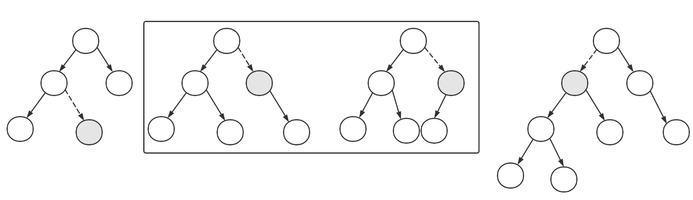

一、AVL树：

AVL树中任何节点的两个子树的高度**最大差**别为1

假定==当前节点平衡因子 = 左子树深度 - 右子树深度==

(一)、插入：

有四种形态：注：灰色节点都是null，L左节点，R右节点，P父节点


1、LL型：cur的balance = 2，且L的balance = 0，因此这里进行**右旋**


2、LR型：cur的balance = 2，且L的balance = -1，因此这里先进行**左旋**变成**LL**型，再进行右旋


3、RR型:cur的balance = -2，且L的balance = 0，因此这里先进行**左旋**


4、RL型:cur的balance = -2，且L的balance = 1，因此这里先进行**右旋**变成**LL**型，再进行左旋


右旋操作：

前提：

1、在插入元素之前整个树是平衡的

2、插入元素后不平衡，假设h(L) = H+ 2，h(R) = H，因此cur的balance = 2


这里有三种情况 

1、h(LL) = H+1, h(LR) = H 这里对应LL型

2、h(LL) = H，h(LR) = H+1 这里对应LR型

3、h(LL) = H+1 h(LR) = H+1，这种情况不可能存在

> 证明：要出现情况3，插入元素前必须是情况1或者是情况2，而之前的树状态必定是平衡的，不可能在情况1或者情况2，存在冲突，因此不存在情况3


右旋涉及4个节点：cur，p，L，LR

经过右旋后各种情况对应结果：

1、H(LL) = H+1,H(cur) = H+1，此时树平衡

2、H(LL) = H ,H(cur) = H+2，此时树不平衡，因此在右旋前**需要**先左旋一次

代码如下：

结点数据结构

```java
class Node<E extends Comparable<E>>{
    E data;
    Node<E> left;
    Node<E> right;
    Node<E> parent;
    int depth;
    int balance;
    public void refresh(){
        int l = left == null?0:left.depth;
        int r = right == null?0:right.depth;
        depth = Math.max(l,r)+1;
        balance = l - r;
    }
    public Node<E> getRoot(){
        Node x, y = this;
        while (y != null){
            x = y;
            y = y.parent;
        }
        return x;
    }
}
```

insert()方法：

```java
    private void insert(E data){
        Node<E> x = root,y = root;
        while (x != null){
            y = x;
            if (data.compareTo(x.data) > 0)
                x = x.right;
            else
                x = x.left;
        }
        if (data.compareTo(y.data) > 0){
            y.right = new Node<>(data);
            y.right.parent = y;
        } else {
            y.left = new Node<>(data);
            y.left.parent = y;
        }
        reBalance(y,null);
        root = y.getRoot();
    }
```

reBalance():

```java
    private void reBalance(Node<E> n,Node<E> target){
        while (n != null && n != target){
            n.refresh(); //当前结点经过插入，或者旋转操作，因此这里需要更新结点的平衡因子和深度
            Node<E> p = n.parent; //无论如何旋转，父结点不会改变
            if (n.balance > 1){
                if (n.left.balance == -1)
                    rotateLeft(n.left);

                rotateRight(n);
            } else if (n.balance < -1){
                if (n.right.balance == 1)
                    rotateRight(n.right);

                rotateLeft(n);
            }
            n = p;
        }
    }
```

右旋操作：

```java
public void rotateRight(Node<E> cur){
    Node<E> left = cur.left;
    Node<E> p = cur.parent;
    Node<E> LR = left.right;
    
    left.parent = p;
    if (p != null){
        if (p.right == cur){
            p.right = left;
        } else {
            p.left = left;
        }
    }
    left.right = cur;
    cur.parent = left;
    cur.left = LR;
    if (LR != null){
        LR.parent = cur;
    }
    //更新旋转后变动的结点平衡因子
    cur.refresh();
    left.refresh();
}
```

左旋操作与右旋操作对称

(二)、删除：

假定：删除前树是==平衡==的。

有三种情况：



1、删除的结点是叶子节点：直接将指向该节点的指针置为null，然后向上节点逐个进行reBalance操作

2、删除节点只包含左孩子或者右孩子：直接将孩子的值赋给当前节点的值，然后转化成情况1，将孩子节点删除

3、删除节点既包含左子树也包含右子树。

* 找到要删除节点的前驱（后继也可以）。
* 将前驱的值赋值到当前节点
* 如果前驱是叶子节点，此时转化成情况1，直接删除前驱节点
* 如果前驱是非叶子节点，这里只可能包含一个孩子，因此先转换成情况2，再转换成情况1

> 前驱要么是叶子节点，要么只有一个孩子：
>
> 假设：前驱有两个孩子，则前驱的右孩子一定 大于等于 前驱，则前驱和当前节点中间还有节点，不符合前驱节点定义。

删除：

```java
    public void remove(E date) {
        Node<E> x, y = root;
        while (y != null) {
            if (date.compareTo(y.data) > 0)
                y = y.right;
            else if (date.compareTo(y.data) < 0)
                y = y.left;
            else
                break;
        }
        if (y == null)
            return;

        Node<E> p = y.parent;
        if (y.left == null && y.right == null) {
            if ((x = y.parent) == null)
                root = null;
            else if (x.right == y)
                x.right = null;
            else if (x.left == y)
                x.left = null;

            y = x;
        } else if (y.left == null || y.right == null)
            dealOneChild(y);
        else
            dealTwoChild(y);
        if (p != null){
            reBalance(y, null);
            root = p.getRoot();
        }
    }
```

dealLeafNode()

```java
public void dealLeafNode(Node<E> cur){
    Node<E> p = cur.parent;
    if (p.right == cur){
        p.right = null;
    } else{
        p.left = null;
    }
}
```

dealHasOneChild()

```java
public void dealHasOneChild(Node<E> cur){
    Node<E> l = cur.left;
    Node<E> r = cur.right;
    if (l != null){
        cur.data = l.data;
        cur.left = null;
    } else {
        cur.data = r.data;
        cur.right = null;
    }
}
```

dealHasTwoChild()

```java
    private void dealTwoChild(Node<E> cur){
        Node<E> prev = cur.left;
        while (prev.right != null)
            prev = prev.right;

        if (prev == cur.left){
            cur.data = prev.data;
            if (prev.left != null){
                dealOneChild(prev);
                prev.refresh();
            } else {
                cur.left = null;
            }
            cur.refresh();
        } else {
            Node<E> l = prev.left,p = prev.parent;
            cur.data = prev.data;
            p.right = l;
            if (l != null)
                l.parent = p;

            reBalance(l,cur);
        }
    }
```

