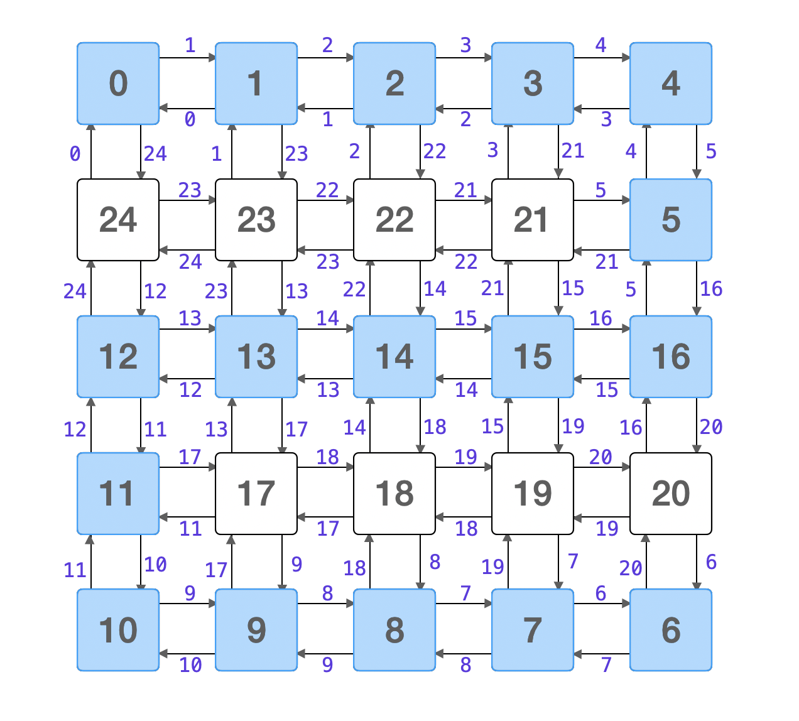

[TOC]


### 一、Dijkstra算法（单源最短路径）

- 一个连通图，若干节点，路径`一定有`权值，并且路径**不能为负**。否则Dijkstra就不适用。

松弛函数：

> 对边集合E中任意边，以w(u,v)表示顶点u出发到顶点v的边权，d[v]表示起点s到当前顶点v的路径权值之和
>
> 若存在w(u,v),使得 d[v] > d[u] + w(u,v)
>
> 则更新d[v] = d[u] + w(u,v)

算法步骤：

> (1) 初始时，S只包含起点s；U包含除s外的其他顶点，且U中顶点的距离为"起点s到该顶点的距离"[例如，U中顶点v的距离为(s,v)的长度，然后s和v不相邻，则v的距离为∞]。
>
> (2) **找最小边**：从U中选出"距离最短的顶点k"，并将顶点k加入到S中；同时，从U中移除顶点k。这里可以用**最小堆**优化
>
> (3) **松弛**：更新U中各个顶点到起点s的距离。之所以更新U中顶点的距离，是由于上一步中确定了k是求出最短路径的顶点，从而可以利用k来更新其它顶点的距离；例如，(s,v)的距离可能大于(s,k)+(k,v)的距离。
>
> (4) 重复步骤(2)和(3)，直到遍历完所有顶点。

为什么不能有负权：

> 假设：s->x...->xi-> v，是最短路径，如果存在负权，则通过环路再经过该负权边则路径权和会再次减小，与假设矛盾

#### 778. 水位上升的泳池中游泳

在一个 N x N 的坐标方格 grid 中，每一个方格的值 grid[i][j] 表示在位置 (i,j) 的平台高度。

现在开始下雨了。当时间为 t 时，此时雨水导致水池中任意位置的水位为 t 。你可以从一个平台游向四周相邻的任意一个平台，但是前提是此时水位必须同时淹没这两个平台。假定你可以瞬间移动无限距离，也就是默认在方格内部游动是不耗时的。当然，在你游泳的时候你必须待在坐标方格里面。

你从坐标方格的左上平台 (0，0) 出发。最少耗时多久你才能到达坐标方格的右下平台 (N-1, N-1)？

示例：

> 输入: [[0,1,2,3,4],[24,23,22,21,5],[12,13,14,15,16],[11,17,18,19,20],[10,9,8,7,6]]
> 输出: 16
> 解释:
>  **0**  **1**  **2**  **3**  **4**
> 24 23 22 21  **5**
> **12** **13** **14** **15** **16**
> **11** 17 18 19 20
> **10**  **9**  **8**  **7**  **6**
>
> 最终的路线用加粗进行了标记。
> 我们必须等到时间为 16，此时才能保证平台 (0, 0) 和 (4, 4) 是连通的

思考：

根据题意：

* 找出一条路径，这条路径上的**最大value**值为所有路径的value值中**最小**的那一个。
* 从一个格子（A）到另一个格子（B），需要花费的天数（假设Avalue < Bvalue）等于Bvalue-Avalue
* 这张格子上的value值**非负**
* 综上，可以将问题转化为，找出所有路径中权值和最小的。因此可以使用==dijkstra==算法

将例题转化成一张有向非负权图

> 

代码：

```java

class Solution {
    private int[][] directions = {{0,1},{0,-1},{1,0},{-1,0}};
    private int column;
    public int swimInWater(int[][] grid) {
        int row = grid.length;
        int column = grid[0].length;
        this.column = column;

        int[] dis = new int[row*column];
        boolean[] vis = new boolean[row * column];
        Arrays.fill(dis,Integer.MAX_VALUE);
        dis[0] = grid[0][0];

        PriorityQueue<Point> queue = new PriorityQueue<>(Comparator.comparingInt(e -> e.value));
        queue.offer(new Point(0,0,grid[0][0]));

        while (!queue.isEmpty()) {
            Point e = queue.poll();
            int index = getIndex(e.x,e.y);
            if (vis[index]) {
                continue;
            }
            if (e.x == row - 1 && e.y == column -1) {
                return dis[column * row - 1];
            }

            vis[index] = true;
            //这里进行广度遍历，将到起点最小距离的点弹出，遍历其相邻的点，如果可以松弛则将点加入到优先队列中
            for (int[] d: directions) {
                int newX = e.x + d[0],newY = e.y+d[1];
                //如果d[v] > d[u] + w(u,v)，就进行松弛
                if (newX >= 0 && newX < row && newY >= 0 && newY < column
                    && dis[getIndex(e.x,e.y)] + Math.max(grid[newX][newY] - dis[getIndex(e.x,e.y)],0) < dis[getIndex(newX,newY)]){
                    dis[getIndex(newX,newY)] = dis[getIndex(e.x,e.y)] + Math.max(grid[newX][newY] - dis[getIndex(e.x,e.y)],0);
                    queue.offer(new Point(newX,newY,dis[getIndex(newX,newY)]));
                }
            }
        }

        return dis[column*row-1];
    }

    public int getIndex(int i,int j){
        return i*column + j;
    }

    private class Point{
        int x;
        int y;
        //这里的value值表示：当前点到起点的最短路径
        int value;

        public Point(int x,int y,int value) {
            this.x = x;
            this.y = y;
            this.value =value;
        }
    }
}
```

### 二、并查集

并查集：一种树型的数据结构，用于处理一些不相交[集合](https://baike.baidu.com/item/集合/2908117)（disjoint sets）的合并及查询问题

- **合并**（Union）：把两个不相交的集合合并为一个集合。
- **查询**（Find）：查询两个元素是否在同一个集合中。

并查集模板：

```java
    public class Union {
        int[] parent;
        /*可以按秩合并，秩在这里有两层含义，根据具体需求具体使用*/
        /*1、可以表示以当前结点为根节点的子树高度*/
        /*2、可以表示以当前结点为根节点的子树节点个数*/
        int[] rank;
        public Union(int count) {
            this.parent = new int[count];
            this.size = new int[count];
            for (int i = 0; i < count; i++) {
                parent[i] = i;
                size[i] = 1;
            }
        }
		/*将两个极大连通子图合并*/
        /*这里可以根据秩的含义进行对应的操作*/
        public void union(int x,int y) {
            int rootX = find(x);
            int rootY = find(y);
            if (rootX == rootY) {
                return;
            }
            parent[rootX] = rootY;
        }
		/*搜寻该元素极大连通子图的根元素*/
        public int find(int x) {
            if (x != parent[x]) {
                parent[x] = find(parent[x]);
            }
            return parent[x];
        }
    }
```

#### 1202、交换字符串中的元素

给你一个字符串 s，以及该字符串中的一些「索引对」数组 pairs，其中 pairs[i] = [a, b] 表示字符串中的两个索引（编号从 0 开始）。

你可以**任意多次交换**在 pairs 中任意一对索引处的字符。返回在经过若干次交换后，s 可以变成的按字典序最小的字符串。

示例 1:

> 输入：s = "dcab", pairs = [[0,3],[1,2]]
> 输出："bacd"
> 解释： 
> 交换 s[0] 和 s[3], s = "bcad"
> 交换 s[1] 和 s[2], s = "bacd"

1、每个**索引对**可以在两个顶点间建立**一条边**

2、任意多次交换在 pairs 中任意一对索引处的字符 => 同**属一个**极大连通子图的顶点中的字母可以**相互交换**

3、使得极大连通子图内的字母字典序最小

由分析可知，这是一个**元素分组**问题，因此可以使用并查集：

步骤：

1、定义并查集的含义，由于**只做**搜索和合并，秩的含义表示当前节点的树高度，在建树的时候降低树的高度，减少搜索次数

```java
    private class UnionFind {
        private int[] parent;
        /**以 i 为根结点的子树的高度 */
        private int[] rank;

        public UnionFind(int n) {
            this.parent = new int[n];
            this.rank = new int[n];
            for (int i = 0; i < n; i++) {
                this.parent[i] = i;//初始父节点为自身
                this.rank[i] = 1;//树高度为1
            }
        }
        public void union(int x, int y) {
            int rootX = find(x); // 搜索包含x的极大连通子图的根节点
            int rootY = find(y); // 搜索包含y的极大连通子图的根节点
            if (rootX == rootY) {
                return;
            }
            // 如果两棵树高度一致，则任一棵树为父节点，将另一棵树接上，同时最终根节点的秩+1
            // 如果两棵树高度不一致，则将高度较小的树合并到高度较大的树，容易得知，总树的秩不变
            if (rank[rootX] == rank[rootY]) {
                parent[rootX] = rootY;
                rank[rootY]++;
            } else if (rank[rootX] < rank[rootY]) {
                parent[rootX] = rootY;
            } else {
                parent[rootY] = rootX;
            }
        }

        public int find(int x) {
            if (x != parent[x]) {
                parent[x] = find(parent[x]);
            }
            return parent[x];
        }
    }
```

2、 构建极大连通子图，将**任意**可以**交换的结点**对输入并查集

```java
        int len = s.length();
        UnionFind unionFind = new UnionFind(len);
        for (List<Integer> pair : pairs) {
            int index1 = pair.get(0);
            int index2 = pair.get(1);
            unionFind.union(index1, index2);
        }
```

3、将极大连通子图的**根节点**与树内的**字母**构建映射关系

```java
        char[] charArray = s.toCharArray();
        // key：连通分量的代表元，value：同一个连通分量的字符集合（保存在一个优先队列中）
        Map<Integer, PriorityQueue<Character>> hashMap = new HashMap<>(len);
        for (int i = 0; i < len; i++) {
            int root = unionFind.find(i);
            hashMap.computeIfAbsent(root, key -> new PriorityQueue<>()).offer(charArray[i]);
        }
```

4、重组字符串

```java
        StringBuilder stringBuilder = new StringBuilder();
        for (int i = 0; i < len; i++) {
            int root = unionFind.find(i);
            stringBuilder.append(hashMap.get(root).poll());
        }
        return stringBuilder.toString();
```

全部代码：

```java
    public String smallestStringWithSwaps(String s, List<List<Integer>> pairs) {
        if (pairs.size() == 0) {
            return s;
        }

        // 第 1 步：将任意交换的结点对输入并查集
        int len = s.length();
        UnionFind unionFind = new UnionFind(len);
        for (List<Integer> pair : pairs) {
            int index1 = pair.get(0);
            int index2 = pair.get(1);
            unionFind.union(index1, index2);
        }

        // 第 2 步：构建映射关系
        char[] charArray = s.toCharArray();
        // key：连通分量的代表元，value：同一个连通分量的字符集合（保存在一个优先队列中）
        Map<Integer, PriorityQueue<Character>> hashMap = new HashMap<>(len);
        for (int i = 0; i < len; i++) {
            int root = unionFind.find(i);
            // 上面六行代码等价于下面一行代码，JDK 1.8 以及以后支持下面的写法
            hashMap.computeIfAbsent(root, key -> new PriorityQueue<>()).offer(charArray[i]);
        }

        // 第 3 步：重组字符串
        StringBuilder stringBuilder = new StringBuilder();
        for (int i = 0; i < len; i++) {
            int root = unionFind.find(i);
            stringBuilder.append(hashMap.get(root).poll());
        }
        return stringBuilder.toString();
    }
    private class UnionFind {
        private int[] parent;
        /**
         * 以 i 为根结点的子树的高度（引入了路径压缩以后该定义并不准确）
         */
        private int[] rank;

        public UnionFind(int n) {
            this.parent = new int[n];
            this.rank = new int[n];
            for (int i = 0; i < n; i++) {
                this.parent[i] = i;
                this.rank[i] = 1;
            }
        }

        public void union(int x, int y) {
            int rootX = find(x);
            int rootY = find(y);
            if (rootX == rootY) {
                return;
            }

            if (rank[rootX] == rank[rootY]) {
                parent[rootX] = rootY;
                // 此时以 rootY 为根结点的树的高度仅加了 1
                rank[rootY]++;
            } else if (rank[rootX] < rank[rootY]) {
                parent[rootX] = rootY;
                // 此时以 rootY 为根结点的树的高度不变
            } else {
                // 同理，此时以 rootX 为根结点的树的高度不变
                parent[rootY] = rootX;
            }
        }

        public int find(int x) {
            if (x != parent[x]) {
                parent[x] = find(parent[x]);
            }
            return parent[x];
        }
    }
```

#### 803 打砖块

有一个 m x n 的二元网格，其中 1 表示砖块，0 表示空白。砖块 稳定（不会掉落）的前提是：

* 一块砖直接连接到网格的顶部，或者
* 至少有一块相邻（4 个方向之一）砖块 稳定 不会掉落时

给你一个数组 hits ，这是需要依次消除砖块的位置。每当消除 hits[i] = (rowi, coli) 位置上的砖块时，对应位置的砖块（若存在）会消失，然后其他的砖块可能因为这一消除操作而掉落。一旦砖块掉落，它会==立即从网格中消失==（即，它不会落在其他稳定的砖块上）。

返回一个数组 result ，其中 result[i] 表示第 i 次消除操作对应掉落的砖块数目。

**注意**：消除可能指向是没有砖块的空白位置，如果发生这种情况，则没有砖块掉落。

==如何想到并查集==
1、当前问题是一个图的连通性问题，砖块和砖块如果在 **4** 个方向上**相邻**，表示这两个砖块上有一条边。砖块的相邻关系而产生的**连接关系**具有==传递性==；
2、第 00 行的砖块连接着「屋顶」；这里可以构建虚拟节点，使得所有顶点的节点指向虚拟节点==屋顶==
3、击碎了一个砖块以后，可能会使得其它与「被击碎砖块」 连接 的砖块不再与顶部相连，然后它们消失；
4、题目只问结果，没有问具体连接的情况；==连通的砖块个数==是我们所关心的，「并查集」内部可以维护「以当前结点为根结点的子树的**结点总数**」。

==如何使用并查集==

* 消除一个砖块的效果是：一个连通分量被**分成**了两个连通分量；

* 并查集的作用是：把两个连通分量合并成一个连通分量。

这是两个相反的操作，因此可以逆过来，从最后一个敲击的砖块开始，重建整张图，回到初始状态。

1、每次恢复一个砖块，将两个连通分量合并，

* 包含==屋顶==的连通分量的节点个数，要么变多，此时增多的节点个数： curNum - originNum - 1

* 要么不变，此时增多的节点个数： 0

2、根据分析，可以写出并查集数据结构模板：

```java
    public class Union {
        int[] parent;
        /*表示以当前节点为根节点的子树的结点总数*/
        int[] size;

        public Union(int count) {
            this.parent = new int[count];
            this.size = new int[count];
            for (int i = 0; i < count; i++) {
                parent[i] = i;
                size[i] = 1;
            }
        }

        /*1、这里并不关心子树的高度，因此随意设置其中一棵树为根节点*/
        /*2、更新合并后子树的节点总数*/
        public void union(int x,int y) {
            int rootX = find(x);
            int rootY = find(y);
            if (rootX == rootY) {
                return;
            }
            parent[rootX] = rootY;
            size[rootY] += size[rootX];
        }

        public int find(int x) {
            if (x != parent[x]) {
                parent[x] = find(parent[x]);
            }
            return parent[x];
        }

        public int getSize(int x) {
            int root = find(x);
            return size[root];
        }
    }
```

3、建图

* 将原先的二维数组中要hit的砖块置为0
* 建立连通分量

```java
        // 将原先的二维数组中要hit的砖块置为0
		int[][] copy = new int[row][col];
        for (int i = 0; i < grid.length; i++) {
            System.arraycopy(grid[i], 0, copy[i], 0, grid[0].length);
        }

        for (int[] hit : hits) {
            copy[hit[0]][hit[1]] = 0;
        }
		// 建立连通分量
		// 首先建立第0行与屋顶的关系
		// 其次建立剩余连通分量，getIndex是将二维数组坐标转一维数组坐标
        int size = row * col;
        Union union = new Union(size + 1);
        for (int j = 0; j < col; j++) {
            if (copy[0][j] == 1) {
                union.union(j,size);
            }
        }

        for (int i = 1; i < grid.length; i++) {
            for (int j = 0; j < grid[0].length; j++) {
                if (copy[i][j] == 1) {
                    if (copy[i - 1][j] == 1) {
                        union.union(getIndex(i - 1,j,col),getIndex(i,j,col));
                    }

                    if (j - 1 >= 0 && copy[i][j - 1] == 1) {
                        union.union(getIndex(i,j-1,col),getIndex(i,j,col));
                    }
                }
            }
        }
```

4、按照 hits 的逆序，在 copy 中补回砖块，把每一次因为补回砖块而与屋顶相连的砖块的增量记录到 res 数组中

* 如果==原二维数组==中，击毁的砖块处无砖块则直接跳过，不做修改。
* 获得当前屋顶所在连通图的结点总数：originNum
* 如果击毁的是第0层的砖块，则先将砖块与==屋顶==相连
* 依次遍历被击毁砖块周围，建立连通关系。小技巧：这里可以建立方向数组，方便编程
* 获得当前屋顶所在连通图的结点总数：curNum，
* 如果curNum == originNum，则说明击毁砖块并没有掉落砖块，res = 0
* 如果curNum != originNumres = curNum - originNum - 1

```java
        int length = hits.length;
        int[] res = new int[length];
        for (int i = length - 1; i > -1; i--) {
            int x = hits[i][0];
            int y = hits[i][1];
            if (grid[x][y] == 0) {
                continue;
            }

            int originNum = union.getSize(size);
            if (x == 0) {
                union.union(y,size);
            }
            for (int[] direction : DIRECTIONS) {
                int newX = x + direction[0];
                int newY = y + direction[1];
                if (isBoundOfArrays(newX,newY,row,col) && (copy[newX][newY] == 1)) {
                    union.union(getIndex(x,y,col),getIndex(newX,newY,col));
                }
            }

            int currentNum = union.getSize(size);

            res[i] = Math.max(0,currentNum - originNum - 1);
            copy[x][y] = 1;
        }
```

这里有一点要==注意==：hits数组里要击毁的位置不是重复的，如果重复这样会有问题，假如i，j次击落重复，且 i < j

* 顺序来看，res[i] 可能会有砖块掉落，res[j]一定不会有砖块掉落，而逆序重建的时候，res[j]可能会有值，res[i]一定没值，因此这里还需要判定重复击落的时候开始和结束位置。
* 不能拼接出初始化的时候整个二维表格；

全部代码：

```java
    private static final int[][] DIRECTIONS = {{0,1},{0,-1},{1,0},{-1,0}};
    public int[] hitBricks(int[][] grid, int[][] hits) {
        int row = grid.length;
        int col = grid[0].length;
        // 1、处理图关系
        int[][] copy = new int[row][col];
        for (int i = 0; i < grid.length; i++) {
            System.arraycopy(grid[i], 0, copy[i], 0, grid[0].length);
        }

        for (int[] hit : hits) {
            copy[hit[0]][hit[1]] = 0;
        }
        //2、建图
        int size = row * col;
        Union union = new Union(size + 1);
        for (int j = 0; j < col; j++) {
            if (copy[0][j] == 1) {
                union.union(j,size);
            }
        }

        for (int i = 1; i < grid.length; i++) {
            for (int j = 0; j < grid[0].length; j++) {
                if (copy[i][j] == 1) {
                    if (copy[i - 1][j] == 1) {
                        union.union(getIndex(i - 1,j,col),getIndex(i,j,col));
                    }

                    if (j - 1 >= 0 && copy[i][j - 1] == 1) {
                        union.union(getIndex(i,j-1,col),getIndex(i,j,col));
                    }
                }
            }
        }

        int length = hits.length;
        int[] res = new int[length];
        for (int i = length - 1; i > -1; i--) {
            int x = hits[i][0];
            int y = hits[i][1];
            if (grid[x][y] == 0) {
                continue;
            }

            int originNum = union.getSize(size);
            if (x == 0) {
                union.union(y,size);
            }
            for (int[] direction : DIRECTIONS) {
                int newX = x + direction[0];
                int newY = y + direction[1];
                if (isBoundOfArrays(newX,newY,row,col) && (copy[newX][newY] == 1)) {
                    union.union(getIndex(x,y,col),getIndex(newX,newY,col));
                }
            }

            int currentNum = union.getSize(size);

            res[i] = Math.max(0,currentNum - originNum - 1);
            copy[x][y] = 1;
        }
        return res;
    }

    private int getIndex(int x,int y,int col) {
        return x * col + y;
    }

    private boolean isBoundOfArrays(int x,int y,int row,int col) {
        return (x >= 0 && x < row) && (y >= 0 && y < col);
    }

    public class Union {
        int[] parent;
        int[] size;

        public Union(int count) {
            this.parent = new int[count];
            this.size = new int[count];
            for (int i = 0; i < count; i++) {
                parent[i] = i;
                size[i] = 1;
            }
        }

        public void union(int x,int y) {
            int rootX = find(x);
            int rootY = find(y);
            if (rootX == rootY) {
                return;
            }
            parent[rootX] = rootY;

            size[rootY] += size[rootX];
        }

        public int find(int x) {
            if (x != parent[x]) {
                parent[x] = find(parent[x]);
            }
            return parent[x];
        }

        public int getSize(int x) {
            int root = find(x);
            return size[root];
        }
    }
```

### 三、Kruskal 算法(根据带权的图生成最小生成树)

Kruskal 算法是一种常见并且好写的最小生成树算法，由 \text{Kruskal}Kruskal 发明。该算法的基本思想是**从小到大**加入边，是一个贪心算法。

算法流程：

* 将图 G=\{V,E\}G={V,E} 中的所有边按照长度由小到大进行排序，等长的边可以按任意顺序。

* 初始化图 G' 为{V,∅}，从前向后扫描排序后的边，如果扫描到的边 e 在 G' 中连接了两个相异的连通块,则将它插入 G' 中。

* 最后得到的图 G'就是图G的最小生成树。

#### 1584、连接所有点的最小路径

给你一个points 数组，表示 2D 平面上的一些点，其中 points[i] = [xi, yi] 。

连接点 [xi, yi] 和点 [xj, yj] 的费用为它们之间的 曼哈顿距离 ：|xi - xj| + |yi - yj| ，其中 |val| 表示 val 的绝对值。

请你返回将所有点连接的最小总费用。只有任意两点之间**有且仅有**一条**简单路径**时，才认为所有点都已连接。

> 输入：points = [[0,0],[2,2],[3,10],[5,2],[7,0]]
> 输出：20

解题思路：

1、两点之间有且仅有一条简单路径的结构是树

2、两点之间权值最小 => 最小生成树

3、根据Kruskal 算法步骤，可知需要不断的将图中的点合并，因此可以使用并查集

```java
class Solution {
    public int minCostConnectPoints(int[][] points) {
        int n = points.length;
        DisjointSetUnion dsu = new DisjointSetUnion(n);
        List<Edge> edges = new ArrayList<Edge>();
        for (int i = 0; i < n; i++) {
            for (int j = i + 1; j < n; j++) {
                edges.add(new Edge(dist(points, i, j), i, j));
            }
        }
        Collections.sort(edges, new Comparator<Edge>() {
            public int compare(Edge edge1, Edge edge2) {
                return edge1.len - edge2.len;
            }
        });
        int ret = 0, num = 1;
        for (Edge edge : edges) {
            int len = edge.len, x = edge.x, y = edge.y;
            if (dsu.unionSet(x, y)) {
                ret += len;
                num++;
                if (num == n) {
                    break;
                }
            }
        }
        return ret;
    }

    public int dist(int[][] points, int x, int y) {
        return Math.abs(points[x][0] - points[y][0]) + Math.abs(points[x][1] - points[y][1]);
    }
}

class DisjointSetUnion {
    int[] f;
    int[] rank;
    int n;

    public DisjointSetUnion(int n) {
        this.n = n;
        this.rank = new int[n];
        Arrays.fill(this.rank, 1);
        this.f = new int[n];
        for (int i = 0; i < n; i++) {
            this.f[i] = i;
        }
    }

    public int find(int x) {
        return f[x] == x ? x : (f[x] = find(f[x]));
    }

    public boolean unionSet(int x, int y) {
        int fx = find(x), fy = find(y);
        if (fx == fy) {
            return false;
        }
        if (rank[fx] < rank[fy]) {
            int temp = fx;
            fx = fy;
            fy = temp;
        }
        rank[fx] += rank[fy];
        f[fy] = fx;
        return true;
    }
}

class Edge {
    int len, x, y;

    public Edge(int len, int x, int y) {
        this.len = len;
        this.x = x;
        this.y = y;
    }
}
```

