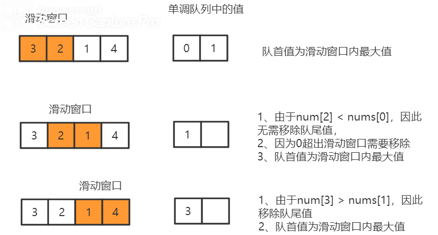

[TOC]

# 数据结构

### 一、设计一个可以随机获取元素的集合（RandomizedCollection）

> 设计一个支持在平均 时间复杂度 O(1) 下， 执行以下操作的数据结构。
>
> 注意: 允许出现重复元素。
>
> insert(val)：向集合中插入元素 val。
> remove(val)：当 val 存在时，从集合中移除一个 val。
> getRandom()：从现有集合中随机获取一个元素。每个元素被返回的概率应该与其在集合中的数量呈线性相关。

> 示例：

```
// 初始化一个空的集合。
RandomizedCollection collection = new RandomizedCollection();
// 向集合中插入 1 。返回 true 表示集合不包含 1 。
collection.insert(1);
// 向集合中插入另一个 1 。返回 false 表示集合包含 1 。集合现在包含 [1,1] 。
collection.insert(1);
// 向集合中插入 2 ，返回 true 。集合现在包含 [1,1,2] 。
collection.insert(2);
// getRandom 应当有 2/3 的概率返回 1 ，1/3 的概率返回 2 。
collection.getRandom();
// 从集合中删除 1 ，返回 true 。集合现在包含 [1,2] 。
collection.remove(1);
// getRandom 应有相同概率返回 1 和 2 。
collection.getRandom();
```

> 核心思想：
>
> 1、将所有数据保存在ArrayList中，因此使用Math.random()*size()，可以保证按照概率随机获取相应元素
>
> 2、但是删除时无法保证o（1）的时间，因此需要Set<Integer>记录元素的下标集合。由于是随机获取元素，因此元素的顺序不重要，因此可以先将需要删除的元素与最后一个元素互换位置，然后再把最后一个元素删除。

```java
class RandomizedCollection {
    /** 元素下标集合*/
    private Map<Integer,Set<Integer>> idx;
    /** 元素集合*/
    private List<Integer> nums;
    /** Initialize your data structure here. */
    public RandomizedCollection() {
        nums = new ArrayList<>();
        idx = new HashMap<>();
    }
    /** Inserts a value to the collection. Returns true if the collection did not already contain the specified element. */
    public boolean insert(int val) {
        Set<Integer> set = idx.getOrDefault(val, new HashSet<>());/**将元素添加到num末尾*/
        int index = nums.size();
        set.add(index);
        nums.add(val);
        idx.put(val,set);
        return set.size() == 1;//如果size==1，则说明num中不包含目标元素，是新加入的元素
    }
    /** Removes a value from the collection. Returns true if the collection contained the specified element. */
    public boolean remove(int val) {
        if (!idx.containsKey(val)) {
            return false;
        }
        //获取val的一个下标
        Iterator<Integer> iterator = idx.get(val).iterator();
        int index = iterator.next();
        int lastNum = nums.get(nums.size() - 1);
        nums.set(index,lastNum);
        idx.get(val).remove(index);
        idx.get(lastNum).remove(nums.size() - 1);
        if (index < nums.size() - 1) {
            idx.get(lastNum).add(index);
        }

        if (idx.get(val).size() == 0) {
            idx.remove(val);
        }
        nums.remove(nums.size() - 1);
        return true;
    }
    /** Get a random element from the collection. */
    public int getRandom() {
        return nums.get((int)(Math.random() * nums.size()));
    }
}

```

## 单调队列

### 239. 滑动窗口最大值

给你一个整数数组 nums，有一个大小为 k 的滑动窗口从数组的最左侧移动到数组的最右侧。你只可以看到在滑动窗口内的 k 个数字。滑动窗口每次只向右移动一位。返回滑动窗口中的最大值。

示例 1：

> 输入：nums = [1,3,-1,-3,5,3,6,7], k = 3
> 输出：[3,3,5,5,6,7]
> 解释：
> 滑动窗口的位置                最大值
>
> ---------------               -----
> [1  3  -1] -3  5  3  6  7       3
>  1 [3  -1  -3] 5  3  6  7       3
>  1  3 [-1  -3  5] 3  6  7       5
>  1  3  -1 [-3  5  3] 6  7       5
>  1  3  -1  -3 [5  3  6] 7       6
>  1  3  -1  -3  5 [3  6  7]      7

思路：使用**优先级队列**（最大堆）维护滑动窗口中数组值的顺序，如果优先级队列的最大值超出滑动窗口的范围则移除。

改进：使用单调队列维护窗口内的数组下标，数组下标对应的值严格满足单调递减。

1、将队尾的值与新加入的元素进行比较，如果大于则移除队尾的下标值

2、队首的下标对应的值则是滑动窗口的中最大值，如果队首值超出了滑动窗口则移除。



```java
class Solution {
    public int[] maxSlidingWindow(int[] nums, int k) {
        int n = nums.length;
        Deque<Integer> deque = new LinkedList<Integer>();
        for (int i = 0; i < k; ++i) {
            while (!deque.isEmpty() && nums[i] >= nums[deque.peekLast()]) {
                deque.pollLast();
            }
            deque.offerLast(i);
        }

        int[] ans = new int[n - k + 1];
        ans[0] = nums[deque.peekFirst()];
        for (int i = k; i < n; ++i) {
            while (!deque.isEmpty() && nums[i] >= nums[deque.peekLast()]) {
                deque.pollLast();
            }
            deque.offerLast(i);
            while (deque.peekFirst() <= i - k) {
                deque.pollFirst();
            }
            ans[i - k + 1] = nums[deque.peekFirst()];
        }
        return ans;
    }
}
```

## 双优先队列+延迟删除

### 480.滑动窗口中位数

中位数是有序序列最中间的那个数。如果序列的长度是偶数，则没有最中间的数；此时中位数是最中间的两个数的平均数。

例如：

* [2,3,4]，中位数是 3
* [2,3]，中位数是 (2 + 3) / 2 = 2.5

给你一个数组 nums，有一个长度为 k 的窗口从最左端滑动到最右端。窗口中有 k 个数，每次窗口向右移动 1 位。你的任务是找出每次窗口移动后得到的新窗口中元素的中位数，并输出由它们组成的数组。

示例:

> 窗口位置                      中位数
> ---------------               -----
> [1  3  -1] -3  5  3  6  7       1
>  1 [3  -1  -3] 5  3  6  7      -1
>  1  3 [-1  -3  5] 3  6  7      -1
>  1  3  -1 [-3  5  3] 6  7       3
>  1  3  -1  -3 [5  3  6] 7       5
>  1  3  -1  -3  5 [3  6  7]      6

思路：

1、每次滑动窗口移动会动态加入数和删除数，因此要设计一个数据结构，包含以下功能：

* 插入一个数
* 删除一个数
* 获取中位数

2、可以使用两个优先队列（堆）维护所有的元素，第一个优先队列 ==small== 是一个==大根堆==，它负责维护所有元素中较小的那一半；第二个优先队列 ==large== 是一个==小根堆==，small的大小为⌈x/2⌉ ，large的大小为⌊x/2⌋。

> small 中的元素个数要么与 large 中的元素个数**相同**，要么比*large 中的元素个数恰好**多 1 个**。
>
> * 当k为偶数时，中位数= (small.peek()+large.peek())/2
>
> * 当k为奇数时，中位数 = small.peek();

可以设计出获取中位数的方法：

```java
    public double getMedium(){
        return (k&1) == 1? small.peek() : ((double)small.peek()+(double)large.peek())/2.0;
    }
```

3、接下来思考insert：

> 当small为空的时候，为了保持先前定义的堆大小，优先插入small
>
> 当num ≤ small.peek()，插入的这个数属于small堆
>
> 其他情况插入large

```java
    public void insert(int num){
        if (small.isEmpty() || num <= small.peek()){
            small.offer(num);
            smallSize++;
        }else{
            large.offer(num);
            largeSize++;
        }
        //下面会介绍这步的作用
        makeBalance();
    }
```

4、接下来思考remove：

由于java堆中不能够删除指定的数据，因此可以考虑延迟删除，使用一个HashMap记录要删除的数的记录，当遍历到元素时就-1，为0时就删除

> 如果当前堆顶元素为目标元素可以直接调用prune

```java
public void remove(int num){
    delay.put(num,delay.getOrDefault(num,0)+1);
    if(num <= small.peek()){
        smallSize--;
        if (num == small.peek()) {
            prune(small);
        }
    } else {
        largeSize--;
        if(num == large.peek()){
            prune(large);
        }
    }
    makeBalance();
}
```

5、prune(PriorityQueue<Integer> heap):

精简函数，不断的遍历堆顶元素，直到堆顶元素为不需要删除的元素

```java
    private void prune(PriorityQueue<Integer> heap){
        while (!heap.isEmpty()) {
            Integer top = heap.peek();
            if (!delay.containsKey(top)) {
                break;
            }
            delay.put(top,delay.get(top) - 1);
            if (delay.get(top) == 0) {
                delay.remove(top);
            }
            heap.poll();
        }
    }
```

6、平衡函数makeBlance:

当insert或者remove时，有可能出现两个堆的元素个数==不符合==初始定义，因此需要平衡函数。

* small中的元素 比 large中的元素多两个时，需要将small中的堆顶元素放到large中

* small中的元素 比 large中的元素少一个时，需要将large中的堆顶元素放到small中

当将堆中元素移除后，需要判断当前堆顶元素是否需要删除，因此使用**prune**

```java
    private void makeBalance(){
        if (smallSize > largeSize + 1){
            large.offer(small.poll());
            smallSize--;
            largeSize++;
            prune(small);
        } else if (smallSize < largeSize){
            small.offer(large.poll());
            largeSize--;
            smallSize++;
            prune(large);
        }
    }
```

