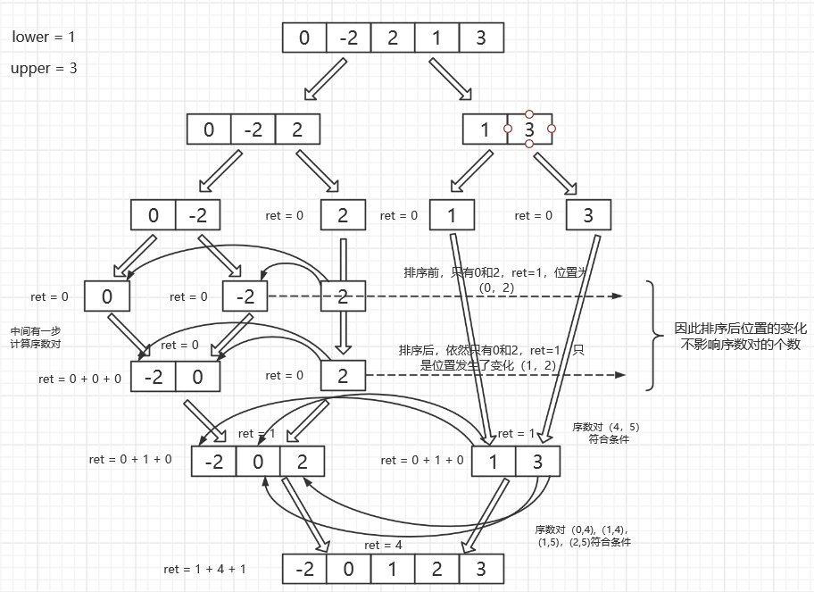

# 排序

## 一、归并排序

### 1、计算连续区间和在指定范围内的个数

> `说明`：给定一个整数数组 nums，返回区间和在 [lower, upper] 之间的==个数==，包含 lower 和 upper。区间和 S(i, j) 表示在 nums 中，位置从 i 到 j 的元素之和，包含 i 和 j (i ≤ j)。

> 示例：

```
输入: nums = [-2,5,-1], lower = -2, upper = 2,
输出: 3 
解释: 3个区间分别是: [0,0], [2,2], [0,2]，它们表示的和分别为: -2, -1, 2。
```

方法一：

首先考虑：给定两个`升序排列`的数组 n1,n2，试找出所有的下标对 ==(i,j)==，满足：

<div style="text-align:center;background:#F8F8FF">n2[j] − n1[i]∈[lower,upper]</div>

在已知两个数组均为升序的情况下，这一问题是相对简单的：

1、我们在 n2 中维护两个指针` l`，`r`。起初，它们都指向 n2 的起始位置。

2、随后，我们考察 n1 的第一个元素。首先，不断地将指针 l 向右移动，直到 n2[l] ≥ n1[0]+lower为止，此时， l 及其右边的元素均大于或等于 n1[0]+lower。随后，再不断地将指针 r 向右移动，直到 n2[r]>n1[0]+upper 为止，则 r 左边的元素均小于或等于 n1[0]+upper。故区间 [l,r) 中的所有下标 j，都满足

<div style="text-align:center;background:#F8F8FF">n2[j] − n1[i]∈[lower,upper]</div>

3、接下来，我们考察 n1 的第二个元素。由于 n1 是递增的，不难发现 l,r ==只可能向右移动==。因此，我们不断地进行上述过程，并对于 n1 中的每一个下标，都记录相应的区间 [l,r) 的大小。最终，我们就统计得到了满足条件的下标对 (i,j) 的数量。

```java
    /**sum中[left,mid],[mid+1,right]已经归并排序好了**/
    private int statisticSubPair(long[] sum,int lower, int upper,int left,int right){
        int mid = (left + right) / 2;
        int i = left;
        int l,r;
        l = r = mid + 1;
        int count = 0;
        while (i <= mid) {
            while (l <= right && sum[l] - sum[i] < lower) {
                l++;
            }
            while (r <= right && sum[r] - sum[i] <= upper) {
                r++;
            }
            count += r - l;
            i++;
        }
        return count;
    }
```

接下来进行归并排序：

```java
    private void merge(long[] sum,int lower, int upper,int left,int right) {
        int mid = (left + right) / 2;
        int[] sorted = new int[right - left + 1];
        int p1 = left, p2 = mid + 1;
        int p = 0;
        while (p1 <= mid || p2 <= right) {
            if (p1 > mid) {
                sorted[p++] = (int) sum[p2++];
            } else if (p2 > right) {
                sorted[p++] = (int) sum[p1++];
            } else {
                if (sum[p1] < sum[p2]) {
                    sorted[p++] = (int) sum[p1++];
                } else {
                    sorted[p++] = (int) sum[p2++];
                }
            }
        }
        for (int j = 0; j < sorted.length; j++) {
            sum[left + j] = sorted[j];
        }
    }
```

> 过程：
>
> 例如：num = [-2,4,-1,2]，lower = 1，upper = 3 => sum = [0,-2,2,1,4]



> 完整代码：

```java
    public int countRangeSum(int[] nums, int lower, int upper) {
        long s = 0;
        long[] sum = new long[nums.length + 1];//将0加入前缀和数组中是为了计算自身
        for (int i = 0; i < nums.length; ++i) {
            s += nums[i];
            sum[i + 1] = s;
        }
        return countRangeSumRecursive(sum, lower, upper, 0, sum.length - 1);
    }

    public int countRangeSumRecursive(long[] sum, int lower, int upper, int left, int right) {
        if (left == right) {
            return 0;
        } else {
            int mid = (left + right) / 2;
            int n1 = countRangeSumRecursive(sum, lower, upper, left, mid);
            int n2 = countRangeSumRecursive(sum, lower, upper, mid + 1, right);
            int ret = n1 + n2;
            // 首先统计下标对的数量
            ret += statisticSubPair(sum, lower, upper, left, right);
            // 随后合并两个排序数组
            merge(sum, lower, upper, left, right);
            return ret;
        }
    }
```

