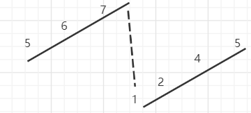

[TOC]

> 二分查找：
>
> ==核心==：确定搜索的范围，即left，right值是否可能为结果，从而判断要舍去的区间
>
> 使用场景：当出现查找，有序等字眼时可以思考二分查找

#### 5643. 将数组分成三个子数组的方案数

我们称一个分割整数数组的方案是**好的** ，当它满足：

* 数组被分成三个 非空 连续子数组，从左至右分别命名为 left ， mid ， right 。
* left 中元素和**小于等于** mid 中元素和，mid 中元素和**小于等于** right 中元素和。

给你一个**非负**整数数组 nums ，请你返回 **好的** 分割 nums 方案数目。由于答案可能会很大，请你将结果对 10^9 + 7 取余后返回。

示例1、

> 输入：nums = [1,2,2,2,5,0]
> 输出：3
> 解释：nums 总共有 3 种好的分割方案：
> [1] [2] [2,2,5,0]
> [1] [2,2] [2,5,0]
> [1,2] [2,2] [5,0]

解题思路：

> 1、涉及连续数组和一般需要维护一个前缀和
>
> 2、如果暴力法就是C^2^ ~n-1~ ，根据提示：nums.length <= 10^5^ ，可知暴力肯定超时，需要优化。
>
> 3、本题需要先确定第一次分割的位置，然后再搜索寻找第二次分割的位置，由搜索可以联想到**二分查找**

步骤：

设第一次分割的位置为i，第二次分割的位置为j，则【0，i】为left，【i+1，j】为mid，【j+1，nums.length - 1】为right

> 1、首先确定**i**的位置，如果preSum[i] > preSum[nums.length - 1] / 3，则**j**无论在什么位置都无法完成分割，因此第一次分割**i**的值可以使用枚举
>
> 枚举值到preSum[i] <= preSum[nums.length - 1] / 3
>
> 2、其次确定j的位置：
>
> 首先确定最小的位置，最小要满足：left == mid => preSum[i] * 2  = preSum[j] 
>
> if 存在 preSum[i] * 2  = preSum[j] 则返回 j
>
> if 不存在 则返回 满足preSum[j] ≤ preSum[i] * 2 ≤ preSum[j+1]
>
> 其次确定最大的位置，最大要满足：mid == right => preSum[j] ≤ preSum[i] + (preSum[n - 1] - preSum[i])/2

确定j的下界：

==注意==：由于bound是乘法得来，因此bound不会出现丢失小数点问题。

1、确定搜索范围

因此当preSum[mid] < bound时，j ≤ mid的值都会使得preSum[j] < bound，因此抛弃mid左边(==包括mid==) => left = mid + 1;

当preSum[mid] ≥ bound时，j ≥ mid 的值都会使得preSum[j] ≥ preSum[mid] ≥ bound，因此需要保留**mid** => right = mid

2、确定退出条件

right表示right**有可能**是j，当right**右边的一定不是**j，left表示left有可能是j，left左边的一定不是j

因此当**left == right**时，可以得出left一定是j，所以循环条件为left < right

```java
private int getLowerBound(int[] preSum,int left,int right,int bound) {
   while (left < right) {
       int mid = (right - left)/2 + left;
       if (preSum[mid] < bound) {
           left = mid + 1;
       } else {
           right = mid;
       }
   }
   return left;
}
```

确定j的上界：

==注意==：由于bound是除法得来，可能会出现小数点丢失问题。

1、确定搜索范围

假设：当bound = 6.5时，bound会变为==6==

因此当preSum[mid] ≤ bound时，mid值可能为答案，mid左边的值一定不为答案

当preSum[mid] ＞ bound时，例如在假设中preSum[mid] = 7，不符合题意，因此mid右边的值(==包括mid==)一定不是答案

2、确定退出条件

right表示right**右边的（包括right）一定不是**j，left表示left有可能是j，但left左边的一定不是j

因此当**left == right**时，可以得出left - 1一定是j，所以循环条件为left < right

```java
private int getHigherBound(int[] preSum,int left,int right,int bound) {
    while (left < right) {
       int mid = (right - left)/2 + left;
       if (preSum[mid] <= bound) {
           left = mid + 1;
       } else {
           right = mid;
       }
    }
    return left - 1;
}
```

#### 81. 搜索旋转排序数组 II

假设按照**升序**排序的数组(可能存在==重复元素==)在预先未知的某个点上进行了旋转。

( 例如，数组 [0,0,1,2,2,5,6] 可能变为 [2,5,6,0,0,1,2] )。

编写一个函数来判断给定的目标值是否存在于数组中。若存在返回 true，否则返回 false。

示例 1:

> 输入: nums = [2,5,6,0,0,1,2], target = 0
> 输出: true

示例 2:

> 输入: nums = [2,5,6,0,0,1,2], target = 3
> 输出: false

思考;

从相对有序的数组进行查找，一般可以想到使用二分查找

算法步骤：

1、如果target == nums[right] || target == nums[left] || target == nums[right]，直接返回

2、接下来有三种情况

* 当 nums[right] == nums[mid]，无法抛弃任何一段的值，因此right--

* 当 nums[right] > nums[mid]，有两种情况

  * target > nums[mid]，

    > 出现这种情况无法，无法舍弃任一区间，如果target为4则舍弃[left,mid]，如果target为6 则舍弃[mid,right]，因此还需要比较
    >
    > 

    * 当target > nums[right]，舍弃 [mid,right]
    * 当target < nums[right]，舍弃 [left,mid] 

  * target < nums[mid]，舍弃 [mid,right]	

* 当 nums[right] < nums[mid]，同理

3、时间复杂度：当nums数组值都相同时，需要o(n)的时间

```java
class Solution {
    public boolean search(int[] nums, int target) {
        int left = 0;
        int right = nums.length-1;
        while (left <= right){
            int mid = (right - left)/2 + left;
            if (nums[mid] == target || nums[right] == target || nums[left] == target){
                return true;
            }
            if (nums[mid] > nums[right]){
                if (target > nums[mid]){
                    left = mid+1;
                } else if (target < nums[mid]){
                    if (target > nums[right]){
                        right = mid - 1;
                    } else if (target < nums[right]){
                        left = mid + 1;
                        right--;
                    }
                }
            } else if (nums[mid] < nums[right]) {
                if (target > nums[mid]){
                    if (target > nums[right]){
                        right = mid - 1;
                    } else if (target < nums[right]){
                        left = mid+1;
                        right--;
                    } 
                } else if (target < nums[mid]){
                    right = mid - 1;
                }
            } else{
                right--;
            }
        }
        return false;
    }
}
```

#### 153. 寻找旋转排序数组中的最小值

假设按照升序排序的数组在预先未知的某个点上进行了旋转。例如，数组 [0,1,2,4,5,6,7] 可能变为 [4,5,6,7,0,1,2] 。

请找出其中最小的元素。

示例 1：

> 输入：nums = [3,4,5,1,2]
> 输出：1

示例 2：

> 输入：nums = [4,5,6,7,0,1,2]
> 输出：0

示例 3：

> 输入：nums = [1]
> 输出：1

思路：在相对排序的数组寻找最小值，容易想到**二分查找**

> **技巧**：在==旋转==后的排序数组中，可以使用value[mid]与value[right]，进行比较
>
> 因为计算的mid = (right - left)/2 + left，mid向下取整，会出现left == mid  != right
>
> 因此以left值为依据时，当value[mid] == value[left]时还需要再做一次判断
>
> 而以right值为依据时，当value[mid] == value[right] 时，一定会有 left == mid == right

```java
class Solution {
    public int findMin(int[] nums) {
        int left = 0;
        int right = nums.length - 1;
        while (left < right){
            int mid = (right - left)/2 + left;
            if (nums[mid] > nums[right]){
                left = mid + 1;
            } else{
                right = mid;
            }
        }
        return nums[left];
    }
}
```

