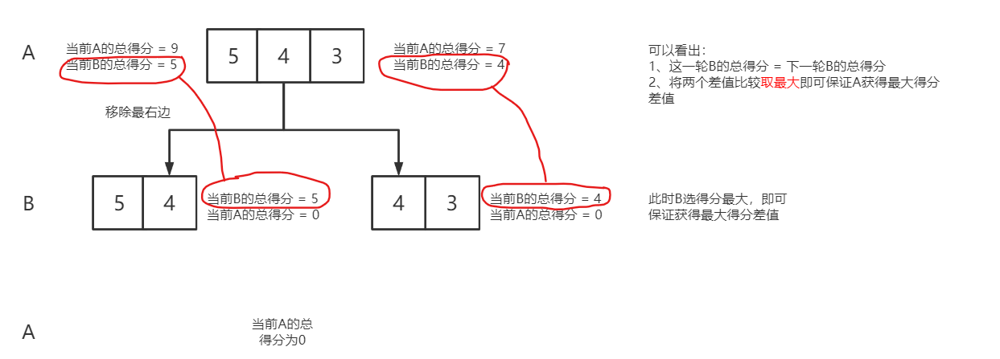

# 动态规划


### 5672、石子游戏VII

石子游戏中，爱丽丝和鲍勃**轮流**进行自己的回合，爱丽丝先开始 。有 n 块石子排成一排。每个玩家的回合中，可以从行中 移除 最左边的石头或最右边的石头，并获得与该行中剩余石头值之和相等的得分。当没有石头可移除时，得分较高者获胜。

鲍勃发现他总是输掉游戏（可怜的鲍勃，他总是输），所以他决定尽力 ==减小得分==的差值 。爱丽丝的目标是最大限度地 ==扩大得分==的差值 。

给你一个整数数组 stones ，其中 stones[i] 表示 从左边开始 的第 i 个石头的值，如果爱丽丝和鲍勃都 发挥出==最佳水平== ，请返回他们 得分的差值 。

例：

> 输入：stones = [5,3,1,4,2]
> 输出：6
> 解释：
> - 爱丽丝移除 2 ，得分 5 + 3 + 1 + 4 = 13 。游戏情况：爱丽丝 = 13 ，鲍勃 = 0 ，石子 = [5,3,1,4] 。
> - 鲍勃移除 5 ，得分 3 + 1 + 4 = 8 。游戏情况：爱丽丝 = 13 ，鲍勃 = 8 ，石子 = [3,1,4] 。
> - 爱丽丝移除 3 ，得分 1 + 4 = 5 。游戏情况：爱丽丝 = 18 ，鲍勃 = 8 ，石子 = [1,4] 。
> - 鲍勃移除 1 ，得分 4 。游戏情况：爱丽丝 = 18 ，鲍勃 = 12 ，石子 = [4] 。
> - 爱丽丝移除 4 ，得分 0 。游戏情况：爱丽丝 = 18 ，鲍勃 = 12 ，石子 = [] 。
> 得分的差值 18 - 12 = 6 。
>

核心思想：==先选必赢==

A先选，A移除【i，j】中最左或最右的值，使得sum(A) - sum(B)的**差值最大**

此时B站在A的角度，B在剩余的j - i个数中移除一个数，在这一轮中使得剩余的sum(B) - sum(A) 的**差值最大**，这样B的总得分与A的总得分最小

=> 每一轮都要保证，这一轮人选移除石头时，都能获得**最大得分差**

思路步骤：

动态规划：dp[i] [j]表示轮到这一个人选时，石头剩下 i 到 j ，他能获得的==最大得分差== 

1、写出状态转移方程： 

> ①当i == j时，dp[i] [j] = 0，此时无论这个人如何选择都==无法获得==得分，因此得分差为**0**
>
> ②当j - i == 1，dp[i] [j] = Math.max(stones[i]，stones[j])，此时这人无论选什么，对方得分**都为0**，只要保证这轮自己**得分最高**，就可以保证得分差**最大**
>
> ③当j - i > 1时，**dp[i] [j] = Math.max(prefixSum[i+1] [j] - dp[i+1] [j]，prefixSum[i] [j - 1] - dp[i] [j - 1])**
>
> 假设当前人为A，当移除右边时（**移除左边同理**），当前人的得分差 = curDiff，下一人得分差 = nextDiff
>
> 当前A的总得分为sumA，当前B的总得分sumB，下一轮A的总得分sumA1，下一轮B的总得分sumB1，移除某一个数后当前的前缀和prefixSum
>
> （1）当前人最大得分差 = A的总得分 - B的总得分，A的总得分 = 当前前缀和 + 下一轮A的总得分
>
> （2）下一人最大得分差 = 当前B的总得分 - 当前A的总得分
>
> 由题意知：curDiff= sumA - sumB;	sumA  = prefixSum + sumA1;	nextDiff =  sumB1 - sumA1； 
>
> **sumB = sumB1**（由于当前移除只对A有影响，对下一轮B的总得分无影响）
>
> curDiff = prefixSum - (sumB - sumA1) = 前缀和 - 下一人最大得分差

2、返回dp[0] [stones.length - 1] （表示A先选时获得的**最大得分差**）

举例说明：

> 

```java
public class StoneGameVII {
    public int stoneGameVII(int[] stones) {
        int[] prefixSum = new int[stones.length];
        //计算前缀和
        prefixSum[0] = stones[0];
        for (int i = 1; i < stones.length; i++) {
            prefixSum[i] += prefixSum[i - 1] + stones[i];
        }
        
        int[][] dp = new int[stones.length][stones.length];
        for (int i =stones.length - 1; i >= 0 ; i--) {
            for (int j = i + 1; j < stones.length; j++) {
                if (j - i == 1) {
                    dp[i][j] = Math.max(stones[i],stones[j]);
                } else {
                    dp[i][j] = Math.max(prefixSum[j] - prefixSum[i] - dp[i + 1][j],
                                        prefixSum[j - 1] - (i == 0 ? 0 :prefixSum[i - 1]) - dp[i][j - 1]);
                }
            }
        }

        return dp[0][stones.length - 1];
    }
}
```