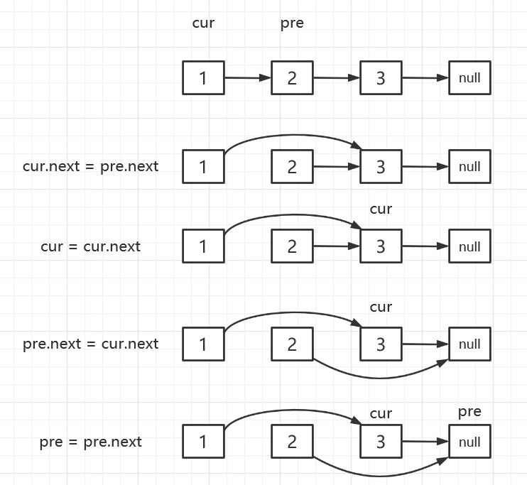

[TOC]

## 基础链表操作

### (一)奇偶链表

> 给定一个单链表，把所有的奇数节点和偶数节点分别排在一起。算法的空间复杂度应为 O(1)，时间复杂度应为 O(nodes)，nodes 为节点总数。
>
> 示例：
>
> **输入:** 1->2->3->4->5->NULL **输出:** 1->3->5->2->4->NULL

>  思路：
>
> 1、将链表分成两部分，奇数节点为一部分，偶数节点为一部分，将奇数节点末尾指针指向偶数节点开头
>
> 2、三指针，cur：指向奇数节点末尾指针，pre：指向偶数节点末尾指针，evenHead：记录偶数节点开始位置
>
> 核心操作：1->2->3->4
>
> 

```java
    public ListNode oddEvenList(ListNode head) {
        if (head == null || head.next == null || head.next.next == null)
            return head;

        ListNode evenHead,pre,cur;
        cur = head;
        evenHead = pre = head.next;
        while (pre != null && pre.next != null){
            cur.next = pre.next;
            cur = cur.next;
            pre.next = cur.next;
            pre = pre.next;
        }
        cur.next = evenHead;

        return head;
    }
```

