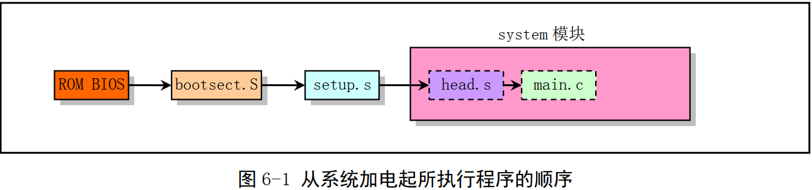
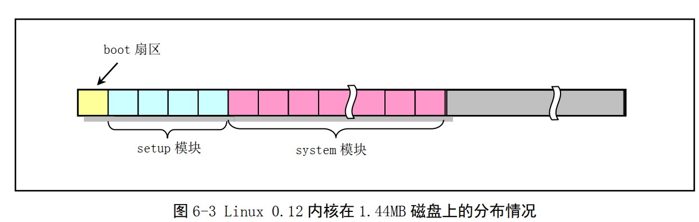

一、Linux内核启动流程

1、x86进入实模式从0xFFFF0开始自动执行程序代码，这个地址通常是 ROM-BIOS 中的地址。 

2、在物理地址 0 处开始设置和初始化中断向量。

3、它将可启动设备的第一个扇区（磁盘引导扇区， 512 字节）读入内存绝对地址 0x7C00 处，并跳转到这个地方开始引导启动机器运行了。 

4、boot/bootsect.S  将由 BIOS 读入到内存绝对地址 0x7C00（ 31KB） 处，当它被执行时就会把自己移动到内存绝对地址 0x90000（ 576KB） 处，并把启动设备盘中后 2KB 字节代码（ boot/setup.S） 读入到内存 0x90200 处  

5、内核的其他部分（ system 模块）则被读入到从内存地址 0x10000（ 64KB）开始处  

6、setup 程序将会把 system 模块移动到物理内存起始位置处，这样 system 模块中代码的地址也
即等于实际的物理地址，便于对内核代码和数据进行操作  

各部分在内存中的位置变化如下图：

6、加载IDT、 GDT 以及 LDT ，确认处理器和协处理器，设置分页工作， 最终会调用执行 init/main.c 中的 main()代码  

1.44MB 磁盘盘片两面各有 80个磁道（柱面），每磁道有 18 个扇区，共有 2880 个扇区  

boot:1扇区
setup：4扇区
system：260扇区

7、补充信息：

Linux 系统中由主设备号和次设备号组合而成， 主设备号指定了设备的种类，次设备号则指明了具体的设备对象。 主、 次设备号分别用 1 个字节表示， 即各个设备号均有 2 个字节。  

主设备号代表含义：

1 - 内存；
2 - 磁盘；
3 - 硬盘；
4 - ttyx； 
5 - tty；
6 - 并行口；
7 - 非命名管道。  

设备号 = 主设备号*256 + 次设备号  

| 逻辑设备号 | 对应设备文件 | 说明                         |
| ---------- | ------------ | ---------------------------- |
| 0x300      | /dev/hd0     | 代表整个第 1 个硬盘          |
| 0x301      | /dev/hd1     | 表示第 1 个硬盘的第 1 个分区 |
| 0x302      | /dev/hd2     | 表示第 1 个硬盘的第 2 个分区 |
| 0x303      | /dev/hd3     | 表示第 1 个硬盘的第 3 个分区 |
| 0x304      | /dev/hd4     | 表示第 1 个硬盘的第 4 个分区 |
| 0x305      | /dev/hd5     | 代表整个第 2 个硬盘          |
| 0x306      | /dev/hd6     | 表示第 2 个硬盘的第 1 个分区 |
| 0x307      | /dev/hd7     | 表示第 2 个硬盘的第 2 个分区 |
| 0x308      | /dev/hd8     | 表示第 2 个硬盘的第 3 个分区 |
| 0x309      | /dev/hd9     | 表示第 2 个硬盘的第 4 个分区 |