[TOC]

# 形式语言与自动机

## 第二章 有穷自动机

### 一、确定型有穷接收器

2、已知 `Σ` = {a,b}，分别构造接受下面集合的`dfa`:

(a)、只有一个a的字符串

> 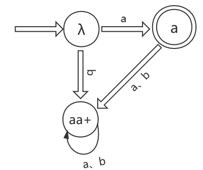

(e)、恰有两个a并且多于2个b的字符串。

> 

5、构造分别接受下面语言的dfa：

(a)、L={ab^5^wb^2^ | w ∈ {a,b}^*^}

> 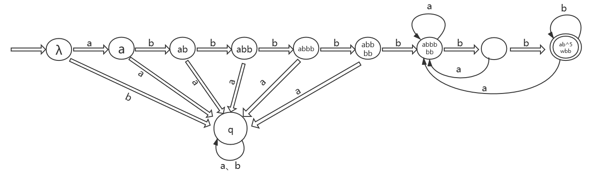

(b)、L={w~1~abw~2~ | w~1~∈{a,b}^*^,w~2~∈{a,b}^*^}

> 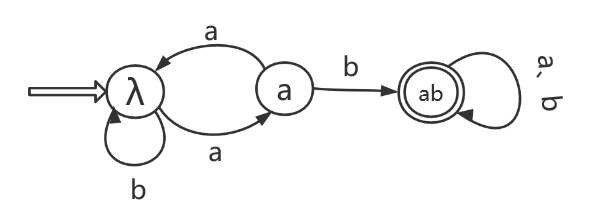

6、描述下列自动机接受的语言集合

> 解答：L = {a}∪{aw~1~b | w~1~∈{a,b}^*^}}

7、在Σ={a,b}上构造分别接受下面语言的dfa:

(b) L={w | |w| mod 5 ≠ 0} 

> 

(c) L={w | n~a~(w) mod 3 > 1} 

> 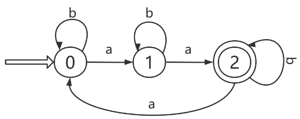

(e) L={w | (n~a~(w) - n~b~(w)) mod 3 > 0}

> ==公式：(a - b) % p = (a % p - b % p + p) % p==
> 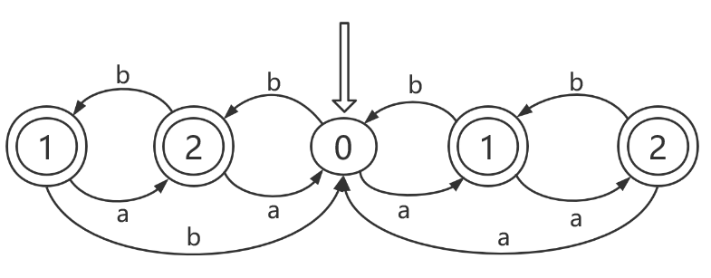

(f) L={w | (n~a~(w) + 2*n~b~(w)) mod 3 < 2}

> ==公式：(a + b) % p = (a % p + b % p) % p==
>
> 

8、一个符号串上的`“run”`指的是符号串中包含由至少两个相同符号构成的子串。比如，符号串`abbbaab`包含一个符号`b`的长度为`3`的`“run”`和一个符号`a`的长度为`2`的`“run”`。在 Σ = {a,b}，中，分别构造下列语言的dfa：

(a) L = {w | w不包含长度小于4的“run”} => ==w中包含的 |run| ≥ 4==

> 

(d) L={w | 每个符号串就包含两个长度为3的“run”}

> 

11、证明：L={vwv | v，w∈{a,b},|v| = 2}是正则语言

> 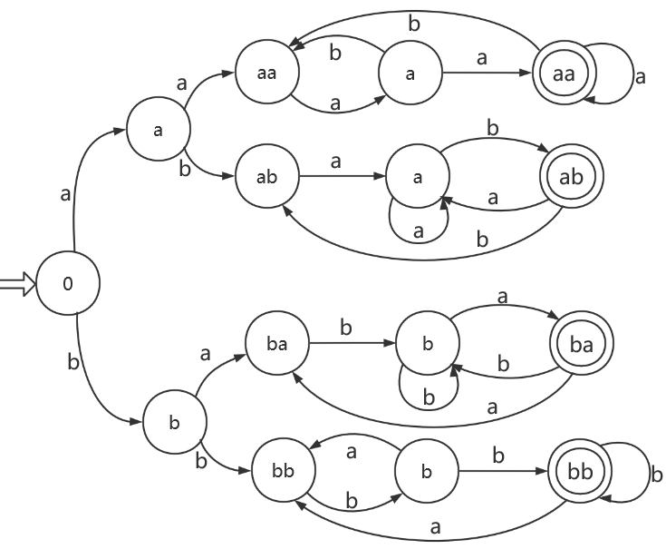

### 四、减少有穷自动机中状态的化简(重要概念)

> 定义2.8 对于所有的w ∈Σ^*^，如果
>
> δ^*^(p,w) ∈ F ∩ δ^*^(q,w) ∈ F ∩ δ^*^(p,w) ∉ F ∩ δ^*^(q,w) ∉ F
>
> 则称 dfa的两个状态`p`和`q`是==不可区分的==。反之，如果
>
> ∃ w ∈Σ^*^   δ^*^(p,w) ∉ F 并且 δ^*^(q,w) ∈ F，则`p`和`q`==是可区分的==

> 程序mark：
>
> 1、去掉所有==不可达状态==
>
> 2、考察所有状态对(p,q)。判断是否可区分
>
> 3、重复下述过程：
>
> 对于`∀(p,q)∧∀a ∈Σ`，计算δ(p,a) =p~a~和δ(q,a) =p~b~，如果(p~a~,p~b~)是可区分的，那么(p,q)也标记为可区分

2、寻找接受下面语言的最小dfa

(a) L={a^n^b^m^ | n≥2，m≥1}

> 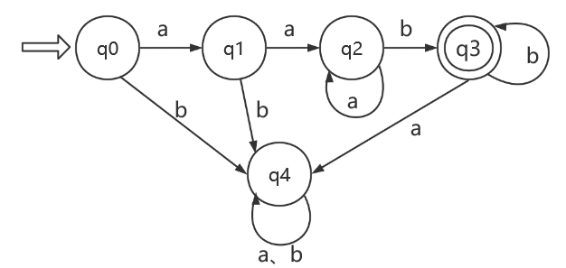

(b) L={a^n^b| n≥0}∪{b^n^a | n≥1}

> 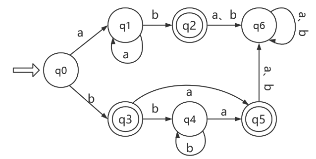

## 第三章 正则语言与正则文法

### 一、正则表达式：

4：为集合{a^n^b^m^ | (n+m)是偶数}构造一个正则表达式：

先构造相应的dfa，然后
(ab+λ)(bb)^*^ + (aa)^*^

5: 为下列语言构造正则表达式：

(a) L~1~ = {a^n^b^m^, n≥4，m≤3}

> r = aaaaa^*^ (λ+b+bb+bbb)

(b) L~1~ = {a^n^b^m^, n＜4，m≤3}

> r = (λ+a+aa+aaa)(λ+b+bb+bbb)

10、给出L = {ab^n^w | n ≥ 3，w∈{a,b}^+^}的正则表达式

> r = abbbb^*^(a+b)(a+b)^*^

12、为L={vwv | v，w∈{a，b}^*^,|v|=2}构造正则表达式

> aa(a+b)^*^aa
>
> +ab(a+b)^*^ab
>
> +ba(a+b)^*^ba
>
> +bb(a+b)^*^bb

13、为L={w ∈{0,1}^*^ | w有且只有一对连续的0}构造正则表达式：

> r = 1^*^ (01)^*^ 001^*^ (01)^*^

14、为下面定义在∑ = {a,b,c}上的语言构造正则表达式：

(a)有且只有一个a的所有符号串

> r = (b+c)^*^ a (b+c)^*^

(b)仅有3个a的所有符号串

> r = (b+c)^*^ a (b+c)^*^ a (b+c)^*^ a (b+c)^*^

(e)a的长度为3的倍数的所有符号串

> r = (b+c)^*^ a (b+c)^*^ a (b+c)^*^ a (b+c)^*^
> (a (b+c)^*^ a (b+c)^*^ a (b+c)^*^)^*^

15、分别写出下列定义在{0,1}上的语言的正则表达式

(a)结束符为01的所有符号串

> r = (0+1)^*^01

(b)结束符不为01的所有符号串

> r = (0+1)^*^00 + (0+1)^*^10 + (0+1)^*^11

(c)包含偶数个0的符号串

> r = 1^*^ (01^*^01^*^)^*^

(d)至少包含两个00子串的符号串(000包含两个这样的子串)

> r = 1^*^(01)^*^(000+001^*^(01)^*^00)(0+1)^*^

16、为下列定义在{a,b}上的语言构造正则表达式：

(a) L = {w | |w| mod 3 = 0}

> r=((a+b)(a+b)(a+b))^*^

(b) L = {w | n~a~(w) mod 3 =0}

> r = b^*^ (ab^*^ab^*^ab^*^)^*^

### 二、正则表达式和正则语言之间的联系

3、设计一个接受L((a+b)^*^b(a+bb)^*^)的nfa

> 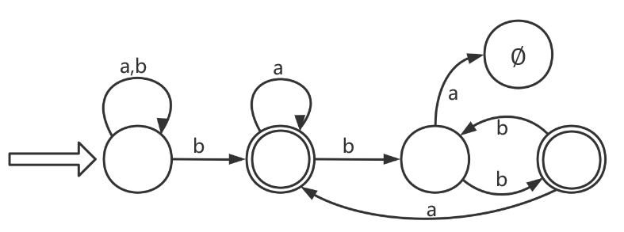

4、分别构造接受下列语言的dfa

(a) L(aa^*^+aba^*^b^*^)

> 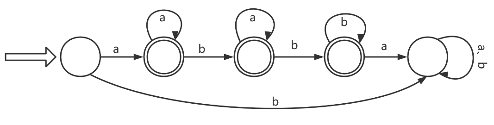

(b) L(ab(a+ab)^*^(a+aa))

> 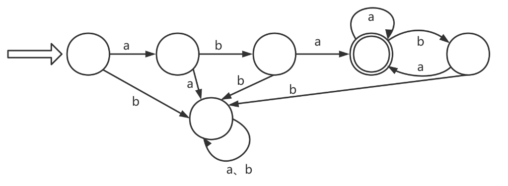

(c) L((abab)^*^+(aaa^*^+b)^*^)

> 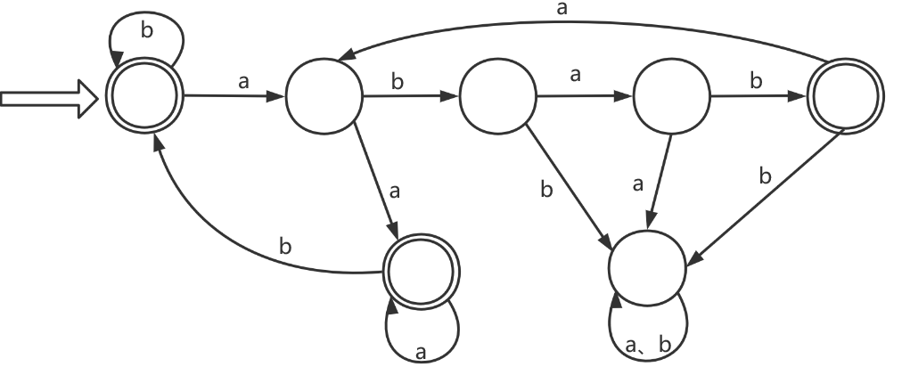

(d) L((aa^*^)^*^b^*^)

> 

8、考虑下面的通用转移图：

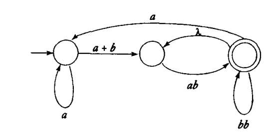

(a)给出一个与之等价的只有两个状态的通用转移图。

(b)这个图接受的语言是什么?

> (a)
>
> 8a.png)
>
> (b) r = a^*^(a+b)ab(ab+bb)^*^(λ + (aa^*^(a+b)ab(bb+ab)^*^)^*^)

9、下面这个转移图接受的语言是什么？

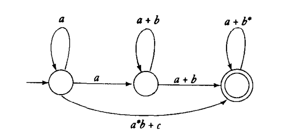

> r = a^*^(a(a+b)(a+b)^*^+(b+c))(a+b^*^)^*^

10、分别给出下列自动机接受的语言的正则表达式：

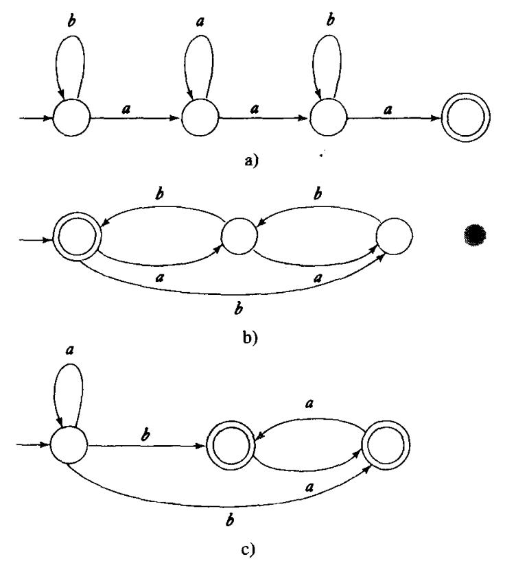

> (a)、r = b^*^aa^*^ab^*^a
>
> (b)、r = (ab)^*^+(aabb)^*^+(bbb)^*^
>
> (c)、r = a^*^ba^*^

12、为下面定义在{a,b}上的语言构造正则表达式：

(a) L = {w | n~a~(w) 和n~b~(w)都是偶数}

(b) L = {w | (n~a~(w) -n~b~(w)) mod 3 =1}

(c) L = {w | (n~a~(w) -n~b~(w)) mod 3 =1}

(d) L = {w | (n~a~(w) -n~b~(w)) mod 3 =1}

> (a) r = (aa)^*^(bb)^*^(aa)^*^
>
> (b) r = (a+bb)(ab)^*^((aa+b)(a+bb)(ab)^*^)^*^
>
> 

### 三、正则文法

1、构造dfa接受由下面文法生成的语言：

S -> abA

A -> baB

B -> aA | bb

> 

2、构造一个能生成语言*L*(aa^*^(ab+a)^*^)的正则文法：

> S -> aA
>
> A -> aA | λ
>
> A -> aB | abB
>
> B -> aB | abB | λ

3、为习题一构造一个左线性文法

> S -> Abb
>
> A -> Bba
>
> B -> Aa | ab

4、为下面的语言构造左线性文法和右线性文法：

L = {anbm | n ≥ 2，m ≥ 3}

> 右线性文法：
>
> 

>     

>         <b>
>             
S -> aaA;

>             
A -> aA | bbbB;

>             
B -> bB | λ;

>         </b>
>     

> 

>
> 左线性文法：
>
> 

>     

>         <b>
>             
S -> Sb | Abbb;

>             
A -> Aa | Baa;

>             
B -> λ
</b>
>     

> 

5、为语言*L*((aab^*^ab)^*^)构造右线性文法

> 

>     

>         <b>
>             
S -> aaA | λ;

>             
A -> bA | aB;

>             
B -> bS;
</b>
>     

> 

6、构造一个正则文法，使之产生的语言定义在Σ ={a,b}上，并且这个语言中的每一个符号串至多有3个a

> 

>  

>      <b>
>          
S -> bS | aA | λ;

>          
A -> bA | aB | λ;

>          
B -> bB | aC | λ;

>          
C -> bC | λ;

>      </b>
>  

> 

9、为习题5中的语言构造一个左线性文法

> 

>  

>      <b>
>          
S -> Ab | λ;

>          
A -> Ba;

>          
B -> Bb | Saa;
</b>
>  

> 

10、为语言L = {a^n^b^m^ | n+m是偶数}构造一个正则文法

> 

>  

>      <b>
>          
S -> aA |bB | λ;

>          
A -> aS | bD;

>          
B -> bD;

>          
D -> bB | λ;

>      </b>
>  

> 

11、构造正则文法，使它可以生成语言L = {w∈{a,b}^*^ | n~a~(w) + 3n~b~(w) 是偶数}

> 

>  

>      <b>
>          
S -> aA |bA | λ;

>          
A -> bS | aS;

>      </b>
>  

> 

12、分别为下列定义在{a,b}上的语言构造正则文法

(a) L = {w | n~a~(w) 和n~b~(w)都是偶数}

> 先构造dfa:
>
> 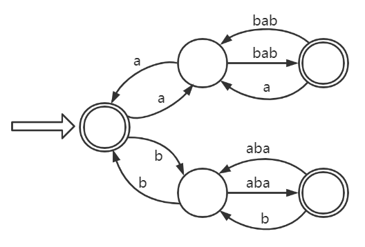
>
> 

>  

>      <b>
>          
S -> aA |bC | λ;

>          
A -> babB | aS;

>          
B -> babA | aA | λ;

>          
C -> abaD | bS;

>          
D -> abaC | bC | λ;

>      </b>
>  

> 

(a) L = {w | n~a~(w) +n~b~(w) = 1}

> 

> 

>   <b>
>       
S -> aA |bbA;

>       
A -> abA | bS | aaS | λ;

>   </b>
> 

> 
