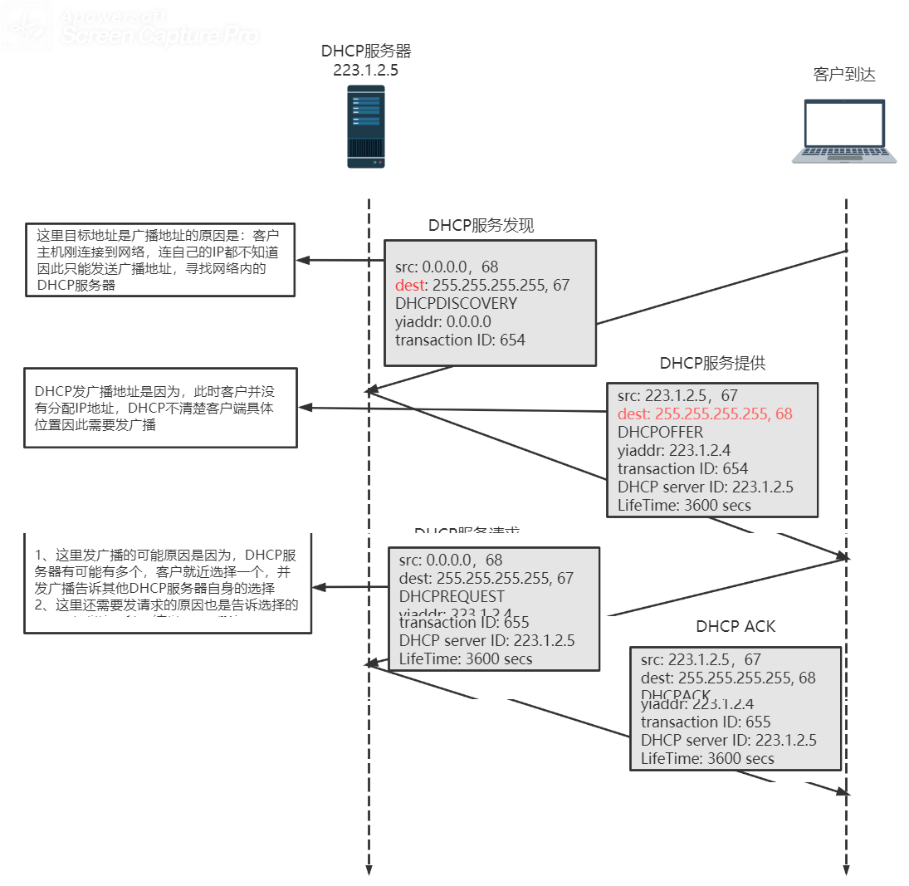
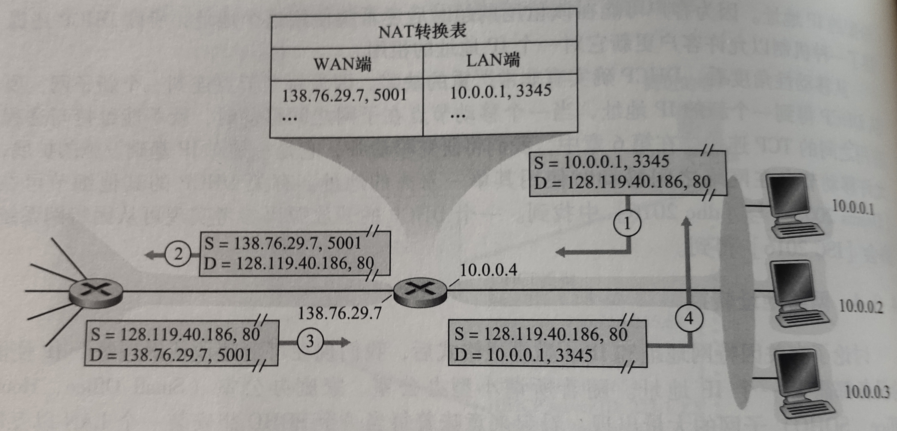
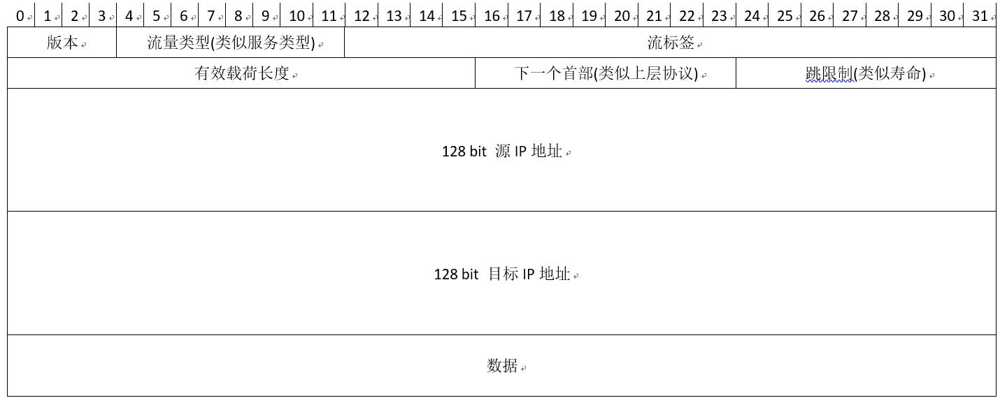
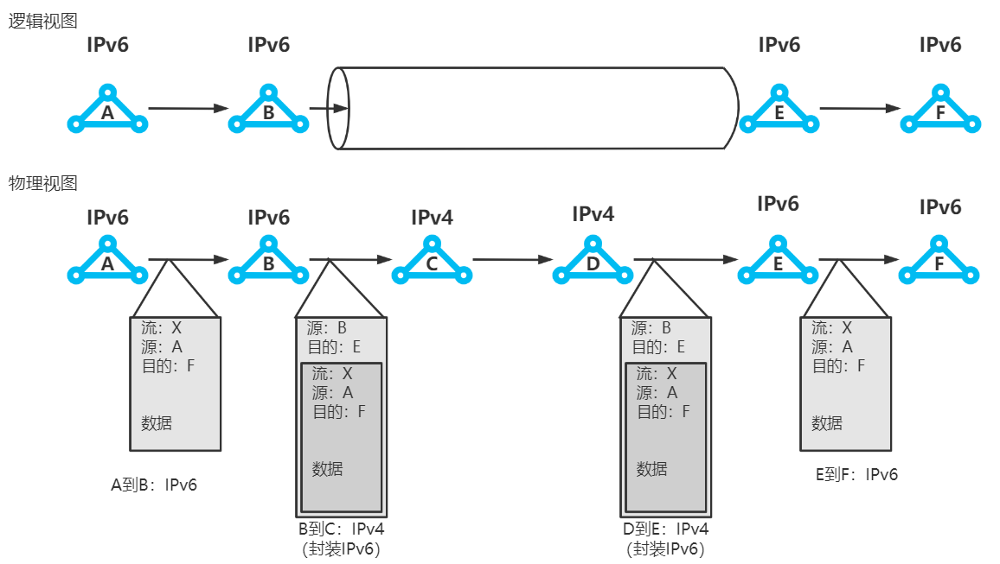
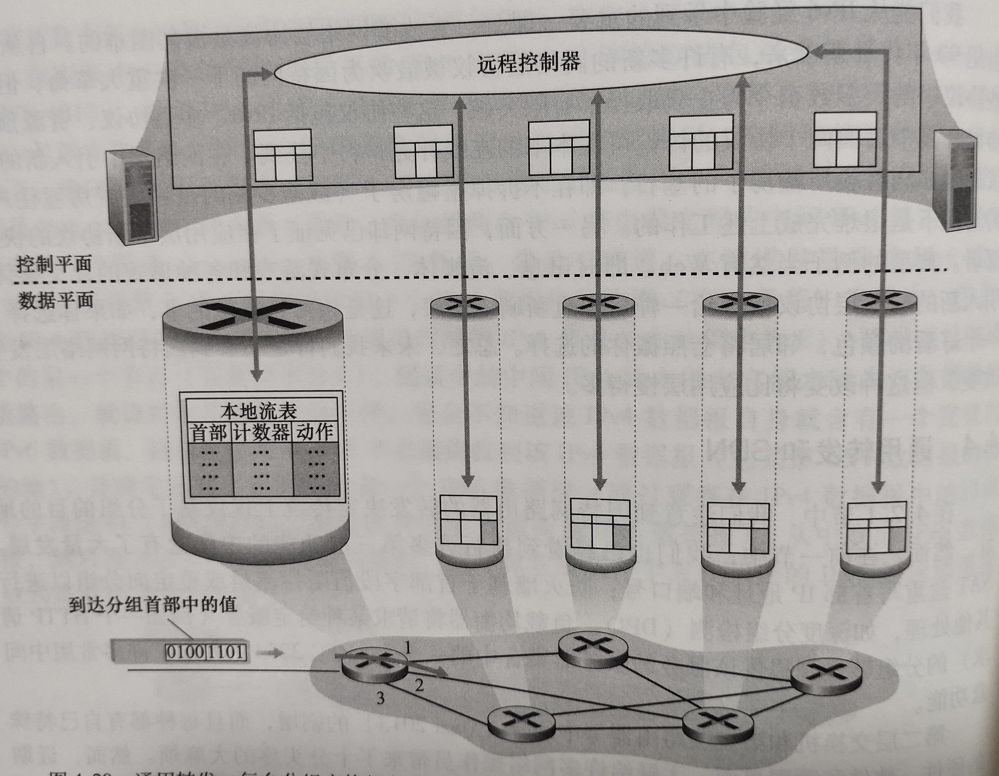
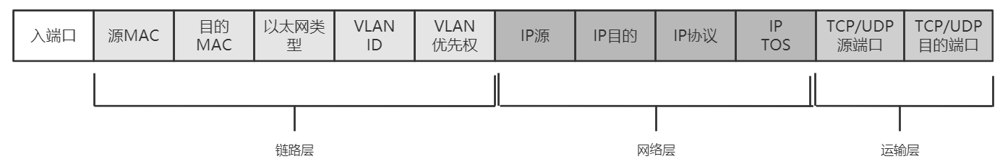
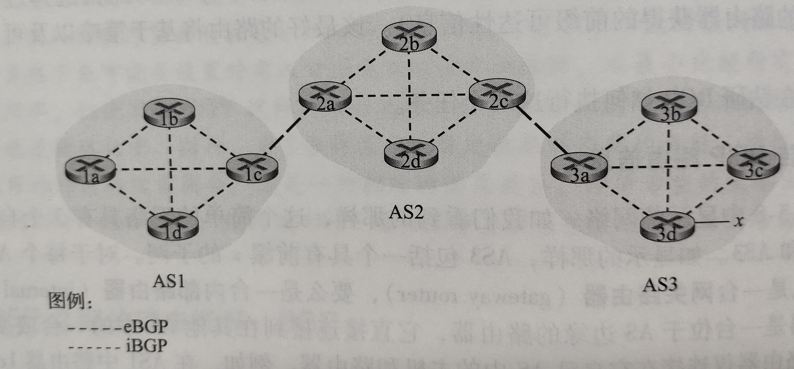
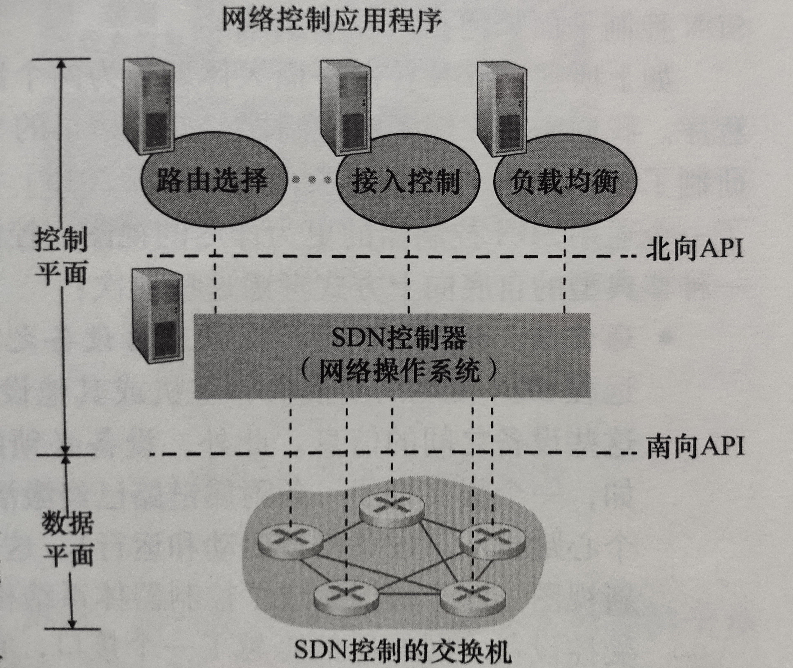
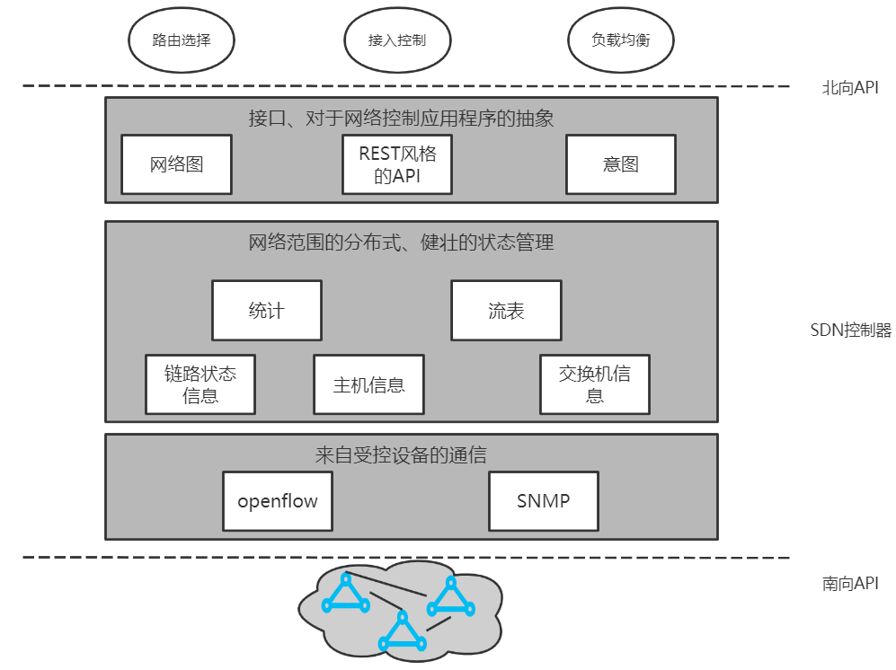
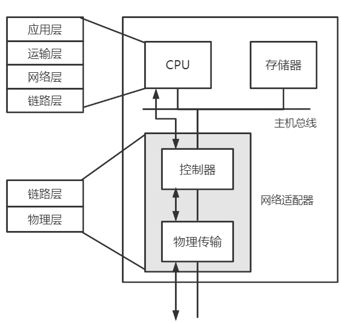

[TOC]

# 计算机网络

## 三、网络层：

>  网络层可以被分解为相互作用的两个部分：**数据平面**和**控制平面**

功能：

* 转发：将分组从一个**输入链路**接口转移到适当的**输出链路**接口的路由器本地动作。（==数据平面==）
* 路由选择：确定分组从**源**到**目的地**所采取的端到端路径的网络范围**处理过程**。

问题：

* 运输层能够**指望**网络层将该分组交付给目的地吗？
* 当发送多个分组时，它们会按发送顺序**按序交付**给接收主机的运输层吗？
* 发送两个连续分组信息的**时间间隔**与接收到两个分组的时间间隔相同吗？
* 网络层会提供拥塞的**反馈信息**吗？
* 在发送主机与接收主机中连接运输层通道的**抽象视图**是什么？

网络服务模型：定义了分组在发送与接收端系统之间的端到端运输特性

注：因特网提供了单一的服务列表，称为**尽力而为服务**（best-effort service）。不确保任何事情。

### （一）、数据平面：

核心：网络层中每台路由器的功能，

作用：决定到达路由器的==数据报== 如何从路由器的输入链路到输出链路

#### 1、路由器体系结构：

（1）输入端口：

* 最左侧：执行终结入物理链路的物理层功能
* 中间部分：与远端的数据链路层交互，执行数据链路层功能
* 最右端：执行查找功能，通过转发表决定路由器的输出端口

（2）交换结构：将路由器的输入端口连接到输出端口

（3）输出端口：存储从交换结构传来的分组，并执行必要的物理层和数据链路层功能

（4）路由选择处理器：执行控制平面功能，执行路由选择协议。

注意：(1)(2)(3)通常由硬件来实现，假设10Gbps的输入链路和64B的IP数据报，输入端口只有51.2ns的时间来处理，这远快于软件处理的时间。

#### 2、输入端口处理：

查找：通过转发表进行查找输出端口（转发表使用最长前缀匹配规则），为了实现纳秒级搜索，提供了硬件与软件支持：

* 快速查找算法
* DRAM与SRAM。实践中经常使用**三态内容可寻址存储器**(TCAM)查找

转发：

* 基于目的地的转发
* 通用转发

排队：当交换结构出现堵塞时，必须要在输入端口处排队

其他动作：

①物理层和链路层处理

②校验：检查分组的版本好、校验和以及寿命字段，并且需要重写后两个字段

③必须要更新用于网络管理的计数器

> **匹配加动作**：在路由器和交换机中特别常见的**抽象**结构

#### 3、交换结构：

①内存交换：由CPU（路由选择处理器）的直接控制完成，输入输出端口类似于操作系统的中I/O。

* 优点：简单
* 缺点：假设内存的可读性带宽为B分组/s，则总的吞吐率==不会超过==B/2

②总线交换：

​	输入端口预先在分组首部添加==字段==（指示输出端口）

​	分组可由**所有端口**收到，但只有首部**匹配**的端口才会**保存**

* 优点：简单，速率相对于内存交换更快，
* 缺点：一次只能通过一个分组，使得总吞吐量受到总线速率影响

③互联网络交换：

由2N条总线组成的互联网络，连接N个输入端口，N个输出端口。每条总线的交叉点通过交换结构控制，使得当分组到达A的时候可以传送到X，同时来自B端口的

分组可以到达Y。

* 优点：吞吐率极高，克服了单一、共享式总线带宽限制
* 缺点：复杂

> Cisco CRS利用三级非阻塞交换策略，可以将分组分成==k个==小块发送到互联网络中，然后在端口处组装

#### 4、输出端口处理

(1)、何时出现排队：

定义：

R~line~ ： 输入线路速度与输出线路传输速率（单位：分组/秒）

R~switch~ : 交换结构传送速率

①输入排队：R~line~ > n * R~switch~，这种被称为**HOL阻塞**（线路前部阻塞），即使输出端口空闲，输入队列中的排队也必须等待交换结构进行传送

②输出排队：R~switch~ > n * R~line~，当输出队列满时，采取丢弃策略：

* 删除一个或多个**已排队**的分组
* 丢弃**新来**的分组

B(缓存大小) = RTT(往返时延) * C(链路带宽)

当有N条TCP流时（N很大）：B = RTT * C / N^0.5^

(2)、分组调度：确定分组的传送**次序**问题

①先进先出FIFO

②**优先权**排队：

* 为每个队列分配一个优先权W，当选择一个分组传输时，将从队列为**非空**的**最高优先权**队列中挑出一个分组。
* 在同一优先权类的分组，以**FIFO**先到先服务的规则。
* 在非抢占式调度的情况下，一旦分组开始传输，就不能被打断

③**循环**排队规则：由于每个队列并非有严格的优先顺序，因此采用轮询的方式，循环调度每个分组

具体实现：加权公平排队WFQ

为每个队列 **i** 设置权值 **W i**，保证每个队列在相同时间间隔内，接收到的服务部分等于W i / ( ΣW j)，ΣW j为所有权重之和。

这样保证了即使在最坏的情况下，队列i能分配到带宽W i / ( ΣW j)部分

#### 5、网际协议：IPv4，IPv6，寻址

(1)、IPv4

* 版本号：规定了数据报**IP协议**的**版本**。确定了路由器如何==解释==IP报剩余部分
* 首部长度：确定数据报中**数据载荷**的实际**开始**位置，IP数据报具有20字节的首部
* 服务类型(TOS)：区分不同服务类型的IP数据报（要求低时延，高吞吐量或可靠性的数据报）
* 数据报长度：**理论**最大长度为2^16^ = 65536字节，但受限于**以太网**帧的载荷（1500字节）
* 标识、标志、片偏移：与IP分片有关，在IPv6中不允许对IP分片
* 寿命(TTL) : 每经过一台路由器**减一**，确保数据报不会在网络中**循环**
* 上层协议：**指示**IP报数据部分应该交付于哪个运输层协议处理。只有在最终目的处才会使用，TCP：6，UDP：17
* 首部校验和：校验IP数据报**首部**中的bit错误。只在IP层有作用
* 源和目的IP地址：发报的数据源IP地址，以及最终目的IP地址，通常由DNS服务器解析
* 选项：允许IP首部被扩展。但由于选项的存在，使得解析IP数据报过于复杂，因此在IPv6中已经去掉。
* 数据：有效载荷

①数据报分片：将较大的数据报分成小的数据报以适应链路层上的载荷，小的数据报称为片（fragment）

原因：链路层帧严格限制IP数据报长度。（能承载的最大传送单元**MTU**）

* 数据报中的**标识**用来确定哪些数据报属于同一个**较大的**数据报

* **最后**一个片的标志为0，其他为1
* 用**片偏移**使目的主机确定是否丢失了一个片

②IPv4编址：采用**点分十进制**表示

> 主机与物理链路之间的边界称为**接口**，每个IP地址与接口相关

子网：分开主机和路由器的每个接口，产生几个隔离的网络岛，使用接口端连接这些隔离的网络端点，每个**隔离**的网络都叫做**子网**。（通俗：每个**相同的网段**都称为一个子网）。例如下图中有6个子网。

CIDR（无类别域间路由选择）：使用子网寻址时，将IP地址分成两部分：

* a.b.c.d/x，x指示了地址的第一部分的bit数。（被称为**网络前缀**）
* 地址的剩余 32 - x bit用于标识该组织内部设备。可用于继续划分子网

> ==地址聚合==：使用**单个**网络前缀通告**多个**网络的能力，如果匹配多个地址，则采用==最长前缀匹配==

DHCP动态主机配置协议：为主机分配IP地址

NAT网络地址转换：

①主机10.0.01指派端口3345，发送请求报文到web服务器128.119.40.186:80，首先发送到**LAN**

②NAT路由器收到报文后，将==源地址==改写为WAN端的IP地址，并为该数据报生成新端口 138.76.29.7:5001 （可以发现NAT转换表最多只有2^16^个表项）

③web发给NAT路由器响应报文 （web服务器不知道NAT的存在）

④根据==端口号==5001，在转换表中搜索LAN端的地址，改写数据报目的地址

> 反对者理由：
>
> * 端口号是用于标识进程寻址而非主机寻址
> * 路由器处于第三层网络层协议，应当只处理网络层的分组，违反主机直接对话原则

（2）IPv6

> 与IPv4的变化：
>
> * 扩大寻址容量
> * 任播地址，可以将数据报交付给一组主机中的任意一个
> * 简化高效的**40字节**首部
> * 流标签：该字段用于**标识**一条数据报的**流**，能够对一条流中的某些数据报给出优先权

从IPv4到IPv6的数据迁移：

建隧道：两个IPv6节点通过中间的IPv4路由器互联。将IPv6路由器中间的IPv4路由器集合称为==隧道==

隧道节点接收端E通过解析IPv4**协议字段**（值为41）得知有效载荷是IPv6数据报文

（6）通用转发：

> 匹配加动作范式：动作包括将分组转发到一个或多个端口，负载均衡，重写首部值等。

①流表（匹配加动作转发表）

* 首部字段值的集合：入分组将与之匹配
* 计数器集合：当分组与流表项匹配时更新计数器，可能包括：匹配的分组数量，上一次匹配的时间
* 动作集合：当匹配成功后路由器的下一个动作

②匹配：

> 流表项可以有**通配符**

③动作：

* 转发
* 丢弃：没有动作的流表项表明匹配的分组应该被丢弃
* 修改字段：在分组被转发到输出端口之前，分组首部字段都可以被重写

### （二）、控制平面

转发表和流表的计算、安装和维护有两种方式：

* 每台路由器独立控制：在每台路由器都包含转发和路由选择功能。每台路由器都有一个**路由选择组件**，用于与其他路由器中的路由选择组件**通信**。
* 逻辑集中式控制：由**逻辑集中式控制器**计算并分发转发表以供每台路由器使用，控制器通过CA（控制代理）与路由器进行交互。CA不能与其他CA之间相互交互。

#### 1、路由选择算法

(1)、链路状态路由选择算法（集中式路由选择算法）

Dijkstra算法（单源最短路径算法）

(2)、距离向量路由选择算法（分散式路由选择算法）

* 异步的、迭代的、分布式的

> 为什么会有AS间(BGP)和AS内部(OSPF)路由选择协议？
>
> * 策略：在AS之间策略起主导作用，一个AS的流量是否能通过另一个AS这很关键。而AS内部都是在相同管理控制下，因此策略不是很重要
> * 规模：扩展一个路由选择算法及其数据结构在大量网络或网络之间，是AS间路由选择的关键。而在AS内部，如果网络过大，总可以通过OSPF将AS分成两个新的小的AS，因此AS内规模不是主要关注点
> * 性能：在AS之间以**策略**为主，因此性能反而不是很重要，有时花费更多的路由代价满足策略要求也是可以的，而在AS内部不关注策略，因此可以选择更多的关注**性能**

#### 2、AS内部的路由选择：OSPF

产生原因：

* 规模：路由器数目很大，涉及到路由选择信息的**通信**、**存储**、**计算**的成本难以估计

* 管理自洽：每个ISP都有自己的网络，ISP希望按自己的意愿运行路由器

解决方案：自洽系统 Autonomous System AS，由一组在相同管理控制下的路由器组成

开放最短路优先（OSPF）：

> 链路状态协议，由泛洪链路状态信息和Dijkstra最短路径算法

* 使用OSPF向AS内的所有路由器广播路由选择信息

* 每当路由器链路状态发生改变就会广播一次，每隔30分钟就会**周期性**的广播一次
* OSPF报文由IP协议承载，其上层协议的值是89

优点：

* 安全：能够鉴权OSPF路由器之间的交换。MD5鉴别（基于每台路由器上配置的**共享密钥**）
* 多条相同路径开销：当到达某目的地的多条路径具有相同开销时，OSPF允许使用**多条**路径。避免了所有流量集中在一条链路上。
* 对单播与多播路由选择的综合支持：多播OSPF提供对OSPF简单扩展，增加了一种新型的链路状态通告。
* 支持在单个AS中的层次结构：AS系统内能够**层次化**的配置OSPF协议，每个区域都运行自己的OSPF路由选择算法

#### 3、ISP之间的路由选择：边界网关协议 ==BGP==

> 将因特网中的ISP黏合起来，其重要性不言而寓

作用：

* 从相邻的AS获得前缀的可达性信息
* 确定到达该前缀的==“最优”==路由

(1)、通告BGP路由信息

> 外部BGP连接：跨越两个AS的BGP连接
>
> 内部BGP连接：在相同AS中的两台路由器的BGP会话

考虑向AS1和AS2中的所有路由器通告前缀x的可达性信息：

* 网关路由器3a向网关路由器2c发送**eBGP**报文“AS3 x”
* 网关路由器2c向 AS2 内部的所有路由器发送 **iBGP**报文 “AS3 x”
* 网关路由器2a向网关路由器1c发送**eBGP**报文“AS3 AS2 x”
* 网关路由器1c向 AS3 内部的所有路由器发送 **iBGP**报文 “AS3 AS2 x”

(2)、确定最好的路由：

> BGP属性：
>
> AS-PATH：当一个前缀通过某AS时，该AS将**其自身**的ASN加入AS-PATH中。AS1到AS3有一条路，其中AS-PATH：AS2 AS3
>
> NEXT-HOP：是AS-PATH**起始路由器**的地址。图中NEXT-HOP是路由器2a左边的接口

①热土豆路由选择：

②路由选择算法

(3)、IP任播

#### 4、SDN控制平面

关键特征：

> ①基于流的转发：分组转发规则被精确规定在**分组交换机**的流表中，SDN控制平面的工作是**计算**、**管理**、**安装**所有网络交换机中的流表项
>
> ②数据平面与控制平面分离：数据平面由分组交换机组成，**执行**流表中的动作，控制平面由服务器和管理流表的**软件**组成
>
> ③网络控制功能：位于数据平面交换机外部。
>
> 控制平面包括两部分：
>
> 
>
> * SDN控制器：维护网络状态信息，并提供API，使得应用程序能够通过API监视、控制和编程下面网络设备
>
> * 若干网络控制应用程序。
>
> ④可编程的
>
> 通过SDN控制器提供的API，网络控制应用程序可对数据平面的交换机进行编程控制

SDN控制平面（逻辑上集中，物理上分布式）：

* 通信层：SDN控制器和受控网络设备之间的通信。受控网络设备之间的通信与交换机跨越了一个接口，该接口称为**南向API**。
* 网络范围状态管理层：要求控制器具有有关网络的主机、链路、交换机和其他SDN控制设备的最新状态信息
* 对于网络控制应用程序层的接口：控制器通过**北向API**与网络控制应用层交互。

> openflow协议：运行在**TCP**上，使用**6653**默认的端口号
>
> SDN控制器  ==->== 受控交换机
>
> ①配置：允许控制器查询并设置交换机的配置参数
>
> ②修改状态：以增加/删除或修改交换机**流表**中的表项，并且设置交换机端口特性
>
> ③读状态：从交换机的流表和端口**收集**统计数据和计数器值
>
> ④发送分组：作用于交换机，使交换机从**特定**的端口发送一个特定的分组
>
> 受控交换机 ==->== SDN控制器
>
> ①流删除：通知控制器已经删除一个流表项
>
> ②端口状态：交换机用该报文向控制器通知端口状态变化
>
> ③分组入：“分组入”报文用于将分组发送给SDN控制器

5、ICMP报文：因特网控制报文协议

> 用于沟通**主机**和**路由器**之间的**网络层**信息，通常被认为是IP的一部分。

| ICMP类型 | 编码 | 描述                   |
| -------- | ---- | ---------------------- |
| 0        | 0    | 回显回答（对ping回答） |
| 3        | 0    | 目的网络不可达         |
| 3        | 1    | 目的主机不可达         |
| 3        | 2    | 目的协议不可达         |
| 3        | 3    | 目的端口不可达         |
| 3        | 6    | 目的网络未知           |
| 3        | 7    | 目的主机未知           |
| 4        | 0    | 源抑制（拥塞控制）     |
| 8        | 0    | 回显请求               |
| 9        | 0    | 路由器通告             |
| 10       | 0    | 路由器发现             |
| 11       | 0    | TTL过期                |
| 12       | 0    | IP首部损坏             |

ping程序：发送一个报文类型为8，编码为0的回显请求，目的主机发回一个类型为0，编码为0的回显回答

Traceroute程序：

* 向目的主机依次发送一系列具有==UDP不可达==的UDP报文，
* 第1个**TTL**为1，...第**n**个TTL为**n**，第n个路由器观察到报文**刚好过期**，发送一个类型为11，编码为0的**告警报文**。该报文包含路由器名字和IP
* 当报文发送到主机时，主机返回一个类型为3，编码为3的端口不可达报文，此时Traceroute知道了主机已达停止发送报文。

## 四、链路层和局域网

(一)、概论

> 基础术语：
>
> * 节点：运行链路层协议的任何**设备**
>
> * 链路：连接相邻**节点**的通信**信道**
>
> 链路层提供的服务：
>
> * 封装成帧
> * 链路接入：媒体访问控制协议(**MAC**协议)
> * 可靠交付：主要针对**无线**链路
> * 差错检测和纠正
>
> 

(二)、差错检测和纠正技术

1、奇偶校验

> 假设要传输的信息D有d比特，发送方只需要附加一个比特，使得它选择的值中1的个数为偶数

