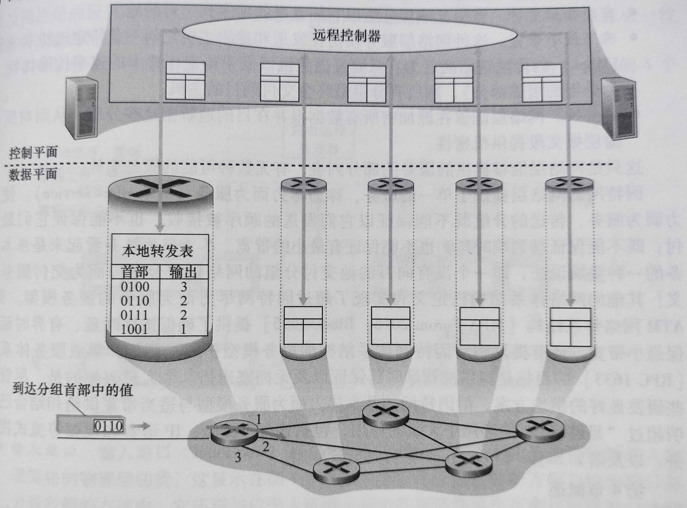
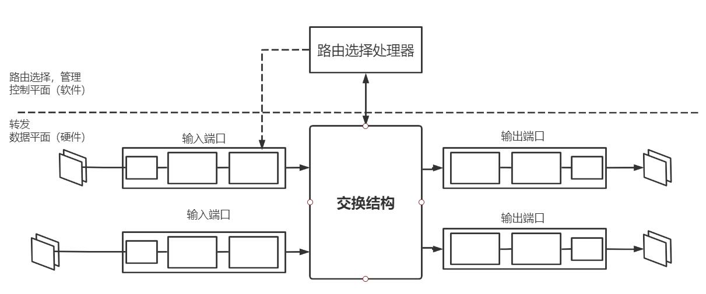
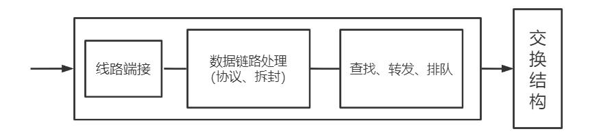
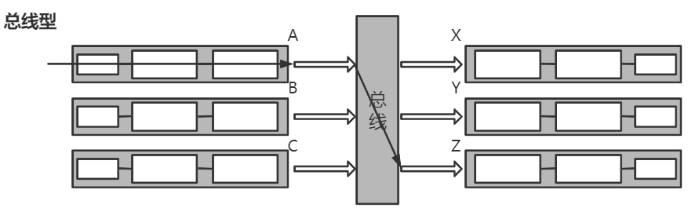
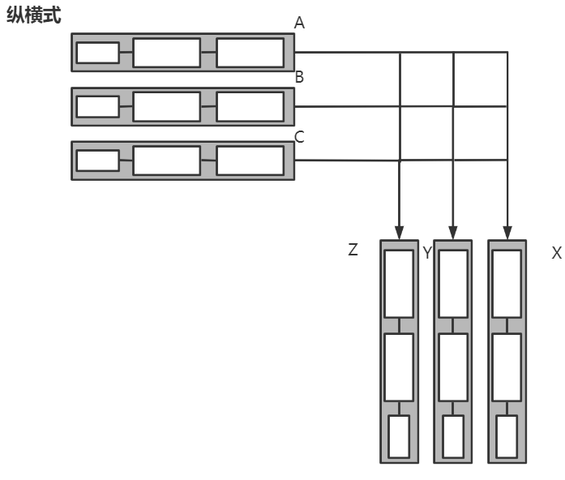
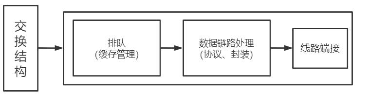
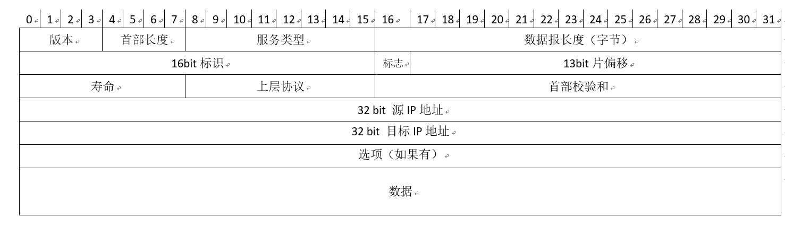
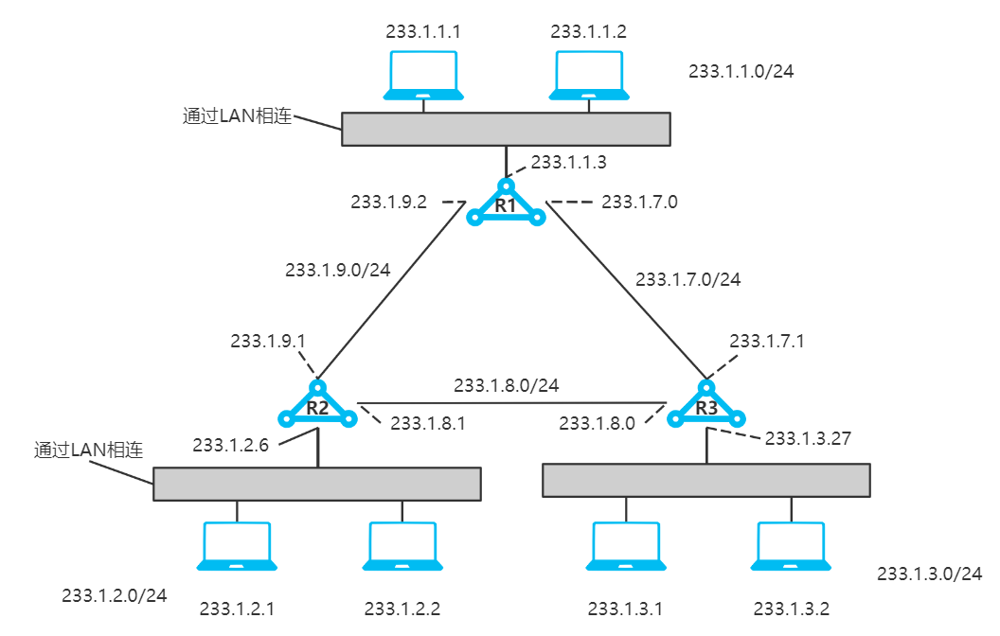

[TOC]

# 计算机网络

## 三、网络层：

>  网络层可以被分解为相互作用的两个部分：**数据平面**和**控制平面**

功能：

* 转发：将分组从一个**输入链路**接口转移到适当的**输出链路**接口的路由器本地动作。（==数据平面==）
* 路由选择：确定分组从**源**到**目的地**所采取的端到端路径的网络范围**处理过程**。

问题：

* 运输层能够**指望**网络层将该分组交付给目的地吗？
* 当发送多个分组时，它们会按发送顺序**按序交付**给接收主机的运输层吗？
* 发送两个连续分组信息的**时间间隔**与接收到两个分组的时间间隔相同吗？
* 网络层会提供拥塞的**反馈信息**吗？
* 在发送主机与接收主机中连接运输层通道的**抽象视图**是什么？

网络服务模型：定义了分组在发送与接收端系统之间的端到端运输特性

注：因特网提供了单一的服务列表，称为**尽力而为服务**（best-effort service）。不确保任何事情。

### （一）、数据平面：

核心：网络层中每台路由器的功能，

作用：决定到达路由器的==数据报== 如何从路由器的输入链路到输出链路

#### 1、路由器体系结构：

（1）输入端口：

* 最左侧：执行终结入物理链路的物理层功能
* 中间部分：与远端的数据链路层交互，执行数据链路层功能
* 最右端：执行查找功能，通过转发表决定路由器的输出端口

（2）交换结构：将路由器的输入端口连接到输出端口

（3）输出端口：存储从交换结构传来的分组，并执行必要的物理层和数据链路层功能

（4）路由选择处理器：执行控制平面功能，执行路由选择协议。

注意：(1)(2)(3)通常由硬件来实现，假设10Gbps的输入链路和64B的IP数据报，输入端口只有51.2ns的时间来处理，这远快于软件处理的时间。

#### 2、输入端口处理：

查找：通过转发表进行查找输出端口（转发表使用最长前缀匹配规则），为了实现纳秒级搜索，提供了硬件与软件支持：

* 快速查找算法
* DRAM与SRAM。实践中经常使用**三态内容可寻址存储器**(TCAM)查找

转发：

* 基于目的地的转发
* 通用转发

排队：当交换结构出现堵塞时，必须要在输入端口处排队

其他动作：

①物理层和链路层处理

②校验：检查分组的版本好、校验和以及寿命字段，并且需要重写后两个字段

③必须要更新用于网络管理的计数器

> **匹配加动作**：在路由器和交换机中特别常见的**抽象**结构

#### 3、交换结构：

①内存交换：由CPU（路由选择处理器）的直接控制完成，输入输出端口类似于操作系统的中I/O。

* 优点：简单
* 缺点：假设内存的可读性带宽为B分组/s，则总的吞吐率==不会超过==B/2

②总线交换：

​	输入端口预先在分组首部添加==字段==（指示输出端口）

​	分组可由**所有端口**收到，但只有首部**匹配**的端口才会**保存**

* 优点：简单，速率相对于内存交换更快，
* 缺点：一次只能通过一个分组，使得总吞吐量受到总线速率影响

③互联网络交换：

由2N条总线组成的互联网络，连接N个输入端口，N个输出端口。每条总线的交叉点通过交换结构控制，使得当分组到达A的时候可以传送到X，同时来自B端口的

分组可以到达Y。

* 优点：吞吐率极高，克服了单一、共享式总线带宽限制
* 缺点：复杂

> Cisco CRS利用三级非阻塞交换策略，可以将分组分成==k个==小块发送到互联网络中，然后在端口处组装

#### 4、输出端口处理

(1)、何时出现排队：

定义：

R~line~ ： 输入线路速度与输出线路传输速率（单位：分组/秒）

R~switch~ : 交换结构传送速率

①输入排队：R~line~ > n * R~switch~，这种被称为**HOL阻塞**（线路前部阻塞），即使输出端口空闲，输入队列中的排队也必须等待交换结构进行传送

②输出排队：R~switch~ > n * R~line~，当输出队列满时，采取丢弃策略：

* 删除一个或多个**已排队**的分组
* 丢弃**新来**的分组

B(缓存大小) = RTT(往返时延) * C(链路带宽)

当有N条TCP流时（N很大）：B = RTT * C / N^0.5^

(2)、分组调度：确定分组的传送**次序**问题

①先进先出FIFO

②**优先权**排队：

* 为每个队列分配一个优先权W，当选择一个分组传输时，将从队列为**非空**的**最高优先权**队列中挑出一个分组。
* 在同一优先权类的分组，以**FIFO**先到先服务的规则。
* 在非抢占式调度的情况下，一旦分组开始传输，就不能被打断

③**循环**排队规则：由于每个队列并非有严格的优先顺序，因此采用轮询的方式，循环调度每个分组

具体实现：加权公平排队WFQ

为每个队列 **i** 设置权值 **W i**，保证每个队列在相同时间间隔内，接收到的服务部分等于W i / ( ΣW j)，ΣW j为所有权重之和。

这样保证了即使在最坏的情况下，队列i能分配到带宽W i / ( ΣW j)部分

5、网际协议：IPv4，IPv6，寻址

(1)、IPv4

* 版本号：规定了数据报**IP协议**的**版本**。确定了路由器如何==解释==IP报剩余部分
* 首部长度：确定数据报中**数据载荷**的实际**开始**位置，IP数据报具有20字节的首部
* 服务类型(TOS)：区分不同服务类型的IP数据报（要求低时延，高吞吐量或可靠性的数据报）
* 数据报长度：**理论**最大长度为2^16^ = 65536字节，但受限于**以太网**帧的载荷（1500字节）
* 标识、标志、片偏移：与IP分片有关，在IPv6中不允许对IP分片
* 寿命(TTL) : 每经过一台路由器**减一**，确保数据报不会在网络中**循环**
* 上层协议：**指示**IP报数据部分应该交付于哪个运输层协议处理。只有在最终目的处才会使用，TCP：6，UDP：17
* 首部校验和：校验IP数据报**首部**中的bit错误。只在IP层有作用
* 源和目的IP地址：发报的数据源IP地址，以及最终目的IP地址，通常由DNS服务器解析
* 选项：允许IP首部被扩展。但由于选项的存在，使得解析IP数据报过于复杂，因此在IPv6中已经去掉。
* 数据：有效载荷

①数据报分片：将较大的数据报分成小的数据报以适应链路层上的载荷，小的数据报称为片（fragment）

原因：链路层帧严格限制IP数据报长度。（能承载的最大传送单元**MTU**）

* 数据报中的**标识**用来确定哪些数据报属于同一个**较大的**数据报

* **最后**一个片的标志为0，其他为1
* 用**片偏移**使目的主机确定是否丢失了一个片

②IPv4编址：采用**点分十进制**表示

> 主机与物理链路之间的边界称为**接口**，每个IP地址与接口相关

子网：分开主机和路由器的每个接口，产生几个隔离的网络岛，使用接口端连接这些隔离的网络端点，每个**隔离**的网络都叫做**子网**。（通俗：每个**相同的网段**都称为一个子网）。例如下图中有6个子网。

CIDR（无类别域间路由选择）：使用子网寻址时，将IP地址分成两部分：

* a.b.c.d/x，x指示了地址的第一部分的bit数。（被称为**网络前缀**）
* 地址的剩余 32 - x bit用于标识该组织内部设备。可用于继续划分子网

> ==地址聚合==：使用**单个**网络前缀通告**多个**网络的能力，如果匹配多个地址，则采用==最长前缀匹配==

### （二）、控制平面

