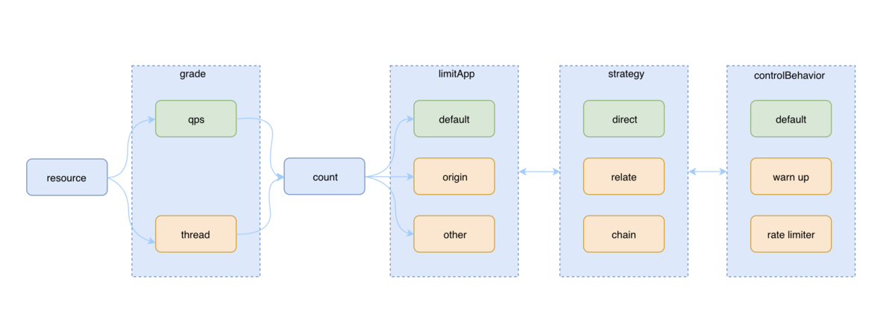
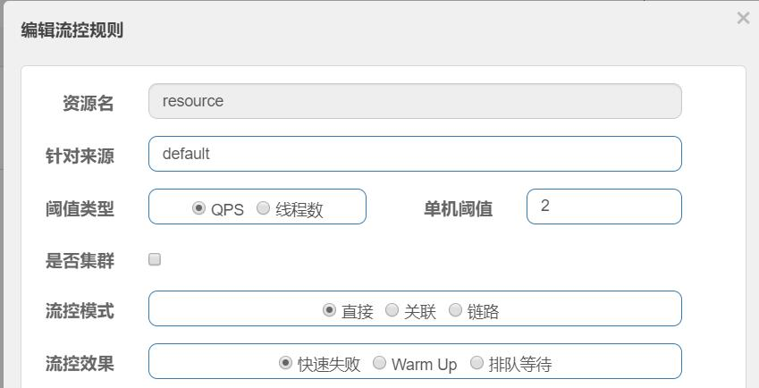

[toc]

## SpringCloud Alibaba Sentinel学习

### Sentinel的三大功能：限流，降级，系统保护

限流规则的定义：

```java
private static void initFlowQpsRule() {
        List<FlowRule> rules = new ArrayList<FlowRule>();
        FlowRule rule1 = new FlowRule();
        rule1.setResource(KEY);//设置需要限流的资源
        // set limit qps to 20
        rule1.setCount(20);
        // 设置限流类型：根据qps
        rule1.setGrade(RuleConstant.FLOW_GRADE_QPS);
        rule1.setLimitApp("default");
        rules.add(rule1);
        // 加载限流的规则
        FlowRuleManager.loadRules(rules);
    }

```

**resource**: 规则的资源名

**grade**: 限流阈值类型，qps 或线程数

**count**: 限流的阈值

**limitApp**: 被限制的应用，授权时候为逗号分隔的应用集合，限流时为单个应用

- default

  表示不区分调用者，来自任何调用者的请求都将进行限流统计。

- {some_origin_name}
	表示针对特定的调用者，只有来自这个调用者的请求才会进行流量控制。

- other

  表示除 {some_origin_name} 以外的其余调用方的流量进行流量控制。

  例如：资源 `NodeA` 配置了一条针对调用者 **caller1** 的限流规则，同时又配置了一条调用者为 **other** 的规则，那么任意来自非 **caller1** 对 `NodeA` 的调用，都不能超过 **other** 这条规则定义的阈值。

**strategy**: 基于调用关系的流量控制

- **STRATEGY_DIRECT**

  根据调用方进行限流。ContextUtil.enter(resourceName, origin) 方法中的 origin 参数标明了调用方的身份。

  如果 strategy 选择了DIRECT ，则还需要根据限流规则中的 limitApp 字段根据调用方在不同的场景中进行流量控制，包括有：”所有调用方“、”特定调用方origin“、”除特定调用方origin之外的调用方“。

- **STRATEGY_RELATE**

  根据关联流量限流。当两个资源之间具有资源争抢或者依赖关系的时候，这两个资源便具有了关联，可使用关联限流来避免具有关联关系的资源之间过度的争抢。

  比如对数据库同一个字段的读操作和写操作存在争抢，读的速度过高会影响写得速度，写的速度过高会影响读的速度。

  举例来说：read_db 和 write_db 这两个资源分别代表数据库读写，我们可以给 read_db 设置限流规则来达到写优先的目的：设置 FlowRule.strategy 为 RuleConstant.STRATEGY_RELATE，同时设置 FlowRule.refResource 为 write_db。这样当写库操作过于频繁时，读数据的请求会被限流。

- **STRATEGY_CHAIN**

  根据调用链路入口限流。假设来自入口 Entrance1 和 Entrance2 的请求都调用到了资源 NodeA，Sentinel 允许根据某个入口的统计信息对资源进行限流。

  举例来说：我们可以设置 FlowRule.strategy 为 RuleConstant.CHAIN，同时设置 FlowRule.refResource 为 Entrance1 来表示只有从入口 Entrance1 的调用才会记录到 NodeA 的限流统计当中，而对来自 Entrance2 的调用可以放行。

**controlBehavior**：流控策略

- CONTROL_BEHAVIOR_DEFAULT

  这种方式是：**直接拒绝**，该方式是默认的流量控制方式，当 qps 超过任意规则的阈值后，新的请求就会被立即拒绝，拒绝方式为抛出FlowException。

  这种方式适用于对系统处理能力确切已知的情况下，比如通过压测确定了系统的准确水位。

- CONTROL_BEHAVIOR_WARM_UP

  这种方式是：**排队等待** ，又称为 **冷启动**。该方式主要用于当系统长期处于低水位的情况下，流量突然增加时，直接把系统拉升到高水位可能瞬间把系统压垮。

  通过"冷启动"，让通过的流量缓慢增加，在一定时间内逐渐增加到阈值上限，给冷系统一个预热的时间，避免冷系统被压垮的情况。

- CONTROL_BEHAVIOR_RATE_LIMITER

  这种方式是：**慢启动**，又称为 **匀速器模式**。这种方式严格控制了请求通过的间隔时间，也即是让请求以均匀的速度通过，对应的是漏桶算法。

  这种方式主要用于处理间隔性突发的流量，例如消息队列。想象一下这样的场景，在某一秒有大量的请求到来，而接下来的几秒则处于空闲状态，我们希望系统能够在接下来的空闲期间逐渐处理这些请求，而不是在第一秒直接拒绝多余的请求。



对应的控制台：




### Sentinel的核心：资源的定义，规则的配置，代码中的埋点

示例：

```java
    @GetMapping("/resource")
    @SentinelResource(value = "resource",blockHandler = "exHandler",blockHandlerClass = {ExceptionUtils.class})//注解方式定义资源，规则配置，埋点
    public String resource() {
        String resourceName = "resource";//代码方式进行资源的定义，规则配置在sentinel的控制台
        Entry entry = null;
        String retVal;
        try {
            //埋点，EntryType.IN是对进来的资源做限制，EntryType.OUT是对放出的资源做限制
            entry= SphU.entry(resourceName, EntryType.IN);
            retVal = "passed";
        } catch (BlockException e) {
            retVal = "block";
        }
        return retVal;
    }
```

### CommandCenter

sentinel-core 在第一次规则被触发的时候，启动了一个 CommandCenter，也就是我们引入的 sentinel-transport-simple-http 依赖中被引入的实现类：**SimpleHttpCommandCenter**。

这个 SimpleHttpCommandCenter 类中启动了两个线程池：主线程池和业务线程池。

主线程池启动了一个 ServerSocket 来监听默认的 8719 端口，如果端口被占用，会自动尝试获取下一个端口，尝试3次。

业务线程池主要是用来处理 ServerSocket 接收到的数据。可以看出用的是传统的**BIO**模式

```java
public class SimpleHttpCommandCenter implements CommandCenter {
    // 省略初始化
    private ExecutorService executor;//主线程池
    private ExecutorService bizExecutor;
    @Override
    public void start() throws Exception {
        Runnable serverInitTask = new Runnable() {
            int port;
            {
                try {
                    port = Integer.parseInt(TransportConfig.getPort());
                } catch (Exception e) {
                    port = DEFAULT_PORT;
                }
            }
            @Override
            public void run() {
                // 获取可用的端口用以创建一个ServerSocket
                ServerSocket serverSocket = getServerSocketFromBasePort(port);
                if (serverSocket != null) {
                    // 在主线程中启动ServerThread用以接收socket请求
                    executor.submit(new ServerThread(serverSocket));
                    // 省略部分代码
                } else {
                    CommandCenterLog.info("[CommandCenter] chooses port fail, http command center will not work");
                }
                executor.shutdown();
            }
        };
        new Thread(serverInitTask).start();
    }

    class ServerThread extends Thread {
        private ServerSocket serverSocket;
        ServerThread(ServerSocket s) {
            this.serverSocket = s;
        }

        @Override
        public void run() {
            while (true) {
                Socket socket = null;
                try {
                    socket = this.serverSocket.accept();
                    setSocketSoTimeout(socket);
                    // 将接收到的socket封装到HttpEventTask中由业务线程去处理
                    HttpEventTask eventTask = new HttpEventTask(socket);
                    bizExecutor.submit(eventTask);
                } catch (Exception e) {
                    // 省略部分代码
                }
            }
        }
    }
}
```


