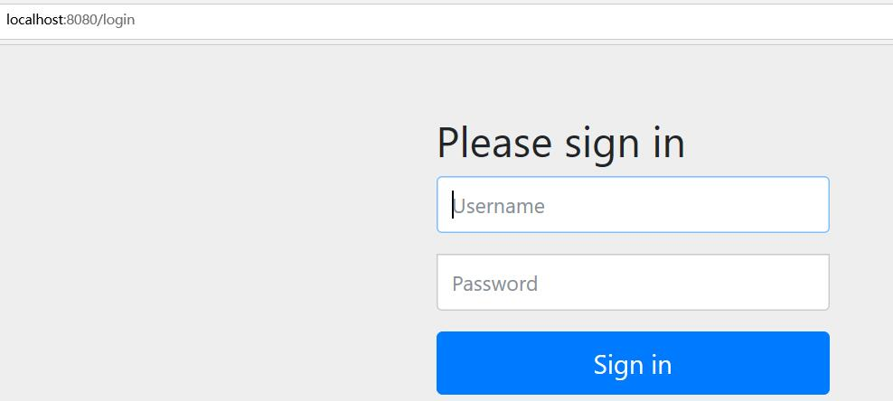

# SpringSecurity学习


[toc]

## 前言

安全的核心：“认证”和“授权”

## 1.SpringSecurity基本原理

Security内置了多种filter组成了filter链：


UsernamePasswordAuthenticationFilter：用来处理表单登录

BasicAuthenticationFilter：用来处理basic登录

FilterSecurityInterceptor：最后一个过滤器用来判断用户权限，决定请求是否能通过，不过则抛出异常

ExceptionTranslationFilter：用来捕获FilterSecurityInterceptor这个过滤器抛出的异常，根据抛出异常进行相应的处理

## 2.Security filter调用流程

测试用例：

Controller层代码：

```java
@RestController
public class HelloController {
    @GetMapping("/hello")
    public String hello(){
        System.out.println("hello");
        return "hello";
    }
}
```

启动springboot，浏览器输入http://localhost:8080/hello

此时代码停到ExceptionTranslationFilter.java中：


接下来继续调试，跳转到FilterSecurityInterceptor.java中的invoke()方法：


继续调试发现没有权限，抛出异常回到上一层ExceptionTranslationFilter中，然后该类根据相应异常进行处理：


根据异常类型跳转到登录页面



输入用户名密码后：


可以看出调用顺序：


## 3、Security中的filter

1.**ChannelProcessingFilter**，使用它因为我们可能会指向不同的协议(如:Http,Https)

 2.**SecurityContextPersistenceFilter**,负责从SecurityContextRepository 获取或存储 SecurityContext。SecurityContext 代表了用户安全和认证过的session

 3.**ConcurrentSessionFilter**,使用SecurityContextHolder的功能，更新来自“安全对象”不间断的请求,进而更新SessionRegistry

 4.认证进行机制，**UsernamePasswordAuthenticationFilter**，**CasAuthenticationFilter**，**BasicAuthenticationFilte**r等等--SecurityContextHolder可能会修改含有Authentication这样认证信息的token值

 5.**SecurityContextHolderAwareRequestFilter**,如果你想用它的话，需要初始化spring security中的HttpServletRequestWrapper到你的servlet容器中。

 6.**JaasApiIntegrationFilter**，如果JaasAuthenticationToken在SecurityContextHolder的上下文中，在过滤器链中JaasAuthenticationToken将作为一个对象。

 7.**RememberMeAuthenticationFilter**，如果还没有新的认证程序机制更新SecurityContextHolder，并且请求已经被一个“记住我”的服务替代，那么将会有一个Authentication对象将存放到这（就是 已经作为cookie请求的内容）。

 8.**AnonymousAuthenticationFilter**，如果没有任何认证程序机制更新SecurityContextHolder，一个匿名的对象将存放到这。

 9.**ExceptionTranslationFilter**，为了捕获spring security的错误，所以一个http响应将返回一个Exception或是触发AuthenticationEntryPoint。

 10.**FilterSecurityInterceptor**，当连接被拒绝时，保护web URLS并且抛出异常。

## 4、OAuth2协议


## 5、 Security 整合Spring Gateway实战

## 一、安全模块

一共有三个模块：authorization-server，gateway-server，other-server

###  1、框架：Spring Cloud OAuth2，Spring Gateway 

###  2、内容
协议：使用OAuth2协议

token：使用OAuth2中内置的JwtToken进行授权

token加密方式：使用非对称加密，签名的方式是使用对称加密，不安全

步骤如下：

```shell
keytool -genkeypair -alias python-jwt -validity 3650 -keyalg RSA -keypass python -keystore python-jwt.jks -storepass python
生成公钥
keytool -list -rfc --keystore python-jwt.jks | openssl x509 -inform pem -pubkey
输入口令：
python
出现公钥和证书：
-----BEGIN PUBLIC KEY-----
MIIBIjANBgkqhkiG9w0BAQEFAAOCAQ8AMIIBCgKCAQEAhmQLtcFF97ETcDTq5SRM
KXIZn/YlVBDyp5237ZPjA2oDaSkWloEoqSKKyvKuPoZbbjQN4Jlq7ueiuSWrs2Sd
gkRz3pqjuBQt8nTSQV1071M5/wgz3FE/6OM1akuYCevxdHKd7dQqwmGkegI+zYjF
3Gd+feLlzhow4iIxZMXOZWR7TRP0ZDXetCNH2kSnIP2nc8xUuBNhHMX/EWA7YhKA
eFuRjCB/86xEq8Zli5sE8Sp/jWgYl8DvGcuDatlcyuC4i4gnDaCTGGUZqEFYvHvR
Cx1Jsi+pRGy/fzSLQaayEJ9HPfE/ZudIxgVhAZbweTxpQXftM8cmNpJvZKYAa107
JQIDAQAB
-----END PUBLIC KEY-----
```

将生成的python-jwt.jks，放到认证微服务resources目录下，将生成的公钥内容粘贴到public.cert中，然后放到资源微服务resources目录下（gateway集中进行鉴权，放行），以上操作均在linux环境下

模式：OAuth2协议中一共有五种模式，本项目中使用的是password模式

“authorization_code”:

“password”:

“client_credentials”:

“implicit”:

“refresh_token”: