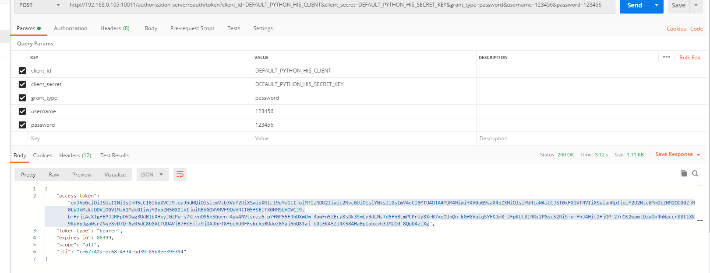
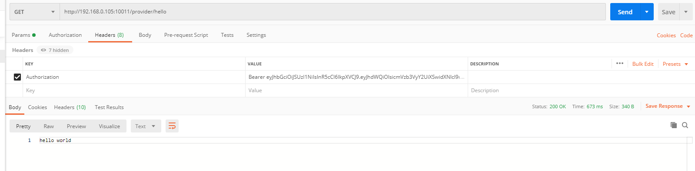

# HIS项目技术文档

## 一、安全模块

一共有三个模块：authorization-server，gateway-server，other-server

### 1、框架：Spring Cloud OAuth2，Spring Gateway

### 2、主要功能：图形验证码（完成），短信 验证码（完成），OAuth2授权、认证（完成），gateway路由转发（完成），JwtToken非对称加密（完成），定时更新KeyStore（未完成）

### 3、内容
协议：使用OAuth2协议

token：使用OAuth2中内置的JwtToken进行授权

token加密方式：使用非对称加密

步骤如下：

```shell
keytool -genkeypair -alias python-jwt -validity 3650 -keyalg RSA -keypass python -keystore python-jwt.jks -storepass python
生成公钥
keytool -list -rfc --keystore python-jwt.jks | openssl x509 -inform pem -pubkey
输入口令：
python
出现公钥和证书：
-----BEGIN PUBLIC KEY-----
MIIBIjANBgkqhkiG9w0BAQEFAAOCAQ8AMIIBCgKCAQEAhmQLtcFF97ETcDTq5SRM
KXIZn/YlVBDyp5237ZPjA2oDaSkWloEoqSKKyvKuPoZbbjQN4Jlq7ueiuSWrs2Sd
gkRz3pqjuBQt8nTSQV1071M5/wgz3FE/6OM1akuYCevxdHKd7dQqwmGkegI+zYjF
3Gd+feLlzhow4iIxZMXOZWR7TRP0ZDXetCNH2kSnIP2nc8xUuBNhHMX/EWA7YhKA
eFuRjCB/86xEq8Zli5sE8Sp/jWgYl8DvGcuDatlcyuC4i4gnDaCTGGUZqEFYvHvR
Cx1Jsi+pRGy/fzSLQaayEJ9HPfE/ZudIxgVhAZbweTxpQXftM8cmNpJvZKYAa107
JQIDAQAB
-----END PUBLIC KEY-----
```

将生成的python-jwt.jks，放到认证微服务上，将生成的公钥放到资源服务上（gateway集中进行鉴权，放行）

导出证书：

```java
keytool -export -alias python-jwt -keystore python-jwt.jks -rfc -file ck.crt
在当前目录生成ck.crt证书

	public static void main(String[] args) throws Exception {
 
		String cerPath = "";		//证书文件路径
		String storePath = "";	//证书库文件路径
		String alias = "";		//证书别名
		String storePw = "";	//证书库密码
		String keyPw = "";	//证书密码
 
		System.out.println("从证书获取的公钥为:" + getPublicKey(cerPath));
		System.out.println("从证书获取的私钥为:" + getPrivateKey(storePath, alias, storePw, keyPw));
 
	}
 
	
	private static String getPublicKey(String cerPath) throws Exception {
		CertificateFactory certificatefactory = CertificateFactory.getInstance("X.509");
		FileInputStream fis = new FileInputStream(cerPath);
		X509Certificate Cert = (X509Certificate) certificatefactory.generateCertificate(fis);
		PublicKey pk = Cert.getPublicKey();
		String publicKey = new BASE64Encoder().encode(pk.getEncoded());
		return publicKey;
	}
```

模式：OAuth2协议中一共有五种模式，本项目中使用的是password模式

“authorization_code”:

“password”:

“client_credentials”:

“implicit”:

“refresh_token”:			

### 4、测试：

postman测试验证授权服务：



postman通过gateway鉴权，获取资源

