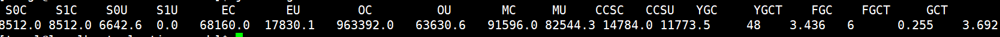
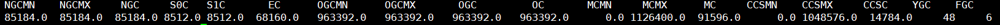

1、jps -m 查看应用ID 

2、jstack 应用ID  检查应用的**死锁**情况

3、查看java字节码：在项目的根目录下输入 javap -verbose 包名+类名

4、jstat 			显示应用状态
-class pid			: 显示加载class的数量，及所占空间等信息
-compiler pid		:显示VM实时编译的数量等信息
-gc pid		:显示gc信息

S0C：第一个幸存区的大小(字节)
S1C：第二个幸存区的大小
S0U：第一个幸存区的使用大小
S1U：第二个幸存区的使用大小
EC：伊甸园区的大小
EU：伊甸园区的使用大小
OC：老年代大小
OU：老年代使用大小
MC：方法区大小
MU：方法区使用大小
CCSC:压缩类空间大小
CCSU:压缩类空间使用大小
YGC：年轻代垃圾回收次数
YGCT：年轻代垃圾回收消耗时间（秒）
FGC：老年代垃圾回收次数
FGCT：老年代垃圾回收消耗时间（秒）
GCT：垃圾回收消耗总时间（秒）
-gccapacity pid

NGCMN：新生代最小容量
NGCMX：新生代最大容量
NGC：当前新生代容量
S0C：第一个幸存区大小
S1C：第二个幸存区的大小
EC：伊甸园区的大小
OGCMN：老年代最小容量
OGCMX：老年代最大容量
OGC：当前老年代大小
OC:当前老年代大小
MCMN:最小元数据容量
MCMX：最大元数据容量
MC：当前元数据空间大小
CCSMN：最小压缩类空间大小
CCSMX：最大压缩类空间大小
CCSC：当前压缩类空间大小
YGC：年轻代gc次数
FGC：老年代GC次数

5、jmap -hisof:live {pid} 打印java当前**存活对象**信息

​	jmap -heap {pid} 打印java**堆内存**信息

6、jvisualvm：提供java**进程可视化界面**