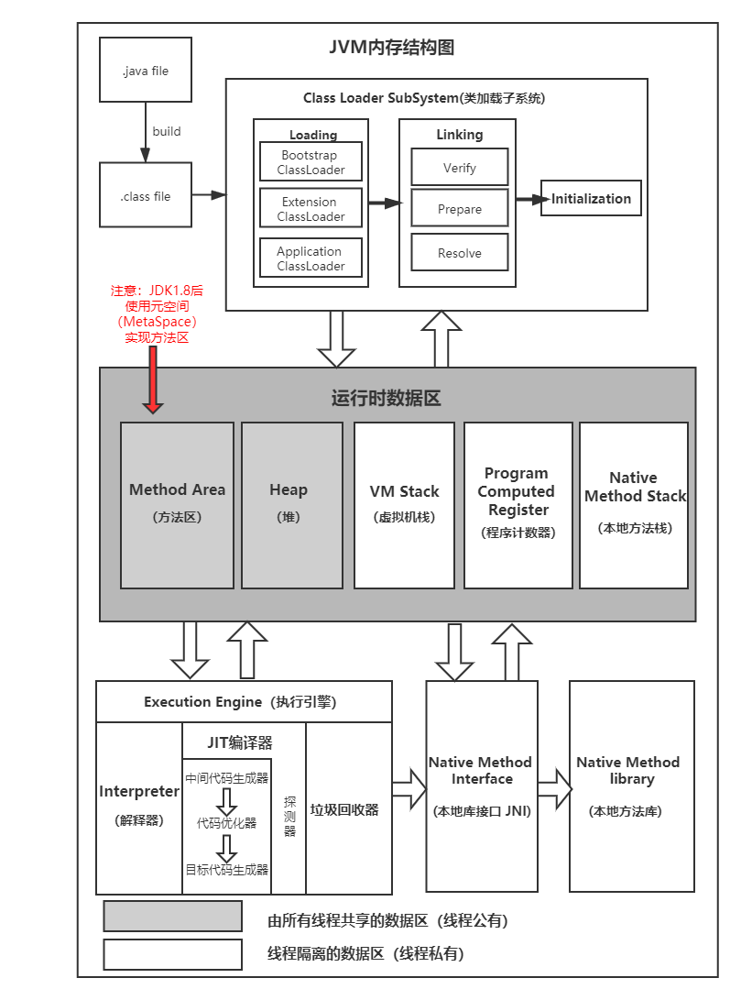
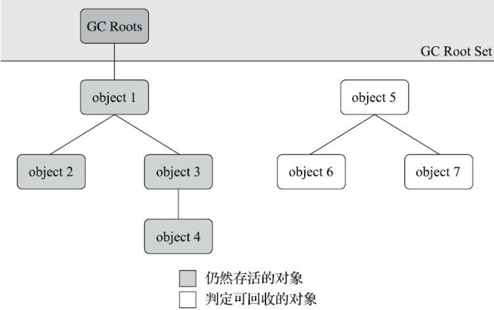
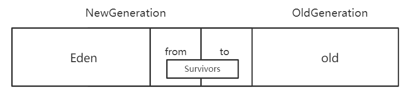

[TOC]




### 一、基础部分

#### (一)、jvm内存区域

1、PC（程序计数器）

> 当前线程执行的字节码的行号指示器。
>
> 如果线程正在执行的是一个**Java方法**， 这个计数器记录的是正在执行的虚拟机字节码==指令的地址==； 如果正在执行的是**本地（Native）** 方法， 这个计数器值则应为==空（Undefined）== 。 此内存区域是唯一一个在《Java虚拟机规范》 中没有规定任何**OutOfMemoryError**情况的区域。  

2、虚拟机栈

> 线程私有的 ,每个方法被执行的时候， Java虚拟机都会同步创建一个栈帧（Stack Frame）用于存储局部变量表、 操作数栈、 动态连接、 方法出口等信息。  
>
> **局部变量表**存放了**编译期**可知的各种Java虚拟机==基本数据类型==、 对象引用 和returnAddress类型（指向了一条字节码指令的地址）

> 规定了两类异常情况：
>
> ①如果线程==请求的栈深度==大于虚拟机所允许的深度， 将抛出**StackOverflowError**异常 
>
> ②线程申请栈空间失败时， 会出现**OOM**异常  

> 本地方法栈同虚拟机栈类似，区别在于：本地方法栈为虚拟机调用到的==本地方法==服务。

3、堆

> 堆是被所有==线程共享==的一块内存区域，此内存区域的唯一目的就是存放**对象实例**。（线程共享的Java堆中可以划分出多个**线程私有**的分配缓冲区（TLAB）， 以提升对象**分配**时的效率  ）
>
> 堆中没有内存完成实例分配， 并且堆也无法扩展时， Java虚拟机将会抛出==OutOfMemoryError==异常。  

4、方法区

> ==线程共享==的一块内存区域，用于存储已被虚拟机加载的类型信息、常量、静态变量、即时编译器编译后的代码缓存等数据。
>
> 方法区无法满足新的内存分配需求时， 将抛出**OutOfMemoryError**异常  

5、运行时常量池

> 用于存放编译期生成的各种==字面量==与==符号引用==，也可以在运行期间将==新的常量==放入池中
>
> 当常量池无法再申请到内存时会抛出==OutOfMemoryError==异常  

6、直接内存

> 可以使用Native函数库==直接分配堆外内存==， 然后通过一个存储在Java堆里面的DirectByteBuffer对象作为这块内存的引用进行操作。
>
> 本机直接内存的分配不会受到Java堆大小的限制， 但是会受到本机==总内存大小==以及==处理器寻址空间==的限制，当内存无法满足动态扩展时，抛出**OutOfMemoryError**

#### (二)、对象

1、对象创建：当遇到一条**new**指令时

> ①将去检查这个指令的参数是否能在常量池中定位到一个类的**符号引用**， 并且检查这个符号引用代表的**类是否已被加载、 解析和初始化**
>
> ②类加载检查通过后， 接下来虚拟机将为新生对象**分配内存**。  
>
> 内存分配方式：
>
> （1）==指针碰撞==：Java堆中内存是**绝对规整**的，被使用过的内存都被放在一边， 空闲的内存被放在另一边，中间放着一个指针作为分界点的指示器， 那所分配内存就仅仅是把那个指针向空闲空间方向挪动一段与对象大小相等的距离。
>
> （2）==空闲列表==：Java堆中的内存**不是规整**的，虚拟机就必须维护一个列表，记录上哪些内存块是可用的， 在分配的时候从列表中找到一块足够大的空间划分给对象实例， 并更新列表上的记录。
>
> Java堆规整由所采用的垃圾收集器是否带有==空间压缩整理的能力==决定。  
>
> 内存分配在==并发情况==的线程安全问题：
>
> （1）对分配内存空间的动作进行同步处理：虚拟机采用CAS配上失败重试的方式保证更新操作的**原子性** 
>
> （2）内存分配的动作按照线程划分在不同的空间之中进行， 即每个线程在Java堆中预先分配一小块内存， 称为本地线程分配缓冲  
>
> ③虚拟机必须将分配到的内存空间（但不包括对象头）都初始化为**零值**， 如果使用了TLAB的话， 这一项工作也可以提前至TLAB分配时顺便进行。
>
> ④设置对象头：这个对象是哪个类的实例、如何才能找到类的元数据信息、对象的哈希码、对象的GC分代年龄等信息    

2、对象的内存布局

对象头：

> 运行时自身的数据：哈希码（HashCode）、GC分代年龄、锁状态标志、线程持有的锁、偏向线程ID、偏向时间戳 
>
> 类型指针：即对象指向它的==类型元数据==的指针， Java虚拟机通过这个指针来确定该对象是哪个类的实例  

```c++
// Bit-format of an object header (most significant first, big endian layout below):
//
// 32 bits:
// --------
// hash:25 ------------>| age:4 biased_lock:1 lock:2 (normal object)// 
// JavaThread*:23 epoch:2 age:4 biased_lock:1 lock:2 (biased object)
// size:32 ------------------------------------------>| (CMS free block)
// PromotedObject*:29 ---------->| promo_bits:3 ----->| (CMS promoted object)
```

实例数据：对象真正存储的有效信息 (在程序代码里面所定义的各种类型的字段内容，包括从==父类继承==下来的)

> 字段分配顺序受虚拟机分配策略参数（-XX： FieldsAllocationStyle参数）和字段在Java源码中定义顺序的影响。  

对齐填充：起着占位符的作用（HotSpot虚拟机的自动内存管理系统要求对象起始地址必须是==8字节==的整数倍）

3、对象的访问：Hotspot中使用的是直接访问

句柄访问：Java堆中将可能会划分出一块内存来作为句柄池， reference中存储的就是对象的句柄地址， 而句柄中包含了对象实例数据与类型数据各自具体的地址信息。

直接访问：Java堆中对象的内存布局就必须考虑如何放置访问类型数据的相关信息， reference中存储的直接就是对象地址。（只需要访问一次，速度快）

### 二、垃圾收集与内存分配

> **核心**：
>
> ==哪些内存需要回收？==
>
> ==什么时候回收？==
>
> ==如何回收？==

#### (一)、判断对象是否存活

1、引用计数法：在对象中添加一个==引用计数器==， 每当有一个地方引用它时， **计数器值就加一**； 当引用失效时， 计数器值就减一； 任何时刻计数器为零的对象就是不可能再被使用的。

> 优点：使用效率高
>
> 缺点：无法使用循环引用问题

2、可达性分析：通过一系列称为“GC Roots”的根对象作为起始节点集， 从这些节点开始， 根据==引用关系==向下搜索， 搜索过程所走过的路径称为“引用链”（Reference Chain），如果某个对象到GC Roots间没有任何引用链相连，则证明此对象是不可能再被使用的。

> 

GC Roots的对象 :

> ·在虚拟机==栈==（栈帧中的本地变量表） 中==引用的对象==。
> ·在==方法区中类静态属性==引用的对象， 譬如Java类的引用类型静态变量。（static修饰）
> ·在==方法区中常量==引用的对象， 譬如字符串常量池（String Table） 里的引用。(final修饰)
> ·在本地方法栈中==JNI==（即通常所说的Native方法） 引用的对象。
> ·Java虚拟机内部的引用， 如基本数据类型对应的==Class对象==，常驻的==异常对象==（比如NullPointExcepiton）等，还有==系统类加载器==。
> ·所有被==同步锁==（synchronized关键字） 持有的对象。
> ·反映Java虚拟机内部情况的JMXBean、 JVMTI中注册的回调、 本地代码缓存等  

补充：java中的引用类型

> ①强引用：程序代码之中普遍存在的引用赋值。Object obj **=** new Object() ，只要==强引用关系存在==， 垃圾收集器就==永远不会回收==被引用的对象。 
>
> ②软引用：用来描述一些还有用， 但非必须的对象。 被软引用关联着的对象，只有在系统**将**要发生==内存溢出==异常前，才会把这些对象列进回收范围之中进行第二次回收 。(**SoftReference**)
>
> ③弱引用：用来描述那些非必须对象， 但是它的强度比软引用更弱一些， 被弱引用关联的对象**只能**生存到==下一次垃圾收集==发生为止。 当垃圾收集器开始工作， 无论当前内存是否足够， 都会回收掉只被弱引用关联的对象。(**WeakReference**)
>
> ④虚引用：**最弱**的一种引用关系，一个对象是否有虚引用的存在，完全不会对其生存时间构成影响，也无法通过虚引用来取得一个对象实例。为一个对象设置虚引用关联的唯一目的只是为了能在这个对象被**收集器回收**时收到一个**系统通知**。（类似与Object中finalize()的作用） (**PhantomReference**)

方法区的回收：==废弃的常量==和==不再使用的类型==

判断常量是否废弃：

> 没有任何字符串对象引用常量池中的“java”常量， 且虚拟机中也没有其他地方引用这个字面量

判断类型是否废弃：

> * 该类**所有的**实例都已经被回收， 也就是Java堆中不存在**该类**及其任何**派生子类**的实例 
> * 加载该类的**类加载器**已经被回收 （该条件很难达成）
> *  该类对应的java.lang.Class对象**没有**在任何地方**被引用**， 无法在任何地方通过==反射==访问该类的方法。  

（二）、垃圾收集算法

1、分代收集理论：

> （1）弱分代假说：==绝大多数==对象都是==朝生夕灭==的。
>
> （2）强分代假说：熬过==越多次==垃圾收集过程的对象就==越难以消亡==

设计原则： 收集器应该将Java堆划分出不同的区域， 然后将回收对象依据其==年龄==（年龄即对象熬过垃圾收集过程的次数） 分配到不同的区域之中存储。  

存在问题：可能出现跨代引用。因此引入第三条假说:

> （3）跨代引用假说：跨代引用相对于同代引用来说仅==占据少数==（由前两条假说逻辑推理得出：存在**相互引用**关系的两个对象，应该倾向于**同时消亡**的。举例，如果某个新生代对象存在跨代引用， 由于老年代对象**难以消亡**【假说2】， 该引用会使得新生代对象在收集时同样得以存活， 进而在年龄增长之后晋升到老年代中， 这时跨代引用也随即被消除了。）

补充：

* 新生代收集（ **Minor GC**/Young GC） ： 指目标只是新生代的垃圾收集。
* 老年代收集（ **Major GC**/Old GC） ： 指目标只是老年代的垃圾收集。 目前只有CMS收集器会有单
  独收集老年代的行为。 
* 混合收集（ Mixed GC）： 指目标是收集整个新生代以及部分老年代的垃圾收集。 目前只有G1收
  集器会有这种行为。
* 整堆收集（ **Full GC**）： 收集整个Java堆和方法区的垃圾收集。  

Hotspot划分堆内存的方式：



2、垃圾回收算法

标记-清除算法：（1）标记出所有需要回收的对象（2）在标记完成后， 统一回收掉所有被标记的对象  

标记-复制算法：将可用内存按容量划分为==大小相等==的两块， 每次只使用其中的一块。 当这一块的内存用完了，就将还存活着的对象复制到另外一块上面， 然后再把已使用过的内存空间一次清理掉。 

> Appel式回收：具体做法是把新生代分为一块较大的**Eden**空间和两块较小的**Survivor**空间（from，to）， 每次分配内存只使用Eden和其中一块Survivor。发生垃圾搜集时， 将Eden和Survivor中仍然存活的对象一次性复制到另外一块Survivor空间上， 然后直接清理掉Eden和已用过的那块Survivor空间。 HotSpot虚拟机默认Eden和Survivor的大小比例是**8∶1**。
>
> 当Survivor空间不足以容纳一次Minor GC之后存活的对象时， 就需要依赖其他内存区域进行分配担保 。

标记-整理算法：标记过程仍然与“标记-清除”算法一样， 但后续步骤是让所有存活的对象都向内存空间一端移动，然后直接清理掉边界以外的内存。

> 是否移动对象都存在弊端:
>
> * 移动则内存回收时会更复杂， 但是从整个程序的吞吐量来看， 移动对象会更划算。   
>
> * 不移动则内存分配时会更复杂。 从垃圾收集的停顿时间来看， 不移动对象停顿时间会更短， 甚至可以不需要停顿。 
>
> 解决方案：
>
> 平时**多数时间**都采用标记-清除算法， 暂时容忍内存碎片的存在， 直到内存空间的碎片化程度已经大到**影响对象分配**时， 再采用标记-整理算法收集一次， 以获得规整的内存空间。

