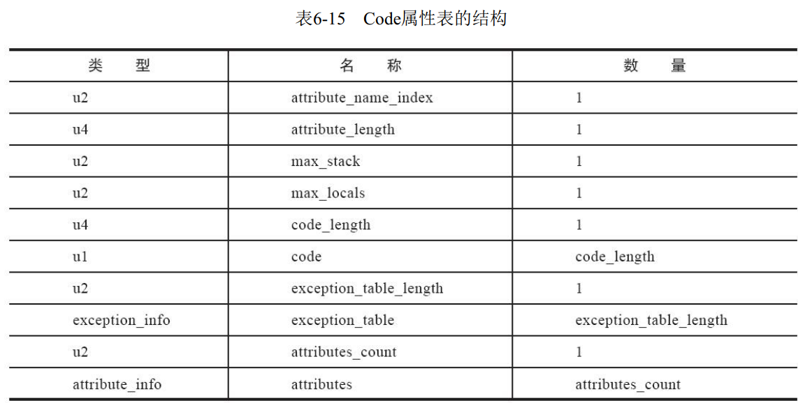

[TOC]

## 一、类文件结构

### (一)、class类文件的结构

> Class文件是一组以8个字节为基础单位的**二进制流**， 各个数据项目严格按照顺序紧凑地排列在文件之中， 中间没有添加任何分隔符  

class文件中只有两种数据结构：==无符号数==和==表==

==无符号数==：基本数据类型，u1,u2,u4,u8，分别代表1个字节、2个字节、4个字节和8个字节的无符号数。用来描述：数字、索引引用、数量值或字符串

==表==：由多个**无符号数**或者其他**表**作为数据项构成的复合数据类型，所有表的命名以“_info”结尾。用于描述有==层次关系==的复合结构数据

#### 1、class文件版本：

魔数：头4个字节，确定文件是否为**class**文件（0xCAFEBABE）

版本号：5、6字节次版本号，7、8字节主版本号（1.1为45.0）

#### 2、常量池：

常量池：比喻为Class文件里的==资源仓库==（主要存放两大类常量：字面量和符号引用）

接下来2个字节为常量池容量计数（u2类型，容量计数从1开始）

> 字面量：被声明为final的**常量值**
>
> 符号引用：
>
> 被模块导出或者开放的包（Package）
>
> 类和接口的全限定名（Fully Qualified Name）
>
> 字段的名称和描述符（Descriptor）
>
> 方法的名称和描述符
>
> 方法句柄和方法类型
>
> 动态调用点和动态常量

常量池中每一项常量都是一个表 ，表结构的第一位是u1类型的标志位。

#### 3、访问标志：常量池结束之后， 紧接着的2个字节代表访问标志。

#### 4、类索引、父类索引、接口索引：

类索引：u2类型，用于确定这个类的**全限定名** 

> 

父类索引：u2类型，用于确定这个类的父类的全限定名，除了java.lang.Object外每个类**都有父类 **

接口索引集合：由一组**u2类型**的集合构成，用来描述这个类实现了哪些接口， 这些被实现的接口将按**implements**关键字（如果这个Class文件表示的是一个接口， 则应当是extends关键字） 后的接口顺序**从左到右**排列在接口索引集合中。入口的第一项u2类型的数据为**接口计数器**（interfaces_count），表示索引表
的容量。  

#### 5、字段表集合：用于描述接口或者类中**声明**的变量（不包括父类或接口定义的变量），接下来两个字节表示类中字段的个数

​																					字段表结构

字段访问标志：

方法和字段的描述符：用来描述字段的数据类型、 方法的参数列表（包括数量、 类型以及顺序） 和返回值  

描述符描述方法：按照先==参数列表==、 后==返回值==的顺序描述， 参数列表按照参数的严格顺序放在一组小括号“()”之内。 如方法java.lang.String toString()的描述符为“()Ljava/lang/String；”  

#### 6、属性表集合

> 属性表：Class文件，方法表，字段表都可以携带自己的属性表集合，以描述某些场景专有的信息。

> 每一个属性， 它的名称都要从常量池中引用一个CONSTANT_Utf8_info类型的常量来表示，而属性值的结构则是完全自定义的，只需要通过一个**u4**的长度属性去说明属性值所占用的位数即可。一个符合规则的属性表应该满足表6-14中所定义的结构。  

​												属性表结构
| 类型 | 名称                 | 数量             |
| ---- | -------------------- | ---------------- |
| u2   | attribute_name_index | 1                |
| u4   | attribute_length     | 1                |
| u1   | info                 | attribute_length |

①Code属性：Java程序方法体里面的代码经过Javac编译器处理之后，变成==字节码指令==存储在Code属性内。

