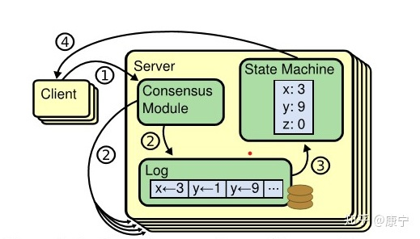
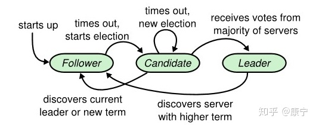

[TOC]

## 一、CAP理论：

### （一）CAP理论作为分布式系统的基础理论,它描述的是一个分布式系统在以下三个特性中：

- 一致性（**C**onsistency）：在分布式系统完成某写操作后任何读操作，都应该获取到该写操作写入的那个最新的值。相当于要求分布式系统中的各节点时时刻刻保持数据的一致性。
- 可用性（**A**vailability）：一直可以正常的做读写操作。简单而言就是客户端一直可以正常访问并得到系统的正常响应。用户角度来看就是不会出现系统操作失败或者访问超时等问题。
- 分区容错性（**P**artition tolerance）：指的分布式系统中的某个节点或者网络分区出现了故障的时候，整个系统仍然能对外提供满足一致性和可用性的服务。也就是说部分故障不影响整体使用。

### （二）CAP三者不可兼得：

* CA: 优先保证一致性和可用性，放弃分区容错。 这也意味着放弃系统的扩展性，系统不再是分布式的，有违设计的初衷。

* CP: 优先保证一致性和分区容错性，放弃可用性。在数据一致性要求比较高的场合(譬如:zookeeper,Hbase) 是比较常见的做法，一旦发生网络故障或者消息丢失，就会牺牲用户体验，等恢复之后用户才逐渐能访问。

* AP: 优先保证可用性和分区容错性，放弃一致性。NoSQL中的Cassandra 就是这种架构。跟CP一样，放弃一致性不是说一致性就不保证了，而是逐渐的变得一致。

## 二、ZAB协议（原子广播协议）

### （一）、复制状态机：

zk的数据存在内存当中（高性能），但是同时记录操作日志+内存快照（二进制），持久化（类似于Redis)。

状态机+命令日志：内存中**保存数据**的最终状态，命令日志中保存所有的操作过程，内存快照中保存某一时间节点的状态机中的数据。

所以zk和raft基本一致，也是**复制状态机**的工作模式，由日志复制的线性化来保证系统的线性化。

### （二）、四种状态

- LOOKING：Leader选举状态，正在寻找Leader
- FOLLOWING：当前节点是Follower。与Leader服务器保持同步状态
- LEADING：当前节点是Leader，作为主进程领导状态。
- OBSERVING：处于观察者状态，功能与follower类似，但是没有投票权

### （三）、zookeeper数据模型

#### 1、zookeeper每个服务节点的**持久化**数据

| 字段         | 含义                                                         |
| ------------ | ------------------------------------------------------------ |
| logs[]       | 日志                                                         |
| zxid         | 最后一条log的zxit，是一个 64位的数字，标识事务id。低 32 位是一个简单的单调递增的计数器， 针对客户端每一个事务请求，计数器+1；高 32 位则代表 Leader 周期 epoch 的编号，每次当选产生一个新的 Leader 服务器，就会从这个 Leader 服务器上取出其本地日志中的最大事务 ZXID ,并从中读取 epoch 值，然后加 1 ，以此作为新的 epoch |
| epoch        | zxid的高32位，会单独持久化                                   |
| lastcommited | 最新的commited的zxid                                         |


#### 2、内存快照信息

| 字段                          | 含义                                                         |
| ----------------------------- | ------------------------------------------------------------ |
| logicalclock                  | 选举专用逻辑时钟。服务启动后第一次选举开始的时候会初始化一个FastLeaderElection实例，logicalclock是他的一个属性，会被初始化为0 |
| propsedLeader                 | 当前节点认为的Leader 的server id                             |
| proposedZxid                  | 当前节点认为的Leader的server的zxid                           |
| proposedEpoch                 | 当前节点认为的Leader的server的epoch，                        |
| state                         | 当前节点处于的状态，LOOKING，FOLLOWING，LEADING，OBSERVING，刚启动时或选举时是LOOKING状态 |
| zabState                      | 节点处于的zab协议的阶段，可能是ELECTION，DISCOVERY，SYNCHRONIZATION，BROADCAST,在节点启动或者leader选举开始的时候初始化为ELECTION |
| Map<Long, Vote> recvset       | 用来收集looking状态下的大家的选票信息，key是投票者的server id, Vote是对应的server投出的票,这个map数据结构是当前server用来记录同样处于LOOKING状态的server发出来的投票信息,如果这个达到了多数一致，那么久认为leader选出来了。 |
| Map<Long, Vote> outofelection | 这个对应收集的是leader或者是follower发出来的信息，这个也是按照多数生效（也就是超过半数的leader+follower信息发过来才认为真正找到了leader，感觉这个还是比较严格的）,同时还会要求必须有leader广播的信息认为自己是leader. |

vote信息：

| 字段          | 含义                                                         |
| ------------- | ------------------------------------------------------------ |
| leader        | 选出的leader的server的id                                     |
| zxid          | 选出的leader的zxid                                           |
| electionEpoch | 选举的逻辑时钟logicalclock                                   |
| state         | 投票者的server state ,一般是LOOKING                          |
| configData    | 集群的服务器配置，用来验证quorum,这个字段应该是包含了当前集群有哪些节点 |
| peerEpoch     | 被认为是leader的节点的epoch                                  |

### （三）、Zab协议的4种阶段

#### 1、ELECTION(选举)

节点在一开始都处于==选举==阶段，只要有一个节点得到==超半数==节点的票数，它就可以当选==准==leader。

每个进入looking状态的节点，最开始投票给自己，然后把投票消息发给其它机器。。

其他looking状态的节点收到后：

（1）首先判断票是否有效。比较票的**投票轮数**和本地记载的**投票轮数**是否相等：

* 如果比本地投票轮数的小，丢弃。

* 如果比本地投票轮数的大 （说明投票过期了，清空本地投票信息，更新投票轮数和结果为收到的内容。通知其他所有节点新的投票方案）
* 如果和本地投票轮数相等，按照投票的优先级比较收到的选票和自己投出去的选票。

（2）每收集到一个投票后，查看已经收到的投票结果记录列表，看是否有节点能够达到一半以上的投票数。如果有达到，则终止投票，宣布选举结束。

#### 2、Discovery

Follower节点向准Leader推送FOllOWERINFO，该信息中包含了上一周期的epoch，接受准Leader的NEWLEADER指令，检查newEpoch有效性，准Leader要确保Follower的epoch与ZXID小于或等于自身的；

#### 3、Synchronization (同步阶段-同步 follower 副本)

同步阶段主要是利用 leader 前一阶段获得的最新提议历史，同步集群中**所有的**副本。 只有当大多数节点都同步完成，准 leader 才会成为真正的 leader。

* 如果follower的zxid比leader的小则leader会发送后面的数据给对应的follower(也是使用两阶段提交的方式)，在发送完后会发送一个Leader.NEWLEADER数据包，follower在同步完成后发送响应的ack消息
* 如果follower的数据zxid比leader的大，则对应的数据都会被删除，完成后也要发送ack消息在leader收到过半的follower的ack消息之后就认为数据同步完成了，后面就可以进入原子播报阶段了

#### 4、Broadcast（广播阶段）

到了这个阶段， Zookeeper 集群才能正式对外提供事务服务。

（1）、对于每一个事务请求过来的时候，都要由leader进行FIFO处理，假如是follower或者observer接收到了这个请求，那么会把这个请求转发给leader
（2）、leader接收到事务请求后，会先生成一个zxid(epoch+有序递增的事务id),然后将该事务存储到本地日志

（3）、接着将这个事务广播所有的follower进行事务日志存储，
（4）、follower 在接收到leader事务请求时，要么选择执行该事务，要么选择抛弃leader，重新发起leader选举（但是会变成无效，直到他重新认领原来的leader，又会通过同步的方式进行数据同步）
（5）、等待过半的follower都回应ack表示可以存储之后，再发送一个commit信息给所有的follower进行提交(更新lastcommited并应用log到状态机当中),然后本地也进行一个提交(更新lastcommited并应用log到状态机当中)，之后返回给客户端成功。

## 三、Raft协议

**（一）、复制状态机(replicated state machine)**

一个分布式的复制状态机系统由多个复制单元组成，每个复制单元均是一个状态机，它的状态保存在一组状态变量中，状态机的变量只能通过外部命令来改变。简单理解的话，可以想象成是一组服务器，每个服务器是一个状态机，服务器的运行状态只能通过一行行的命令来改变。每一个状态机存储一个包含一系列指令的日志，严格按照顺序逐条执行日志中的指令，如果所有的状态机都能按照相同的日志执行指令，那么它们最终将达到相同的状态。因此，在复制状态机模型下，只要保证了操作日志的一致性，我们就能保证该分布式系统状态的一致性。



服务器中的一致性模块(Consensus Modle)接受来自客户端的指令，并写入到自己的日志中，然后通过一致性模块和其他服务器交互，确保每一条日志都能以相同顺序写入到其他服务器的日志中，即便服务器宕机了一段时间。一旦日志命令都被正确的复制，每一台服务器就会顺序的处理命令，并向客户端返回结果。

Raft协议主要使用了两种策略。

* 一是将复杂问题进行分解，在Raft协议中，一致性问题被分解为：leader election、log replication、safety三个简单问题；
* 二是减少状态空间中的状态数目。

### （二）、raft一致性算法

Raft将一致性问题分解为了三个子问题：

* leader选举：当已有的leader故障时必须选出一个新的leader。

* 日志复制：leader接受来自客户端的命令，记录为日志，并复制给集群中的其他服务器，并强制其他节点的日志与leader保持一致。

* 安全safety措施：通过一些措施确保系统的安全性，如确保所有状态机按照相同顺序执行相同命令的措施。

#### （1）、三种状态：

leader：正常情况下只有一个leader，客户端的请求由leader处理

candidate：代表候选人，出现在选举阶段

follower：follower只会响应candidate和leader的请求，，

#### （2）、rpc通信数据结构

term：将时间分成任意长度的时间片，term使用连续递增的编号进行识别，每一个term都从新的选举开始

==RequestVote RPC==：由candidate发起

| 参数字段     | 含义                     |
| ------------ | ------------------------ |
| term         | candidate的term          |
| candidateId  | 候选人请求id             |
| lastLogIndex | 候选人最后一条log的index |
| lastLogTerm  | 候选人最后一条log的term  |

Results

| term        | currentTerm，候选人用于更新自身数据 |
| ----------- | ----------------------------------- |
| voteGranted | true意味着候选人收获投票            |

Receiver实现：

> 1、if term < currentTerm，则返回false
>
> 2、votedFor是server保存的投票对象，一个server在一个term内只能投一次票。如果此时已经投过票了，即votedFor就不为空，那么此时就可以直接拒绝当前的投票（当然还要检查votedFor是不是就是请求的candidate）。
>
> 如果没有投过票：则对比candidate的log和当前server的log哪个更新，比较方式为谁的lastLog的term越大谁越新，如果term相同，谁的lastLog的index越大谁越新。

==AppendEntries RPC==：由leader发起，有两个作用：①、用于复制日志数据；②、用于心跳检测

| 参数字段     | 含义                                     |
| ------------ | ---------------------------------------- |
| term         | leader的term                             |
| leaderId     | follower可以重定向客户端的id             |
| prevLogIndex |                                          |
| prevLogTerm  | prevLogIndex的term                       |
| entries[]    | 存储的日志信息，如果为null，则为心跳检测 |
| leaderCommit | leader已提交的index                      |

Results:

| term    | currentTerm，leader用于更新自身数据                          |
| ------- | ------------------------------------------------------------ |
| success | 如果follower包含的entry，**匹配**上了==prevLogIndex==和==prevLogTerm==，则返回true |

Receiver(Follower) 实现：

> 1、返回false，if term < currentTerm
>
> 2、返回false，if 当前日志不包含对应的prevLogIndex和prevLogTerm
>
> 3、如果已存在的entry与要添加的entry冲突（同一个index不同terms），则删除已存在的entry，并更新数据
>
> 4、添加所有新的entry到操作日志中
>
> 5、if leaderCommit > commitIndex，则设置commitIndex = min（leaderCommit，最新节点的index）

#### （3）、Leader选举



刚开始所有server都是follower状态，等待leader或者candidate的请求

* leader的AppendEntriesRPC请求：更新term和leader信息，
* candidate的RequestVoteRpc请求：为candidate进行投票，如果caadidate的term> 自己的term，则保持现在
* 超时：转变为candidate，开始发起选举投票

candidate收集投票的过程：

收到过半投票：变为leader

发现新leader：转变自身状态为follower

超时：开启新一轮选举，candidate会为此次状态设置随机超时时间，一旦出现当前term大家都没有过半（split vote）则超时时间短的更容易获得过半投票

#### （4）、日志复制

处理请求过程：

leader首先将该请求转化成entry，然后添加到自己的log中，得到该entry的index信息。entry中就包含了当前leader的term信息和在log中的index信息

==State==

所有服务器上已**持久化**状态：

| currentTerm | 集群中最新的term                                             |
| ----------- | ------------------------------------------------------------ |
| votedFor    | 当前term中，收到投票的候选人信息                             |
| log[]       | 日志entry，每个entry包含状态机执行的命令，以及从leader接收到的对应term |

所有服务器上**易变**的状态：

| commitIndex | 已提交的，可见的日志entry最高的index |
| ----------- | ------------------------------------ |
| lastApplied | 应用于状态机中，最高的日志entry      |

leader上**易变**的状态：

| nextIndex[]  | 要发送给follower的下一个日志entry的index |
| ------------ | ---------------------------------------- |
| matchIndex[] | 每一个follower上已提交的副本的最高index  |

一个leader在刚开始的时候会初始化：

```
nextIndex=leader的log的最大index+1
matchIndex=0
```

然后开始准备AppendEntries RPC请求的参数

```
prevLogIndex=nextIndex-1
prevLogTerm=从log中得到上述prevLogIndex对应的term
```

然后开始准备entries数组信息

```
从leader的log的prevLogIndex+1开始到lastLog，此时是空的
```

然后把leader的commitIndex作为参数传给

```
leaderCommit=commitIndex
```

至此，所有参数准备完毕，发送RPC请求到所有的follower,follower再接收到这样的请求之后，处理如下：

- 重置HeartbeatTimeout

- 检查传过来的请求term和当前follower的term

  ```
  Reply false if term < currentTerm
  ```

- 检查prevLogIndex和prevLogTerm和当前follower的对应index的log是否一致，

  ```
  Reply false if log doesn’t contain an entry at prevLogIndex whose term matches prevLogTerm
  ```

  这里可能就是不一致的，因为初始prevLogIndex和prevLogTerm是leader上log的lastLog，不一致的话返回false，同时将该follower上log的lastIndex传送给leader

- leader接收到上述false之后，会记录该follower的上述lastIndex

  ```
  macthIndex=上述lastIndex
  nextIndex=上述lastIndex+1
  ```

  然后leader会从新按照上述规则，发送新的prevLogIndex、prevLogTerm、和entries数组

- follower检查prevLogIndex和prevLogTerm和对应index的log是否一致（目前一致了）

- 然后follower就开始将entries中的数据全部覆盖到本地对应的index上，如果没有则算是添加如果有则算是更新，也就是说和leader的保持一致

- 最后follower将最后复制的index发给leader,同时返回ok，leader会像上述一样来更新follower的macthIndex

leader一旦发现有些entries已经被过半的follower复制了，则就将该entry提交，将commitIndex提升至该entry的index。（这里是按照entry的index先后顺序提交的），具体的实现可以通过follower发送过来macthIndex来判定是否过半了

一旦可以提交了，leader就将该entry应用到状态机中，然后给客户端回复OK

然后在下一次heartBeat心跳中，将commitIndex就传给了所有的follower，对应的follower就可以将commitIndex以及之前的entry应用到各自的状态机中了