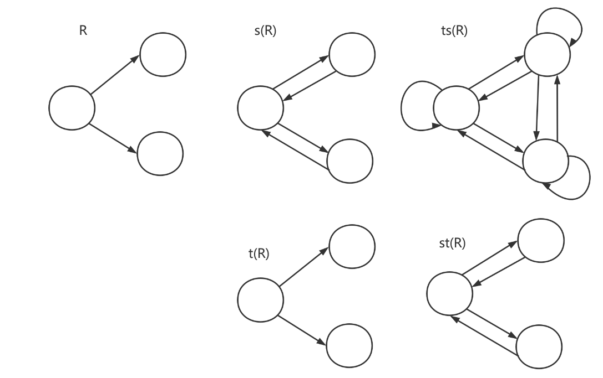
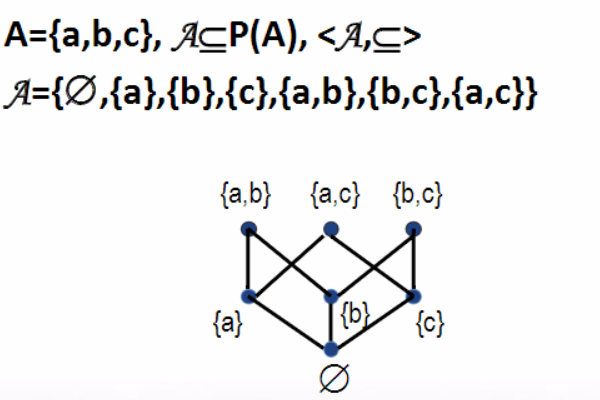
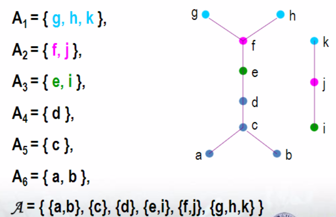

[TOC]

# 离散数学

## 一、预备知识：

### (一)、基本概念

1、联结词

​	合取联结词：p∧q（表示p && q）

​	析取联结词：p∨q（表示p || q）

​	`蕴涵`联结词：p->q （if p 则 q）

​	规定：如果p为假，则不论q的真假，p->q为真，如果p为真，则q为假，==则p->q为假==，可以将→当作不等号，p ≤ q

​	等价联结词：p <-> q

2、命题公式

​	（1）单个命题变元是命题公式

​	（2）若A是命题公式，则¬A也是

​	（3）若A，B是命题公式，则	A∧B，A∨B，A->B，A<->B也是；

​	（4）只有`有限次`应用（1）~（3）形成的符号串才是命题公式

​	==优先级==：¬，∧ ∨，-> <->

### (二)、等值演算

1、等值式：A <=> B : A <-> B 是永真式（永真式可以`互换`）

| p    | q    | p -> q | ¬ p ∨ q | (p -> q) <-> (¬ p ∨ q) |
| ---- | ---- | ------ | ------- | ---------------------- |
| 0    | 0    | 1      | 1       | 1                      |
| 0    | 1    | 1      | 1       | 1                      |
| 1    | 0    | 0      | 0       | 1                      |
| 1    | 1    | 1      | 1       | 1                      |

2、基本的等值式

​	（1）幂等律：A<=>A∨A，A<=>A∧A

​	（2）交换律：A∨B<=>B∨A，A∧B<=>B∧A（3）结合律

​	（4）分配律：A∨(B∧C) <=> (A∨B) ∧ (A∨C)，A∧(B∨C) <=> (A∧B) ∨ (A∧C)

​	（5）德摩根律：¬ （A∨B）<=> ¬ A ∧ ¬ B，¬ （A∧B）<=> ¬ A ∨ ¬ B

​	（6）吸收律：A∨(A∧B) <=> A，A∧(A∨B) <=> A

​	（7）零律：A ∨ 1 <=> 1，A ∧ 0 <=> 0

​	（8）同一律：A ∨ 0 <=> A，A ∧ 1 <=> A

​	（9）排中律：A ∨ ¬ A <=> 1

​	（10）矛盾律：A ∧ ¬ A <=> 0

​	（**对偶原理：∨ - ∧互换，0-1互换** ）

​	（11）蕴涵等值式：A->B <=> ¬ A ∨ B

​	（12）等价等值式：A<->B <=> (A->B) ∧ (B ->A)

​	（13）等价否定等值式：A<->B <=> ¬ A <->¬ B

​	（14）假言易位：A->B <=> ¬ B -> ¬ A （**逆否命题**）

​	（15）归谬论：（A->B）∧ (A->¬ B) <=> ¬ A

### (三)、命题逻辑推理

1、推理的`形式结构`

​	前提：A<sub>1</sub>,A<sub>2</sub>,A<sub>3</sub>,A<sub>4</sub>,A<sub>5</sub>,....A<sub>n</sub>

​	结论：B

​	推理的结构形式：

​		（A<sub>1</sub> ∧ A<sub>2</sub> ∧ A<sub>3</sub> ∧ A<sub>4</sub> ∧ A<sub>5</sub> ∧ .... ∧ A<sub>n</sub>）-> B

2、重要的`推理定律`

​	推论：A=>B : A->B是永真式

​	（1）附加律： A => (A ∨ B)

​	（2）化简律：（A ∧ B）=> A

​	（3）假言推理（A->B）∧ A => B

​	（4）拒取式：（A -> B）∧ ¬ B => ¬ A

​	（5）析取三段论：(A ∨ B) ∧ ¬ B => A，(A ∨ B) ∧ ¬ A => B

​	（6）假言三段论：(A -> B) ∧（B -> C） => (A -> C)

3、判断推理正确的方法

### (四)、一阶谓词

1、基本概念：

​	`个体`：可以独立存在（具体事务或抽象概念）的客体，a，b，c表示==个体常元==，用x，y，z表示==个体变元==

​	`个体域`：个体变元的取值范围。一切事务的组成称为==全总个体域==

​	`谓词`：表示个体性质或彼此之间关系的词，常用F，G，H... 表示==谓词常元==或==谓词变元==，用F（x）表示“x具有性质F”，用F（x，y）表示“x和y具有关系F”

​	`量词`：表示数量的词，==全称量词==是自然语言中的“所有的”，“一切的”，用符号“∀”，用∀x表示个体域里的所有x。==存在量词==是自然语言中饿“有一个”，“至少有一个”，用符号“∃” 表示，用∃x表示个体域里存在x。

2、`命题符号化`：

个体域中==所有==有==性质F==的个体==都有==性质G：

>  ∀x（F(x) -> G(x)）,其中F(x)：x具有F性质，G(x)：x具有G性质

个体域中==存在==有==性质F==的个体==同时==性质G：

> ∃x（F(x) ∧ G(x)）,其中F(x)：x具有F性质，G(x)：x具有G性质

```
例如：男人都比女人跑的快
令F(x):x是男人，G(y):y是女人
  H(x,y):x比y跑的快
命题符号化：∀x（F(x) ->∀y(G(y) -> H(x,y))）
<=> ∀x∀y(F(x) ∧ G(y) -> H(x,y))
```

3、一阶谓词逻辑公式及其分类：

公式∀xA，x称为==指导变元==，A为相应量词的==辖域==。（可以理解为C语言中的作用域）

```
∀x（F(x) -> ∃y(G(y) ∧ H(x,y,z))）
∀x的辖域为（F(x) -> ∃y(G(y) ∧ H(x,y,z))）
∃y的辖域为 (G(y) ∧ H(x,y,z))
```

​	`永真`：若A在任何解释下都为真，则A为`永真式`

​	`永假`：若A在任何解释下都为假，则A为`永假式`

​	`等值式`：A <-> B是永真式，则A与B是==等值==的，记作A <=> B

4、基本等值式：

①在有限个体域D={a1，a2....，an}中消去量词等值式：

>∀xA(x) <=> A(a1)∧A(a2)∧...∧A(an)
>∃xA(x) <=> A(a1)∨A(a2)∨...∨A(an)

②量词==否定==等值式：

> ==¬==`∀x`A(x) <=> `∃x`==¬==A(x)
> ==¬==`∃x`A(x) <=> `∀x`==¬==A(x)

③量词辖域收缩与扩张等值式（B中==不含==x）

> 

④量词分配等值式

> `∀x`(A(x) ∧ B(x)) <=> `∀x`A(x) ∧ `∀x`B(x)
>
> 说明：
> 全称量词对‘∧’有分配律，但对‘∨’不适合分配律
> 例如：全个体域为自然数
> 任意的x属于偶数或者奇数 （√）
> 任意的x属于偶数（×）或者任意的x属于奇数（×）
> 
> `∃x`(A(x) ∨ B(x)) <=> `∃x`A(x) ∨ `∃x`B(x)
> 
> 存在量词对‘∨’有分配律，但对‘∧’不适合分配律
> 例如：全个体域为自然数
> 存在一个数x属于偶数并且属于奇数 （×） 
> 存在一个数是偶数或者存在一个数是奇数 （√）
>  

5、前束范式
> 若公式A具有形式Q<sub>1</sub>x<sub>1</sub>Q<sub>2</sub>x<sub>2</sub>...Q<sub>k</sub>x<sub>k</sub>B，则称A为前束范式，其中Q<sub>i</sub>（i∈（1,k））为`∀`或`∃`,`B`中不含量词。
> `换名规则`：将公式A中某量词辖域中出现的某个约束出现的个体变元及相应的指导变元x<sub>i</sub>，都改成A中没有出现的x<sub>j</sub>，所得公式A <=> A。

```
∀xF(x) ∨ ¬∃xG(x,y)
<=> ∀xF(x) ∨ ∀x¬G(x,y)	(量词否定等值式)
<=> ∀xF(x) ∨ ∀z¬G(z,y)	(换名规则)
<=> ∀x(F(x) ∨ ∀z¬G(z,y))(辖域扩张等值式)
<=> ∀x∀z(F(x) ∨ ¬G(z,y))(辖域扩张等值式)
<=> ∀x∀z(G(z,y) -> F(x)) (蕴含等值式)
```

## 二、集合

### (一)、集合的基本概念

### (二)、集合之间的关系

1、基本概念

> 定义1.1：设A，B为二集合，若`B`中的元素都是`A`中的元素，则称B是A的==子集==，符号化：`B ⊆ A <=> ∀x{x∈B -> x∈A}`
>
> 若B不是A的子集，符号化`B⋢A <=> ∃x{x∈B ∧ x∉A}`

> 定义1.2：若`A`包含`B`且`B`包含`A`，则称A与B相等，即`A=B <=> ∀{x∈B <-> x∈A}`

> 定义1.4：若集合不拥有任何元素，则称为`空集`，记作∅
> 定理1.1 空集是一切集合的子集
> 

>定义1.5 如果限定所讨论的集合都是某个集合的子集，则称该集合为全集，记作`E`，全集不唯一
>

>定义1.6 设A为一个集合，则由A的全体子集组成的集合称为A的==幂集==，用2^A^ 表示 A 的幂集 
>
>定理1.2 设集合A的元素个数|A| = n，则|2^A^| = 2^n^

2、集族：由集合构成的集合称为`集族`

>定义1.7 设Д为一个集族，S为一个集合，若对`∀α∈S`,==∃唯==一的`Aα∈Д`与之对应，而且Д中的任何集合都对应S中的某一元素，则称Д是以S为指标集的==集族==，S称为Д的==指标集==。记为`Д = {A~α~|α∈S}`

### (三)、集合的运算

> 定义1.8 ==并集==：A∪B = {x| x∈A ∨ x∈B}
>
> 定义1.9 ==交集==：A∩B = {x| x∈A ∧ x∈B}
>
> 定义1.10==不相交==：A∩B = ∅
>
> 定义1.11==相对补集==：A-B = {x|x∈A ∧ x ∉ B}
>
> 定义1.12==对称差==：A⊕B ={x| (x∈A ∧ x ∉ B)∨(x ∉ A ∧ x∈B)} = (A-B)∪(B-A)	（类似于异或）
>
> 定义1.13==绝对补集==：~A = {x|x ∉ A ∧ x∈E}
>
> 定义1.14==广义并集==：设Д为一个集族，∪Д={x|∃z(x∈z ∧ z∈Д)}
>
> 定义1.15==广义交集==：设Д为一个集族，∩Д={x|∀z(z∈Д -> x∈z)}

1、集合运算的优先级

> 第一类运算：绝对补、幂集、广义交、广义并等，==从右向左==的顺序运算。
>
> 第二类运算：初级并、初级交、相对补、对称差等，按照括号，如没有括号则按照==从左向右==

2、容斥原理

> 定理1.3 设A~1~，A~2~...，A~n~为n个集合，则：
> $$
> |\bigcup^n_{i=1} A_i| = \sum^n_{i=1}|A_i|-\sum_{i<j}|A_i∩A_j|+\sum_{i<j<k}|A_i∩A_j∩A_k|+(-1)^n|A_i∩A_j∩...∩A_k|
> $$
> 

```
例如：在24名科技人员中，会说英、日、德、法语的人数分别为13、5、10和9，其中同时会说英语、日语的人数为2，同时会说英语、德语，或同时会说英语、法语，或同时
会说德语、法语两种语言的人数均为4。会说日语的人既不会说法语也不会说德语。试求只会说一种语言的人数各为多少？又同时会说英、德、法语的人数有多少？
解：设A、B、C、D分别为会说英、日、德、法的人的集合，E为全集
	据题意:|A|=13、|B|=5、|C|=10、|D|=9、|E| = 24
			=> A∩B=2，B∩C = B∩D = B∩C∩D = A∩B∩C∩D = 0；=>只会日语= 5 - 2 =3
			=> 把只会说日语的人排除，重新定义全集|E| = 21
			=> A∩C= A∩D = D∩C = 4
			=> 运用容斥定理：21=|A∪C∪D| = |A|+|C|+|D| -(|A∩C|+|A∩D|+|D∩C|) + |A∩D∩C| => |A∩D∩C|=1
			=> 只会说英语= |A|-|(B∪C∪D)∩A| = 13 - |(A∩C)∪(A∩D)∪(A∩B)|
			=> |(A∩C)∪(A∩D)∪(A∩B)| = |(A∩C)|+|(A∩D)|+|(A∩B)|-(|A∩C∩B|+|A∩C∩D|+|A∩D∩B|)+|A∩C∩B∩D| = 4+4+2-(0+1+0)+0 = 4
			=> 同理得只会说德语的为3人，只会说法语的2人
```

(四)、基本的集合恒等式

1、集合恒等式，设`E`是全集，A，B，C为E的任意`子集`：

​	①幂等律	A∪A = A，A∩A = A

​	②交换律	A∪B = B∪A，A∪B = B∪A

​	③结合律	(A∪B)∪C = A∪(B∪C);	(A∩B)∩C = A∩(B∩C)

​	零律：A ∪ E = E，A ∩ Ø = Ø                                                                                                        

​	同一律：A ∪ Ø  = A，A ∩ Ø = Ø

​	排中律：A ∪ ∽A = E

​	矛盾律：A ∩ ∽A = Ø 

​	余补律：∽Ø = E，∽E = Ø 

## 三、有序对与卡式积

### (一)、有序对

1、有序对：<a,b> = {{a},{a,b}}

> 引理1 {x,a} = {x,b} <=> a=b
>
> 引理2 若*A*=*B*≠ ∅，则（1）∪*A* = ∪*B*，（2）∩*A*=∩*B*
>
> 定理2.1 `<a,b> = <c,d>` <=> `a=c ∧ b=d`
>
> 推论：a ≠ b <=> <a,b> ≠ <b,a>

2、有序三元组：<a,b,c> = <<a,b>,c>

递归定义有序n元组：<a1,a2,...,an> = <`<a1,a2,....,an-1>`,an>

> 定理2 <a1,a2,...,an> = <b1,b2,...,bn> <=> ai = bi，i=1,2,..,n

3、卡氏积：`A×B = {<x,y> | x∈A ∧ y∈B}`

(1)==卡氏积的性质==

​	①非交换性 A×B ≠ B×A （除非A=B ∨ A=∅ ∨ B=∅）

​	②非结合

​	③分配律 A×(B∪C) = (A×C)∪ (A×C)

> 证明：A×(B∪C) = (A×C)∪ (A×C)
>
> ∀<x,y>, <x,y> ∈ A×(B∪C) 
>
> <=> x∈A ∧ y∈(B∪C)			(`卡氏积定义`)
> <=> x∈A ∧ (y∈B ∨ y∈C) <=> (x∈A ∧ y∈B) ∨ (x∈A ∧ y∈C)	(`分配律`)
> <=> (<x,y> ∈A×B) ∨ (<x,y> ∈A×C)
> <=> <x,y> ∈ (A×B) ∪ (A×C)

(2)n维卡氏积

A~1~×A~2~×....×A~n~ = {<x~1~,x~2~,...,x~n~> | x~1~∈A~1~ ∧ x~2~∈A~2~ ∧ ... ∧ x~n~∈A~n~}

A^n^ = A×A×...×A

### (二)、二元关系

> n元关系：其元素全是有序n元组

1、`2元关系`：元素全是有序对的集合

> 二元关系记号：`<x,y>∈F` <=> x与y具有F关系
>
> ==中缀==记号：xFy
> ==前缀==记号：F(x,y)，Fxy
> ==后缀==记号：<x,y>∈F，xyF
> 例如：`2<15` <=> `<(2,15)` <=> `<2,15> ∈<`

2、`A到B`的二元关系：是A×B的任意`子集` <=> R ⊆ A×B <=>R(P(A×B))

> 若|A| = m,|B| = n,则`|A×B| = mn`，故|P(A×B)| = 2^mn^

3、与二元关系有关的概念：

> 对任意集合R，可以定义
>
> `定义域`(domain)：dom R = {x | ∃y (xRy)}
>
> `值域`(range): ran R = {y | ∃x (xRy)}
>
> `域`(field): fld R = dom R ∪ ran R
>
> 例：R~1~ = {a,b},R2 = {a,b,<c,d>,<e,f>} ==a,b不是有序对==
>
> dom R1 = ∅,ran R1 = ∅,fieldR1 = ∅;
>
> dom R~2~ = {c,e},ran R~2~ = {d,f},fld R~2~ = {c,d,e,f};

4、关系的运算：逆，合成

`逆`：F^-1^ = {<x,y> | yFx}

`逆序合成`：FoG = {<x,y> | ∃z(xGz ∧ zFy)}

`顺序合成`：FoG = {<x,y> | ∃z(xFz ∧ zGy)}

5、限制，象

限制：F↑A = {<x,y> | xFy ∧ x∈A}

象：`F[A] = ran(F↑A)`

> F[A] = {y | ∃x (x∈ A ∧ xFy)}

6、单根、单值：对任意的集合F，可以定义：

> F是单根 
>
> <=> ∀y( y∈ran F -> ==∃!==x(x ∈dom F ∧ xFy))  ==∃!：存在唯一的==
>
> <=> (∀y ∈ran F)(==∃!==x ∈dom F)(xFy)
>
> ∀x(x∈A -> B(x)) 缩写 ==(∀x∈A)B(x)==
>
> ∃x(x∈A ∧ B(x)) 缩写==(∃x∈A)B(x)==
>
> F是单值
>
> <=> ∀x( x∈dom F -> ==∃!==y(y ∈ran F ∧ xFy))
>
> <=> (∀x ∈dom F)(==∃!==y∈ran F)(xFy)

> 定理2.5 设R~1~，R~2~，R~3~，则：
>
> ​			(R~1~oR~2~)oR~3~ = R~1~o(R~2~oR~3~)
>
> 定理2.7 设F，G为二集合，则（FoG）^-1^ = G^-1^oF^-1^

## 三、关系的表示和关系的性质

### (一)、关系的表示

1、集合

2、关系矩阵：

> A ={a1,a2,...,a3}，R⊆ A×A
>
> R的关系矩阵：M(R) = (r~ij~)~n×n~
>
> $$
> M(R)(i,j) = r_{ij}=\left\{
> \begin{array}{rcl}
> 1 &  & {a_iRa_j} \\
> 0 &  & {a_i与a_j不具有R关系}
> \end{array}
> \right.
> $$

> 关系矩阵的性质：
>
> M(R^-1^) = (M(R))^T^ ==T==表示矩阵的转置
>
> M(R~1~oR~2~) = M(R~1~) ==●== M(R~2~)
>
> ●：表示矩阵的“逻辑乘”，加法用∨，乘法用∧

3、关系图：

R的关系图==G(R)==:

> 以“==○==”表示A中元素（称为顶点），以“→”表示R中元素（称为有向边）
>
> 若a~i~Ra~j~，则从顶点a~i~向顶点a~j~引有向边<a~i~,a~j~>

### (二)、关系的性质

1、自反性：

> R是==自反的==
>
> <=> ∀x(x∈A -> xRx)
>
> <=> (∀x ∈A)xRx

> 定理2.10：
>
> R是自反的
>
> <=> I~A~ ⊆ R 
>
> <=> R^-1^是自反的
>
> <=> M(R)==主对角线==上的元素全为`1`
>
> <=> G(R)的==每个顶点==处均有`环`

2、反自反性

> R是==自反的==
>
> <=> `∀x`(x∈A -> ¬xRx)
>
> <=> (∀x ∈A)¬xRx

3、对称性

R ⊆ A×A

> R是==对称的==
>
> <=> ==∀x∀y(x∈A∧y∈A∧xRy -> yRx)==
>
> <=> (∀x∈A)(∀y∈A)(xRy -> yRx)

4、反对称性

R ⊆ A×A

> R是==反对称的==
>
> <=> ==∀x∀y(x∈A∧y∈A∧xRy∧yRx -> x=y)==
>
> <=> (∀x∈A)(∀y∈A)(xRy∧yRx -> x=y)

5、传递性

> R是传递的
>
> <=> ∀x∀y∀z(x∈A∧y∈A∧z∈A∧xRy∧yRz -> xRz)
>
> <=>(∀x∈A)(∀y∈A)(∀z∈A)(xRy∧yRz -> xRz)

### (三)、二元关系的幂运算与闭包

1、`关系的n次幂`

> $$
> \left\{\begin{array}{}
> R^0 &= I_A & {} \\
> R^{n+1} &= R^noR  & {n≥0}
> \end{array}
> \right.
> $$
>
> 显然：R^n^ ⊆ A×A，n∈N

> 定理2.17：
>
> (1)、R^m^oR^n^ = R^m+n^
>
> (2)、(R^m^)^n^ = R^mn^

2、==自反闭包==

> (1)、R ⊆ r(R)				==(包含给定的元素)==
>
> (2)、r(R) 是自反的	==(具有给定的性质)==
>
> (3)、∀S((R ⊆ S ∧ S是自反的) -> r(R) ⊆ S)	(==是最小的二元关系==)

3、==对称闭包==

> (1)、R ⊆ s(R)
>
> (2)、s(R) 是自反的
>
> (3)、∀S((R ⊆ S ∧ S是自反的) -> s(R) ⊆ S)

4、==传递闭包==

> (1)、R ⊆ t(R)
>
> (2)、t(R) 是传递的
>
> (3)、∀S((R ⊆ S ∧ S是自反的) -> t(R) ⊆ S)

> 定理2.19 设R ⊆ A×A 且A≠∅
>
> (1)R自反 <=> r(R) = R
>
> (2)R对称 <=> s(R) = R
>
> (3)R传递 <=> t(R) = R

5、闭包的求法：

> 定理2.22 r(R) = R∪I^A^
>
> 定理2.23 s(R) = R ∪ R^-1^
>
> 定理2.24 t(R) = R ∪ R^2^ ∪ R^3^ ∪...

6、闭包运算与关系性质

> |      | 自反性    | 对称性    | 传递性    |
> | ---- | --------- | --------- | --------- |
> | r(R) | √（定义） | √         | √         |
> | s(R) | √         | √（定义） | ×         |
> | t(R) | √         | √         | √（定义） |

7、闭包运算组合：

> sr(R) = rs (R)，tr(R) = rt(R)，st(R) **⊆** ts(R)
>
> 

(四)、等价关系和划分

1、等价关系(实际上将元素按照关系**分类**)：

> ==定义2.14==：设A≠∅，R⊆A×A，若R是==自反、对称、传递的==，则说R是==等价关系==。

2、等价类：

> ==定义2.15==: 设R是A≠∅上等价关系，∀x∈A，则x关于R的等价类是[x]~R~= { y | y∈A ∧ xRy}，简称y为x的等价类，记作==[x]==

3、商集

> ==定义2.16==：设R是A≠∅上等价关系，A关于R的商集是`A/R = {[x]R | x∈A}`
>
> 例：A = {a，b，c}上全体等价关系共有5种
>
> R1 = I~A~ , {{a},{b},{c}}
>
> R2 = I~E~ , {{a,b,c}}
>
> R3 = I~A~∪{<a,b>,<b,a>},  {{c},{a,b}}
>
> R3 = I~A~∪{<c,b>,<b,c>},  {{a},{c,b}}
>
> R3 = I~A~∪{<a,c>,<c,a>},  {{b},{a,c}}

4、划分

> ==定义2.17==：A≠∅的一个划分是*A*⊆ P(A)满足：
>
> (1) ∅ ∉ *A*
>
> (2)∀x,y(x,y ∈*A* ∧ x ≠ y => x∩y = ∅)
>
> (3) ∪*A* = A
>
> 例：∅ ≠A1，A2，......An ⫋ E
>
> *A* = {A~i~，\~A~i~}，i=1，2，.....，n
>
> 定理2.28：
>
> 设A≠∅，则
>
> (1)R是A上等价关系 => A/R是A的划分
>
> (2)
> $$
> \begin{array}{l}
> {\scr{A}}是A的划分 \Rightarrow 同块关系R_{\scr{A}}\\
> xR_{\scr{A}} \Leftrightarrow ∃(z∈A∧x∈z ∧ y∈z)\\
> 是A上等价关系\\
> R_{\scr {A}} 称为由划分A所定义的等价关系
> \end{array}
> $$

5、Stirling子集数：

把n个**不同**球放到k个**相同**盒子，要求无空盒，不同放法的总数
$$
\left\{\begin{array}{}n\\k
\end{array}\right\}
$$

称为Stirling子集数

> ==Stirling子集数递推公式==
>
> $$
> \left\{\begin{array}{}n\\0
> \end{array}\right\}=0，
> \left\{\begin{array}{}n\\1
> \end{array}\right\}=1，
> \left\{\begin{array}{}n\\2
> \end{array}\right\}=2^{n-1}-1，
> \left\{\begin{array}{}n\\n-1
> \end{array}\right\}=C^{2}_{n}，
> \left\{\begin{array}{}n\\n
> \end{array}\right\}=1\\
> \left\{\begin{array}{}n\\k
> \end{array}\right\}=k
> \left\{\begin{array}{}n\\k-1
> \end{array}\right\}+
> \left\{\begin{array}{}n-1\\k-1
> \end{array}\right\}\\
> $$
>
> **先把n-1个元素分成k个子集，再加入第n个元素到其中之一**
>
> **先把n-1个元素分成k-1个子集，再让第n个元素自成一个子集**

6、划分的加细

> $$
> 定义2.18：设{\scr {A}}和{\scr {B}}都是集合A的划分，若{\scr {A}}的每个划分块都含于{\scr {B}}的某个划分块中，则说{\scr {A}}为{\scr {B}}的加细
> $$
>
> 通俗理解：在划分中继续划分
>
> 

### (四)、序关系

1、偏序关系、偏序集

> 定义2.19 设A≠∅，R ⊆ A×A，若R是**自反、反对称、传递的**，则称R为A上的==偏序关系==。常用==≼==表示偏序关系，读作“小于等于”
> $$
> <x,y>\in R \Leftrightarrow xRy \Leftrightarrow x\pmb{\preceq} y
> $$
> 定义2.20
> $$
> 设\preceq是A上偏序关系，称<A,\preceq>为偏序集
> $$

2、可比，严格小于，覆盖

> 定义2.21 
> $$
> 设<A,\preceq>是偏序集，x,y\in A。\\
> \begin{array}{l}
> 若x \pmb\preceq y \vee y \pmb\preceq x，则称x与y可比\\
> 若x与y可比且不相等，则说x严格小于y，即：
> x \pmb\preceq y \vee y \neq x \Leftrightarrow x\prec y\\
> 若x严格小于y，且不存在z，使得x严格小于z、z严格小于y，则称y覆盖x，即:
> x\prec y \wedge \neg \exist(z\in A \wedge x\prec z \prec y)
> \end{array}
> $$

3、哈斯图

设<A,≼>是偏序集，x,y∈A

`哈斯图`：

(1)用==顶点==表示A中元素

(2)当且仅当y覆盖x时，y在x上方，在x与y之间画==无向边==

>例：
>
>

4、全序关系

> 定义2.22 设<A,≼>是偏序集，若A中任意元素x,y都可比，则称≼为A上的全序关系(线性关系)，称<A,≼>是全序集
>
> 例：∅≠A ⊆ R(实数)，< A,`≤` >，< A,`≥` >
>
> 充要条件：哈斯图是一条“直线”

5、拟序关系

> 定义2.23 设A≠∅，R ⊆ A×A。若R是==反自反、传递的==，则称R为A上的**拟序关系**，常用**≺**表示

> 定理2.29 设≼是非空集合A上偏序关系，≺是A上拟序关系，则
>
> （1）≺是反对称的；
>
> （2）≼ - I~A~是A上拟序关系；
>
> （3）≺ ∪ I~A~是A上偏序关系
>
> 定理2.30 设≺是非空集合A上拟序关系，则
>
> （1）x≺y，x=y，y≺x中之多有一式成立
>
> （2）(x≺y ∨y=x) ∧(y≺x∨x=y) => x=y

6、三歧性、拟线序

> 定义2.24 设A≠∅，≺是A上拟序关系，若
>
> ==x ≺ y，x=y，y≺x==
>
> 中有且仅有一式成立，则称≺有**三歧性**
>
> 同时称≺为A上的**拟线序关系(拟全序关系)**，称==<A,≺>==为拟线序集。

7、链，反链

设< A,≼ >为偏序集，B ⊆ A,

B是A中的链 <=> ==∀x∀y (x∈B ∧ y∈B -> x与y可比)==

B是A中的反链 <=> ==∀x∀y( x∈B ∧ y∈B ∧ x≠y -> x与y不可比 )==

**|B|**称为(反)链的长度

> 定理2.31 设< A,≼ >为偏序集，A中最长链长度为n，则
>
> (1)A中存在`极大元`
>
> (2)A中`存在`n个划分块的划分，使得每个划分块都是反链
>
> 例：
>
> 
>
> 推论：
>
> 设< A,≼ >为偏序集，若|A| = mn + 1，则A中要么存在长度为m+1的反链，要么存在长度为n+1的链。
>
> 证明：反证假设A中既没有长度为m+1的反链，也没有长度为n+1的链，则按照定理31(2)中要求来划分A，则A中至多分成n块，每块至多m个元素，于是A中至多有mn个元素，这与|A| = mn + 1矛盾

8、良序关系

> 定义2.28 设<A,≺>为拟全序集，若==A的任何非空子集B均有最小元==，则称≺为A上的**良序关系**，称<A,≺>为**良序集**

## 四、函数

1、函数（映射）

单值：∀x∈domF，∀y，z∈ranF，

​							==xFy ∧ xFz -> y=z==

**F(x) = y** <=> <x,y> ∈ F <=> xFy

> 偏函数：
>
> 设F是函数，则A到B的**偏函数**（partial function）
>
> ​							domF **⊆** A ∧ ranF **⊆** B
>
> A称为F的**前域**，B称为F的**后域**，记作F:A->B
>
> A到B的全体偏函数是==A->B = {F | A -> B}==

2、全函数：dom F = A

B^A^ = ==A->B = {F | A -> B}==

|B^A^| = |B|^|A|^

> 当A = ∅时，B^A^ = {∅}
>
> 当A = ∅ ∧ B = ∅ 时，B^A^= A->B = ∅
>
> 真偏函数：domF  ⫋ A 定义域是A的真子集

3、全函数性质：

设F : A -> B

单射：F是单根的

满射：ranF = B

双射：既是单射，又是满射

> 设|A| = n，|B| = m
>
> n < m时，A->B中无满射，无双射，**单射**个数为
> $$
> A^{n}_{m} = m(m-1)(m-2)(m-n+1)
> $$
> n > m时，A->B中无单射，无双射，**满射**个数为:
>
> 先将A**划分**成m个块=> Stirling子集数
>
> 然后m中任意一块与B对应=> m!
> $$
> m!\left\{\begin{array}{}
> n\\
> m
> \end{array}\right\}
> $$
> 当n = m时，A->B中双射个数为**n!**

例：

(1)、f:A->B，g：A->A×B，∀a∈A，g(a) = <a,f(a)>

> 当|B| > 1时，
>
> g是单射**g(a)**只对应**<a,f(a)>**不对应==<a,f(b)>== =>F只有单根
>
> <a,f(b)>无对应，因此==非满射==，综上所述：g非双射
>
>  当|B| = 1时：
>
> ∀a∈A f(a) = 定值，假设f(a) = X
>
> 因此g是单射，g(a)只对应<a,X> =>**F只有单根**
>
> 又因为X为定值，因此==|A×B| = |A|==，因此ranF = A×B，
>
> 综上所述：g是单射，g是满射，g是双射

(2)、f：A×B->A，∀<a,b> ∈ A×B，f(<a,b>) = a

> 当|B| > 1时，f是非单射，是**满射**，非双射
>
> 当|B| = 1时，f是单射，满射，双射

(3)、f：A×B->B×A，∀<a,b>∈A×B，f(<a,b>) = <b,a>

> f是单射，满射，双射

4、象、原象

设f:A->B，A’ ⊆ A，B’ ⊆ B

A’的**象(image)**是(==值域==)：

> f(A’) = {y | ∃x(x ∈A’ ∧ f(x) = y)} ⊆ B

B’的**原象(preimage)**是(==定义域==)：

> f^-1^(B’) = {y | ∃y(y ∈B’ ∧ f(x) = y)} ⊆ A

5、特殊函数

> **常数函数**：
>
> f：A -> B，∃b∈B，∀x∈A，f(x) = b
>
> **恒等函数**：
>
> I~A~:A -> A，I~A~(x) = x
>
> **特征函数**：
>
> χ~A~：E -> {0,1}，χ~A~(x) = 1 <=> x∈A
>
> 当∅⫋ A ⫋ E时，χ~A~是满射
>
> **单调函数**：
>
> 设f: A->B，<A,≼~A~>，<B,≼~B~>是偏序集
>
> 单调**增**：∀x,y∈A，x≼~A~ y => f(x)  ≼~B~ f(y)
>
> 单调**减**：∀x,y∈A，x≼~A~ y => f(y)  ≼~B~ f(x)
>
> 严格单调：把≼换成＜，是单射

## 五、自然数

### 一、自然数的定义

1、封闭：A在函数F下封闭 <=> **F(A) ⊆ A** <=> F:A->A <=> F是A上一元运算

> ==Peano系统==
>
> 三元组**<M,F,e>**，F:M->M
>
> (1)**e**∈M
>
> (2)**M**在F下封闭
>
> (3)e ∉ ranF
>
> (4)F是单射
>
> (5)A⊆M∧e∈A∧A在F下封闭 => ==A = M== (极小性公理)

2、后继、归纳集

> A是集合
>
> A的==后继==：A^+^ = A ∪ {A}
>
> 特征：A ⊆ A^+^ ∧ A ∈A^+^
>
> 归纳集：A是归纳集 <=> 
>
> (1) ∅∈A
>
> (2) ∀x(x∈A -> x^+^∈A)
>
> A是归纳集 <=> A含有==∅==且对**后继封闭**

3、自然数

自然数是属于每个==归纳集==的集合

4、自然数集 

> D = {v | v是归纳集}
>
> - D不是集合
>
> - D是“类”

自然数集N = ∩ D	（N是最小的归纳集）

=> ==自然数集==是包含于每个==归纳集==的集合

> 定理4.1 N是归纳集

5、**后继函数**：σ：N -> N，∀n∈N，σ(n) = n^+^

> 定理4.2 <N,σ,0>是Peano系统

> 数学归纳法原理：证明∀ n∈N, P(n)为真
>
> （一）、构造S = {n | n∈N∧P(n)} => S ⊆ N
>
> （二）、证明S是归纳集
>
> ​			(1)∅∈S
>
> ​			(2)∀n (n∈S -> n^+^∈S)   => N ⊆ S ∴ N = S

> 定理4.3 任何自然数的元素均为它的子集
>
> 证明：令S = {n | n∈N∧∀x(x**∈**n -> x **⊆** n)}