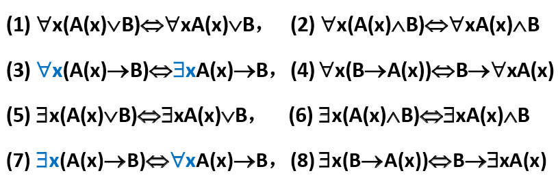

[TOC]

# 离散数学

## 一、预备知识：

### (一)、基本概念

1、联结词

​	合取联结词：p∧q（表示p && q）

​	析取联结词：p∨q（表示p || q）

​	`蕴涵`联结词：p->q （if p 则 q）

​	规定：如果p为假，则不论q的真假，p->q为真，如果p为真，则q为假，==则p->q为假==，可以将→当作不等号，p ≤ q

​	等价联结词：p <-> q

2、命题公式

​	（1）单个命题变元是命题公式

​	（2）若A是命题公式，则¬A也是

​	（3）若A，B是命题公式，则	A∧B，A∨B，A->B，A<->B也是；

​	（4）只有`有限次`应用（1）~（3）形成的符号串才是命题公式

​	==优先级==：¬，∧ ∨，-> <->

### (二)、等值演算

1、等值式：A <=> B : A <-> B 是永真式（永真式可以`互换`）

| p    | q    | p -> q | ¬ p ∨ q | (p -> q) <-> (¬ p ∨ q) |
| ---- | ---- | ------ | ------- | ---------------------- |
| 0    | 0    | 1      | 1       | 1                      |
| 0    | 1    | 1      | 1       | 1                      |
| 1    | 0    | 0      | 0       | 1                      |
| 1    | 1    | 1      | 1       | 1                      |

2、基本的等值式

​	（1）幂等律：A<=>A∨A，A<=>A∧A

​	（2）交换律：A∨B<=>B∨A，A∧B<=>B∧A（3）结合律

​	（4）分配律：A∨(B∧C) <=> (A∨B) ∧ (A∨C)，A∧(B∨C) <=> (A∧B) ∨ (A∧C)

​	（5）德摩根律：¬ （A∨B）<=> ¬ A ∧ ¬ B，¬ （A∧B）<=> ¬ A ∨ ¬ B

​	（6）吸收律：A∨(A∧B) <=> A，A∧(A∨B) <=> A

​	（7）零律：A ∨ 1 <=> 1，A ∧ 0 <=> 0

​	（8）同一律：A ∨ 0 <=> A，A ∧ 1 <=> A

​	（9）排中律：A ∨ ¬ A <=> 1

​	（10）矛盾律：A ∧ ¬ A <=> 0

​	（**对偶原理：∨ - ∧互换，0-1互换** ）

​	（11）蕴涵等值式：A->B <=> ¬ A ∨ B

​	（12）等价等值式：A<->B <=> (A->B) ∧ (B ->A)

​	（13）等价否定等值式：A<->B <=> ¬ A <->¬ B

​	（14）假言易位：A->B <=> ¬ B -> ¬ A （**逆否命题**）

​	（15）归谬论：（A->B）∧ (A->¬ B) <=> ¬ A

### (三)、命题逻辑推理

1、推理的`形式结构`

​	前提：A<sub>1</sub>,A<sub>2</sub>,A<sub>3</sub>,A<sub>4</sub>,A<sub>5</sub>,....A<sub>n</sub>

​	结论：B

​	推理的结构形式：

​		（A<sub>1</sub> ∧ A<sub>2</sub> ∧ A<sub>3</sub> ∧ A<sub>4</sub> ∧ A<sub>5</sub> ∧ .... ∧ A<sub>n</sub>）-> B

2、重要的`推理定律`

​	推论：A=>B : A->B是永真式

​	（1）附加律： A => (A ∨ B)

​	（2）化简律：（A ∧ B）=> A

​	（3）假言推理（A->B）∧ A => B

​	（4）拒取式：（A -> B）∧ ¬ B => ¬ A

​	（5）析取三段论：(A ∨ B) ∧ ¬ B => A，(A ∨ B) ∧ ¬ A => B

​	（6）假言三段论：(A -> B) ∧（B -> C） => (A -> C)

3、判断推理正确的方法

### (四)、一阶谓词

1、基本概念：

​	`个体`：可以独立存在（具体事务或抽象概念）的客体，a，b，c表示==个体常元==，用x，y，z表示==个体变元==

​	`个体域`：个体变元的取值范围。一切事务的组成称为==全总个体域==

​	`谓词`：表示个体性质或彼此之间关系的词，常用F，G，H... 表示==谓词常元==或==谓词变元==，用F（x）表示“x具有性质F”，用F（x，y）表示“x和y具有关系F”

​	`量词`：表示数量的词，==全称量词==是自然语言中的“所有的”，“一切的”，用符号“∀”，用∀x表示个体域里的所有x。==存在量词==是自然语言中饿“有一个”，“至少有一个”，用符号“∃” 表示，用∃x表示个体域里存在x。

2、`命题符号化`：

个体域中==所有==有==性质F==的个体==都有==性质G：

>  ∀x（F(x) -> G(x)）,其中F(x)：x具有F性质，G(x)：x具有G性质

个体域中==存在==有==性质F==的个体==同时==性质G：

> ∃x（F(x) ∧ G(x)）,其中F(x)：x具有F性质，G(x)：x具有G性质

```
例如：男人都比女人跑的快
令F(x):x是男人，G(y):y是女人
  H(x,y):x比y跑的快
命题符号化：∀x（F(x) ->∀y(G(y) -> H(x,y))）
<=> ∀x∀y(F(x) ∧ G(y) -> H(x,y))
```

3、一阶谓词逻辑公式及其分类：

公式∀xA，x称为==指导变元==，A为相应量词的==辖域==。（可以理解为C语言中的作用域）

```
∀x（F(x) -> ∃y(G(y) ∧ H(x,y,z))）
∀x的辖域为（F(x) -> ∃y(G(y) ∧ H(x,y,z))）
∃y的辖域为 (G(y) ∧ H(x,y,z))
```

​	`永真`：若A在任何解释下都为真，则A为`永真式`

​	`永假`：若A在任何解释下都为假，则A为`永假式`

​	`等值式`：A <-> B是永真式，则A与B是==等值==的，记作A <=> B

4、基本等值式：

①在有限个体域D={a1，a2....，an}中消去量词等值式：

>∀xA(x) <=> A(a1)∧A(a2)∧...∧A(an)
>∃xA(x) <=> A(a1)∨A(a2)∨...∨A(an)

②量词==否定==等值式：

> ==¬==`∀x`A(x) <=> `∃x`==¬==A(x)
> ==¬==`∃x`A(x) <=> `∀x`==¬==A(x)

③量词辖域收缩与扩张等值式（B中==不含==x）

> 

④量词分配等值式

> `∀x`(A(x) ∧ B(x)) <=> `∀x`A(x) ∧ `∀x`B(x)
>
> 说明：
> 全称量词对‘∧’有分配律，但对‘∨’不适合分配律
> 例如：全个体域为自然数
> 任意的x属于偶数或者奇数 （√）
> 任意的x属于偶数（×）或者任意的x属于奇数（×）
> 
> `∃x`(A(x) ∨ B(x)) <=> `∃x`A(x) ∨ `∃x`B(x)
> 
> 存在量词对‘∨’有分配律，但对‘∧’不适合分配律
> 例如：全个体域为自然数
> 存在一个数x属于偶数并且属于奇数 （×） 
> 存在一个数是偶数或者存在一个数是奇数 （√）
>  

5、前束范式
> 若公式A具有形式Q<sub>1</sub>x<sub>1</sub>Q<sub>2</sub>x<sub>2</sub>...Q<sub>k</sub>x<sub>k</sub>B，则称A为前束范式，其中Q<sub>i</sub>（i∈（1,k））为`∀`或`∃`,`B`中不含量词。
> `换名规则`：将公式A中某量词辖域中出现的某个约束出现的个体变元及相应的指导变元x<sub>i</sub>，都改成A中没有出现的x<sub>j</sub>，所得公式A` <=> A。

```
∀xF(x) ∨ ¬∃xG(x,y)
<=> ∀xF(x) ∨ ∀x¬G(x,y)	(量词否定等值式)
<=> ∀xF(x) ∨ ∀z¬G(z,y)	(换名规则)
<=> ∀x(F(x) ∨ ∀z¬G(z,y))(辖域扩张等值式)
<=> ∀x∀z(F(x) ∨ ¬G(z,y))(辖域扩张等值式)
<=> ∀x∀z(G(z,y) -> F(x)) (蕴含等值式)
```

## 二、集合

### (一)、集合的基本概念

### (二)、集合之间的关系

1、基本概念

> 定义1.1：设A，B为二集合，若`B`中的元素都是`A`中的元素，则称B是A的==子集==，符号化：`B ⊆ A <=> ∀x{x∈B -> x∈A}`
>
> 若B不是A的子集，符号化`B⋢A <=> ∃x{x∈B ∧ x∉A}`

> 定义1.2：若`A`包含`B`且`B`包含`A`，则称A与B相等，即`A=B <=> ∀{x∈B <-> x∈A}`

> 定义1.4：若集合不拥有任何元素，则称为`空集`，记作∅
> 定理1.1 空集是一切集合的子集
> 

>定义1.5 如果限定所讨论的集合都是某个集合的子集，则称该集合为全集，记作`E`，全集不唯一
>

>定义1.6 设A为一个集合，则由A的全体子集组成的集合称为A的==幂集==，用2^A^ 表示 A 的幂集 
>
>定理1.2 设集合A的元素个数|A| = n，则|2^A^| = 2^n^

2、集族：由集合构成的集合称为`集族`

>定义1.7 设Д为一个集族，S为一个集合，若对`∀α∈S`,==∃唯==一的`Aα∈Д`与之对应，而且Д中的任何集合都对应S中的某一元素，则称Д是以S为指标集的==集族==，S称为Д的==指标集==。记为`Д = {A~α~|α∈S}`

### (三)、集合的运算

> 定义1.8 ==并集==：A∪B = {x| x∈A ∨ x∈B}
>
> 定义1.9 ==交集==：A∩B = {x| x∈A ∧ x∈B}
>
> 定义1.10==不相交==：A∩B = ∅
>
> 定义1.11==相对补集==：A-B = {x|x∈A ∧ x ∉ B}
>
> 定义1.12==对称差==：A⊕B ={x| (x∈A ∧ x ∉ B)∨(x ∉ A ∧ x∈B)} = (A-B)∪(B-A)	（类似于异或）
>
> 定义1.13==绝对补集==：~A = {x|x ∉ A ∧ x∈E}
>
> 定义1.14==广义并集==：设Д为一个集族，∪Д={x|∃z(x∈z ∧ z∈Д)}
>
> 定义1.15==广义交集==：设Д为一个集族，∩Д={x|∀z(z∈Д -> x∈z)}

1、集合运算的优先级

> 第一类运算：绝对补、幂集、广义交、广义并等，==从右向左==的顺序运算。
>
> 第二类运算：初级并、初级交、相对补、对称差等，按照括号，如没有括号则按照==从左向右==

2、容斥原理

> 定理1.3 设A~1~，A~2~...，A~n~为n个集合，则：
> $$
> |\bigcup^n_{i=1} A_i| = \sum^n_{i=1}|A_i|-\sum_{i<j}|A_i∩A_j|+\sum_{i<j<k}|A_i∩A_j∩A_k|+(-1)^n|A_i∩A_j∩...∩A_k|
> $$
> 

```
例如：在24名科技人员中，会说英、日、德、法语的人数分别为13、5、10和9，其中同时会说英语、日语的人数为2，同时会说英语、德语，或同时会说英语、法语，或同时
会说德语、法语两种语言的人数均为4。会说日语的人既不会说法语也不会说德语。试求只会说一种语言的人数各为多少？又同时会说英、德、法语的人数有多少？
解：设A、B、C、D分别为会说英、日、德、法的人的集合，E为全集
	据题意:|A|=13、|B|=5、|C|=10、|D|=9、|E| = 24
			=> A∩B=2，B∩C = B∩D = B∩C∩D = A∩B∩C∩D = 0；=>只会日语= 5 - 2 =3
			=> 把只会说日语的人排除，重新定义全集|E| = 21
			=> A∩C= A∩D = D∩C = 4
			=> 运用容斥定理：21=|A∪C∪D| = |A|+|C|+|D| -(|A∩C|+|A∩D|+|D∩C|) + |A∩D∩C| => |A∩D∩C|=1
			=> 只会说英语= |A|-|(B∪C∪D)∩A| = 13 - |(A∩C)∪(A∩D)∪(A∩B)|
			=> |(A∩C)∪(A∩D)∪(A∩B)| = |(A∩C)|+|(A∩D)|+|(A∩B)|-(|A∩C∩B|+|A∩C∩D|+|A∩D∩B|)+|A∩C∩B∩D| = 4+4+2-(0+1+0)+0 = 4
			=> 同理得只会说德语的为3人，只会说法语的2人
```

(四)、基本的集合恒等式

1、集合恒等式，设`E`是全集，A，B，C为E的任意`子集`：

​	①幂等律	A∪A = A，A∩A = A

​	②交换律	A∪B = B∪A，A∪B = B∪A

​	③结合律	(A∪B)∪C = A∪(B∪C);	(A∩B)∩C = A∩(B∩C)

​	零律：A ∪ E = E，A ∩ Ø = Ø                                                                                                        

​	同一律：A ∪ Ø  = A，A ∩ Ø = Ø

​	排中律：A ∪ ∽A = E

​	矛盾律：A ∩ ∽A = Ø 

​	余补律：∽Ø = E，∽E = Ø 

## 三、有序对与卡式积

### (一)、有序对

1、有序对：<a,b> = {{a},{a,b}}

> 引理1 {x,a} = {x,b} <=> a=b
>
> 引理2 若*A*=*B*≠ ∅，则（1）∪*A* = ∪*B*，（2）∩*A*=∩*B*
>
> 定理2.1 `<a,b> = <c,d>` <=> `a=c ∧ b=d`
>
> 推论：a ≠ b <=> <a,b> ≠ <b,a>

2、有序三元组：<a,b,c> = <<a,b>,c>

递归定义有序n元组：<a1,a2,...,an> = <`<a1,a2,....,an-1>`,an>

> 定理2 <a1,a2,...,an> = <b1,b2,...,bn> <=> ai = bi，i=1,2,..,n

3、卡氏积：`A×B = {<x,y> | x∈A ∧ y∈B}`

(1)==卡氏积的性质==

​	①非交换性 A×B ≠ B×A （除非A=B ∨ A=∅ ∨ B=∅）

​	②非结合

​	③分配律 A×(B∪C) = (A×C)∪ (A×C)

> 证明：A×(B∪C) = (A×C)∪ (A×C)
>
> ∀<x,y>, <x,y> ∈ A×(B∪C) 
>
> <=> x∈A ∧ y∈(B∪C)			(`卡氏积定义`)
> <=> x∈A ∧ (y∈B ∨ y∈C) <=> (x∈A ∧ y∈B) ∨ (x∈A ∧ y∈C)	(`分配律`)
> <=> (<x,y> ∈A×B) ∨ (<x,y> ∈A×C)
> <=> <x,y> ∈ (A×B) ∪ (A×C)

(2)n维卡氏积

A~1~×A~2~×....×A~n~ = {<x~1~,x~2~,...,x~n~> | x~1~∈A~1~ ∧ x~2~∈A~2~ ∧ ... ∧ x~n~∈A~n~}

A^n^ = A×A×...×A

### (二)、二元关系

> n元关系：其元素全是有序n元组

1、`2元关系`：元素全是有序对的集合

> 二元关系记号：`<x,y>∈F` <=> x与y具有F关系
>
> ==中缀==记号：xFy
> ==前缀==记号：F(x,y)，Fxy
> ==后缀==记号：<x,y>∈F，xyF
> 例如：`2<15` <=> `<(2,15)` <=> `<2,15> ∈<`