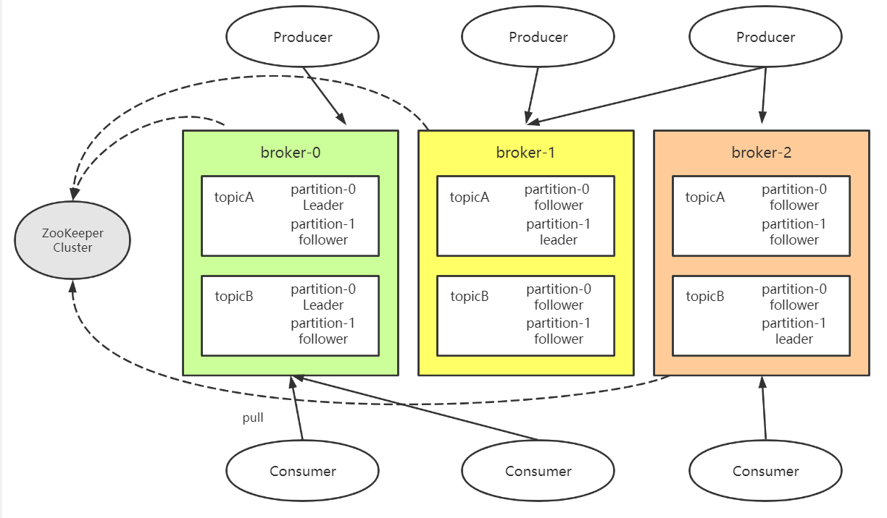
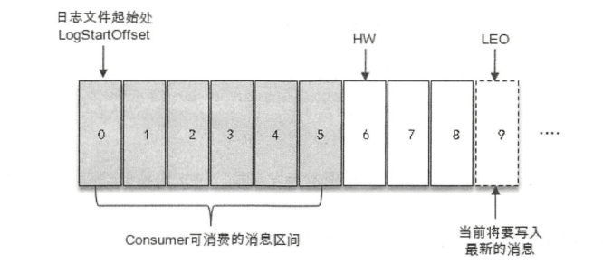
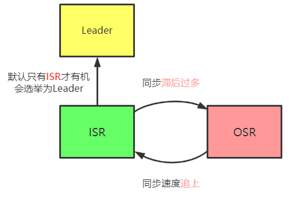

Kafka学习笔记

## 一、基本概念：

1、Producer：生产者，发送消息的一方。负责创建消息，投递到Kafka中

2、Consumer：消费者，接收消息的一方。连接到kafka并接收消息，进行相应的业务处理

3、Broker：服务代理节点。Kafka独立进程

4、Topic：消息以Topic为单位进行归类，是逻辑概念

5、Partition：Topic下可以细分为多个分区，一个分区只属于单个Topic，同一Topic下，不同Partition中的消息是不同的。通过offset保证kafka是==分区有序==而不是主题有序。

6、Replication：分区副本。同一Partition的不同Replication保存的内容是==相同==的，Replication之间是==一主多从==，Leader负责处理写请求，follower只负责与Leader消息同步。Replication处于不同的broker中，当Leader出现故障的时候，从follower副本中重新选出leader进行对外服务。

7、AR（Assigned Replicas）：分区中所有副本的集合。

8、ISR（In-Sync Replicas）：与Leader副本保持==一定同步==（可容忍的滞后）的副本集合

> HW（High Watermark）：高水位，标识特定的消息偏移量（offset），消费者只能拉取到这个offset之前的消息
>
> LEO（Log End Offset）：标识当前日志文件中下一条待写入消息的offset。
>
> 

9、OSR（Out-of-Sync Replicas）：与Leader副本同步==滞后过多==的副本的集合

## 二、生产者：

（一）、重要的生产者参数：

1、acks：指定partition中replicas接收这条消息情况，之后生产者才会认为这条消息成功写入。有三种类型的值（字符串类型）

* acks = “1”。==默认值==，生产者发送消息，只要==leader成功==写入消息，它就会收到来自服务端的成功响应
* acks = “0”。生产者发送消息之后==不需要等==任何服务端的响应
* acks = “-1”或acks = "all"。生产者发送消息，需要等待ISR中的所有Replicas写入消息后才能收到来自服务端的成功响应。

2、max.request.size：限制生产者客户端==能够发送==的消息的最大值，默认为1048576B，即==1MB==。

3、retries和retry.backoff.ms:

* retries参数用来配置生产者重试的次数，==默认值为0==.
* retry.backoff.ms：用来设定两次重试之间的时间间隔，==默认值为100==

4、compression.type：消息的压缩方式，==默认值为none==，可配置为“gzip”，“snappy”和“lz4”

5、connections.max.idle.ms：指定在多久之后关闭空闲的连接，==默认值为54000ms==，即9分钟

6、linger.ms：默认值为0，指定生产者发送ProducerBatch之前等待更多ProducerRecord加入PrducerBatch的时间。会==增加==消息的==延迟==，同时==提升吞吐量==。

7、receive.buffer.bytes：设置Socket接收消息缓冲区的大小，默认32KB。

8、send.buffer.bytes：设置Socket发送消息缓冲区的大小，默认值是128KB

9、request.timeout.ms：设置Producer等待请求响应的最长时间，默认值是30000ms

## 三、消费端

（一）、消费者与消费者组

消费者：负责订阅kafka中的Topic，并且从订阅的Topic上拉取消息

消费者组：每个消费者对应一个消费者组，当消息发布到Topic后，每个Partition只会投递给订阅它的每个消费组中的一个消费者