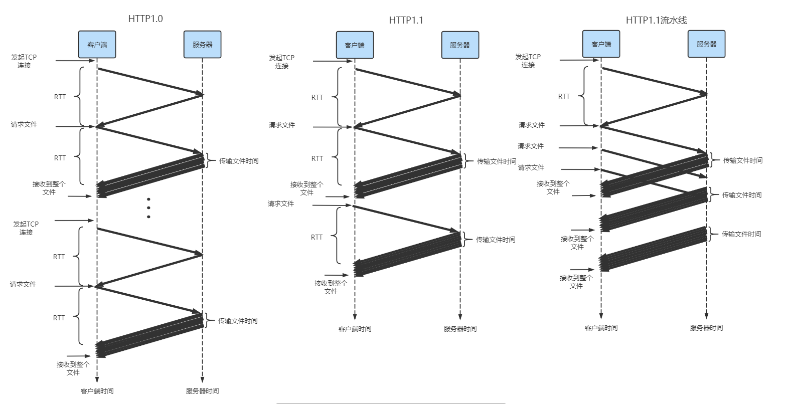
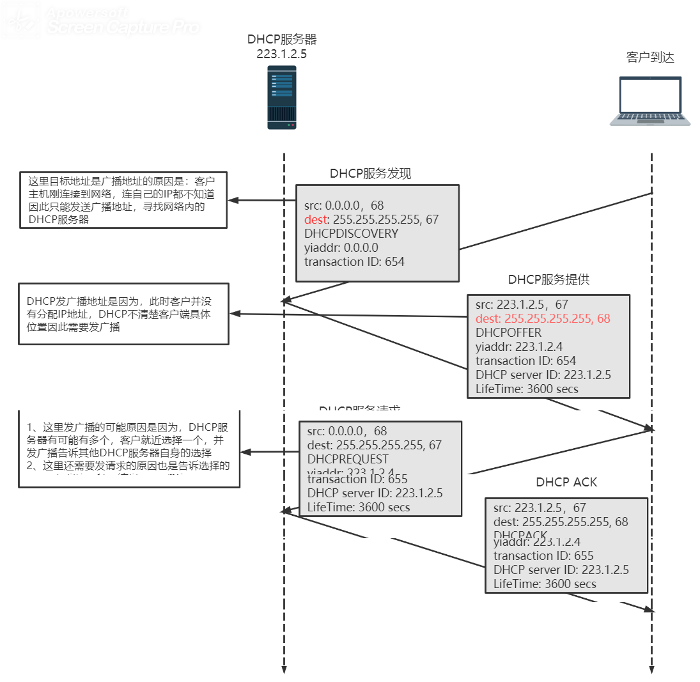

[TOC]

# 计算机网络

## 一、概述：

### 1.1 计算机网络：

#### 1.1.1 基础概念 ★

1、网络：节点和边构成的与大小形状无关的拓扑

2、计算机网络：联网的计算机构成的系统

* 主机节点（web服务器，冰箱...是数据的源和目标），
* 数据交换节点（交换机，路由器，只转发数据，是数据的中转节点，既不是源也不是目标）

3、构成：

* 设备：端系统，运行网络应用程序
* 通信链路：同轴电缆、无线电、卫星，传输速率=kb/s
* 分组交换设备：路由器，链路层交换机

4、协议：对等层的实体在通信过程中所需要遵循的一系列规则的集合，包括语义，语法，及事件所需要采取的动作

#### 1.1.2 网络边缘（了解）

1、组成：==主机==及其上面运行的==应用程序==

> 注：主机可以被进一步划分为==客户端==和==服务器==

2、接入网：将端系统**物理连接**到其边缘路由器的网络，边缘路由器是端系统到任何其他远程端系统的路径上的==第一台路由器==。

3、类型：

* 家庭接入：DSL，电缆，FTTH，拨号和卫星
* 企业（和家庭）接入：以太网和WIFI

#### 1.1.3 网络核心：路由器和网状网络 ★★

1、电路交换：为每个网络呼叫预留一条独享的电路，图中每段链路有4条线路，该呼叫采用了上面链路的第2个线路，右边链路的第1个线路。

特点：

* 独享资源：不共享
* 如果呼叫无数据发送，被分配的资源就会浪费
* 计算机网络通信具有突发性，如果使用线路交换则浪费分片较多

> ★★注：多路复用技术（网络资源被分成片）
>
> ①频分多路复用（FDM）：链路的频谱由跨越链路创建的所有连接共享，在连接期间每条连接专用一个频道
>
> 
>
> ②时分多路复用（TDM）：时间被划分为**固定单位时间**的帧，每个帧又被划分为固定==数量==的**时隙**。当网络跨越一条链路时，网络在每个帧中给该连接指定一个时隙。
>
> 
>
> ③波分多路复用(WDM)：在==光纤通信==中，将光分成固定长度的不同波段，当有连接建立，为每条连接指定一个波段
>
> ④码分多路复用(CDM)：指利用各路信号码型结构正交性而实现多路复用的通信方式
>
> ★例子：在电路交换网络上，从主机A到主机B发送640Kb的文件需要多长时间？链路速率，1.536Mbps，每条链路使用24时隙数为24的TDM，建立端-端的电路需500ms。
>
> V链路/条 = 1.536Mbps/24 = 64kbps
> t传输时间=640kb/64kbps = 10 s
> 总时间= 10s + 500 ms = 10.5s
>
> 

2、分组交换：以分组为单位**存储-转发**方式，==资源共享==，按需使用

* 网络带宽资源不再分为一个个片，而是使用全部
* 主机之间传输的数据被分为一个个**分组**

①存储-转发：在交换机开始向输出链路传输该分组的第一个bit之前，必须接收到整个分组。

> 注：如果不存储完整的分组，直接发送，则这个分组享有所有链路的使用权，而其他分组不能使用其中空闲的链路。这是因为一个分组传输的时候，另一个分组也传输的话会造成混乱，分不清网络中的bit是哪个分组的。

> 思考：由N条速率为R的链路，从源到目的发送一个分组，时延是多少？发送P个分组呢？
>
> 解：
>
> （1）：传输一个分组
>
> 
>
> （2）：传输P个分组
>
> 

②排队延迟和丢失：由共享性带来的坏处

* 如果到达速率>链路的输出速率：分组将会排队，等待传输

* 如果路由器的缓存用完了，分组将会被抛弃（分组丢失）

③转发表和路由协议

* 路由：决定分组采用的源到目标的路径——路由算法
* 转发：将分组从路由器的==输入链路==转移到==输出链路==

> 注：仍然是划分时间片的方式，但不是固定的，因此称为**统计多路复用**

3、分组交换与电路交换的对比：

分组交换

* 优点：①提供了比电路交换更好的带宽感觉 ②比电路交换更有效，更简单，实现成本更低
* 缺点：不适合实时服务，端到端时延不可预知（排队时延的不可预知性）

假设①多个用户==共享==一条 1 Mbps链路；②用户是以 100 kbps周期性访问，时而活跃，时而静默；③用户仅有 10 %的概率活跃。

对于电路交换：

并发用户数：1Mbps / 100kbps = 10 个

对于分组交换：假设总共有35个用户，n = 35
$$
P\{用户数≥10\} = 1 - \sum_{n=0}^9 C_{35}^9 p^n(1-p)^{35-n} = 0.0004
$$
即有99.96%的可能性可以支持35个用户，提供性能与电路交换相差不大。

> 注：这里n = 9是因为当n = 10，进入流量 = 出去流量，流量强度 = 1，会造成==排队延迟==无限大。

### 1.2 分组交换网中的时延、丢包，吞吐量 ★

#### 1.2.1 时延的类型

1、处理时延 t~proc~

* 检查分组首部，校验差错
* 决定分组如何导向

2、排队时延：分组在链路上等待传输时，经受的时延等待，受流量强度影响 t~queue~

3、传输时延：分组被推送到链路上所需要的时间，t~trans~ = L/R （L分组长度，R为带宽）

4、传播时延：从链路起点到链路终点所需要的时间，t~prop~ = d/s （d两个物理媒体距离，s在媒体上传播速率）

t~nodal~ = t~proc~ + t~queue~ + t~trans~ + t~prop~

#### 1.2.2 排队时延

令 α 表示分组到达队列的平均速率(pkt/s)，R是传输速率(bps)，L是分组长度(b/pkt)

流量强度 = Lα/R，设计系统时流量强度 ≤ 1

在==随机过程==中：

Lα/R → 0 小

Lα/R → 1 无限大，由泊松分布推导得出

> 端到端总时延：假设网络无用塞，路径上有n - 1台路由器，d~end-end~ = N （d~proc~ + d~trans~ + d~prop~）

#### 1.2.3 吞吐量

瞬时吞吐率：在任何时刻主机B收到该文件的速率
平均吞吐量：主机B接收到 Fbit用去的时间 T s，吞吐量 = F/T
路径上有N条链路，每条链路的传输速率R~1~，R~2~，R~3~……R~n~，则客户端文件==吞吐量== = min{R~1~，R~2~，R~3~……R~n~}

吞吐量取决于链路上最小的吞吐量速率。

### 1.3 协议层次及服务模型

#### 1.3.1 术语

* 服务：低层实体向上层实体提供他们之间的通信能力

* 原语：上层使用下层服务的形式

* 服务访问点SAP：使用下层提供的服务是通过层间的接口——地点

#### 1.3.2 网络体系结构

## 二、应用层：

### 2.1 网络应用程序体系结构

#### 2.1.1 客户-服务器体系结构（C\S结构）

1、概念：有一个总是打开的主机称为**服务器**，服务来自其他被称为**客户**的主机的请求

2、特点：①客户主机之间==不相互通信==②服务器具有==固定==的、==周知==的地址

#### 2.1.2 P2P体系结构

1、概念：应用程序在间断连接的主机之间直接通信，不依赖或者很少依赖服务器，这些通信主机被称为==对等方==

2、适用于流量密集型应用。

### 2.2 WEB和HTTP ★

#### 2.2.1 基础概念

1、web：核心协议是超文本传输协议（HTTP），对象可以是HTML，JPEG图像，可以通过URL访问。通常web页包含一个HTML文件以及几个引用对象。

2、HTTP：超文本传输协议 (无状态协议) 

客户/服务器模式：客户请求，接收和显示web对象；服务器对请求进行响应，发送给客户端web对象

#### 2.2.2 非持续连接和持续连接

非持续连接：每次传输对象的时候都需要建立连接，传输完成后关闭该连接

持续连接：

* 普通的HTTP1.1协议在传输完对象后，服务器保持连接一段时间不关闭
* 一些特殊的协议可以通过流水线的方式，客户端在服务端未完全响应的时候继续发送请求报文。

> 假设客户端请求10个对象，一次往返时间为RTT
>
> HTTP1.0：20RTT		HTTP1.1(非流水线)：11RTT		HTTP1.1(流水线)：小于11RTT

#### 2.2.3 报文格式

1、HTTP报文包括两种报文：请求报文和响应报文。

2、cookie技术：希望站点对用户进行跟踪，使服务器变成了==有状态==的

* 首次登陆时在HTTP响应报文首部行中添加一个cookie行
* 下次请求时在HTTP请求报文首部行中添加一个cookie行
* 在用户端系统处保存cookie的信息，由浏览器管理
* 信息位于web站点的一个后端系统中

缺点：服务器由无状态变成有状态，不利于服务器的横向扩展（集群搭建）

解决：使用JwtToken，令牌方式。

#### 2.2.4 web缓存 ★

1、web缓存步骤

2、代理服务器使用原因：

* Web缓存器大大减少对客户的==响应时间==
* Web缓存器能从整体上大大减低因特网上的Web==流量==

> 例如：假设初始服务器分散在全国各地。对象平均长度为1Mb，访问速率15请求/s，请求报文很小可以忽略不记。客户端发送请求报文到接收到响应报文为2s。Web缓存的命中率一般在==0.2~0.7==，这里假设0.4。求加上缓存后的响应时间。
>
> 

### 2.3 FTP

### 2.4 电子邮件系统

#### 2.4.1 主要组成部分：用户代理；邮件服务器；简单邮件传输协议：SMTP

1、用户代理：

* 撰写、编辑和阅读邮件
* 输出和输入邮件保存在服务器上

2、邮件服务器：

* 管理和维护发送给用户的邮件
* 邮件服务器之间使用**SMTP**协议，监听25端口

3、SMTP：使用TCP在客户端和服务器之间传送报文，端口号为**25**

①直接传输：从发送方服务器到接受方服务器

②传输阶段：握手；传输报文；关闭

③命令/响应交互：

* 命令：ASCII文本
* 响应：状态码和状态信息

#### 2.4.2 与HTTP的对比 ★

1、协议：HTTP是pull类型，SMTP除了最后传输部分基本是push

2、SMTP采用7bit的ASCⅡ码格式，HTTP不受这种限制

3、HTTP每个对象有自己的报文，SMTP所有对象在一个报文

#### 2.4.3 邮件访问协议

1、POP3：三阶段，认证，事务处理以及更新

* 认证：用户代理发送用户名和口令以鉴别用户
* 事务处理：用户代理取回报文；对报文做删除标记的更改；获取邮件的统计信息
* 更新：结束该POP3会话，邮件服务器会删除那些被标记了删除的邮件。

2、IMAP：==改进==POP3无法给用户提供创建远程文件夹并为报文指派文件夹的方法

* IMAP服务器把每个报文与一个文件夹联系起来；当报文第一次到达服务器时，它与收件人的INBOX联系起来。
* 允许用户代理获取报文某些命令的部分

3、基于Web的电子邮件

### 2.5 DNS ★★

#### 2.5.1 基础概念

①特点：

* 分层的、基于**域**的命名机制，实现分布式的数据库完成==名字==到==IP==地址的转换
* 运行在UDP之上端口号为53的应用进程
* 核心的Internet功能，但以应用层协议实现

②功能：核心功能是==主机名==——==IP==地址的转换

* ==主机别名==到==规范名字==的转换，如一台名为relay1.west-coast.enterprise.com有两个别名，www.enterprise.com和enterprise.com
* 邮件服务器别名到邮件服务器的正规名字的转换
* 负载均衡

#### 2.5.2 工作机理

单个DNS服务器容易出现问题：==单点故障==；通信容量；远距离的集中数据库；维护

1、由于集中式存在问题，因此通过==分布式==、==层次式==数据库解决

①域名结构：采用层次树状结构的命名方法，树叶是主机

* 根DNS服务器：根名字服务器提供TLD服务器的IP地址，有400多个IP地址，由全球不同国家组织管理
* 顶级域服务器：对每个顶级域(org，com，net，edu和gov)和所有国家的顶级域都有TLD服务器。
* 权威服务器：在因特网上具有==公共可以访问==主机的组织机构必须提供公共可访问的DNS记录，权威DNS服务器收藏了这些记录。一个组织可以自己实现权威服务器；也可以支付费用，存储在某个服务商的权威服务器中
* 本地DNS服务器：虽然该服务器不属于层次结构，但是它会将主机的DNS请求转发到DNS服务器层次结构中

②域名的管理：

* 一个域管理其下的子域
* 创建一个新的域，必须征得它所属域的同意

③域与物理网络无关：遵从==组织==界限，而不是物理网络；域的划分是==逻辑==的，而不是物理的

④DNS缓存：在DNS请求链中能将请求关系映射缓存在本地存储器中，在一段时间过后将丢弃缓存信息。

#### 2.5.3 DNS记录报文

DNS服务器存储了资源记录（RR），格式为：name，value，type，ttl（记录的生存时间）

* Type = A：Name为主机，Value为IP地址

* Type = NS：Name为域名，Value为域名的权威服务器的域名

* Type = CNAME：Name为规范名字的别名，Value为规范名字

* Type = MX：Value是别名为Name的邮件服务器的规范主机名

### 2.6 P2P ★★

#### 2.5.1 P2P原理

其中u~i~表示第i对等方接入链路的上载速率，d~i~表示下载速率，F表示文件的大小单位是bit

1、首先计算CS体系结构下的文件分发时间：

* 假设服务器必须向N个客户端发送文件，总长度为NF，上载速率为u~s~，因此t~上传~ ≥ NF/u~s~

* 令d~min~表示客户端最小的下载速率，因此下载时间 t~下载~  ≥ F/d~min~；

经过比较，则时间为：
$$
D_{cs} ≥ max\{\frac{NF}{u_s},\frac{F}{d_{min}}\}
$$
因此获得了客户端——服务器体系的实际分发下界：
$$
D_{cs} = max\{\frac{NF}{u_s},\frac{F}{d_{min}}\}
$$
2、对P2P进行计算分析

* 服务器只需要至少发送文件每个bit 1 次，因此 t~分发时间~ ≥  F/u~s~

* 与CS体系结构相同，令d~min~表示客户端最小的下载速率，因此下载时间 t~下载~  ≥ F/d~min~
* 总上载能力：u~total~ = u~s~ + u~1~+u~2~+……+u~n~，系统必须像N个对等方上载F文件，因此总长度至少为NF

将三个放在一起观察，得出比较P2P的最小分发时间：
$$
D_{p2p} ≥ max\{\frac{F}{u_s},\frac{F}{d_{min}},\frac{NF}{u_s+\sum^n_{i=1}u}\}
$$
可以看出当N趋于+∞时

* D~cs~ F/d~min~是==固定==的，而NF/u~s~是跟着N变化线性增长的，因此随着客户端数量越来越多，获得文件的时间就越长
* D~p2p~前两个是固定的，而后面u~total~ 分母是随着N变化的，因此随着客户数量越多，分子分母同时变化，获得文件的时间变化不明显。

3、假设所有客户端上载速率相同为u，且d~min~ ≥ u ~s~，u~s~ = 10 u，F/u = 1 h

CS体系结构: 
$$
\begin{aligned}
&显然:\frac{F}{u_s}≥\frac{F}{d_{min}} \quad \frac{F}{u_s} = 0.1 h,则D_{cs} = max\{0.1N，\frac{F}{d_{min}}\},
\\
&因此，\lim_{N→∞}D_{cs}=\lim_{N→∞}0.1*N =∞
\end{aligned}
$$
P2P体系结构：NF/(u~s~+Nu) = NF/[(1+N)*u] * F/u > F/u~s~ ≥ F/d~min~ ，因此当N→∞时D~cs~ =  NF/[(1+N) *u]→ F/u = 1
$$
\begin{aligned}
& 因为 \frac{NF}{u_s+N*u} = \frac{NF}{(N+1)*u}\\
& 显然:\frac{F}{u}＞\frac{F}{u_s}≥\frac{F}{d_{min}}，联立D_{p2p} = max\{\frac{F}{u_s},\frac{F}{d_{min}},\frac{NF}{u_s+\sum^n_{i=1}u}\}
\\
&因此，\lim_{N→∞}D_{p2p}=\lim_{N→∞}\frac{NF}{(N+1)*u} =\frac{F}{u} = 1，\\
&显然D_{p2p} 的时间不会超过1
\end{aligned}
$$
综上所述，当客户端越来越多时，选择P2P体系为优选。

#### 2.5.2 BitTorrent

BitTorrent 是用于文件分发的流行P2P协议。所有对等方被称为一个洪流，对等方彼此下载一个等长的块（chunk），一般长度为256KB。

## 三、传输层

### 3.1 多路复用和多路分解

#### 3.1.1 基础概念：

* 多路复用：从源主机中不同套接字收集数据，然后将这些信息封装成报文段，传递到网络层
* 多路分解：将传输层的报文段交付到正确的套接字的工作

#### 3.1.2 面向连接与无连接的多路复用和多路分解

1、无连接的

UDP套接字：由一个二元组标识，二元组包括：目的IP和目的端口

2、面向连接的

TCP套接字：由一个四元组标识，包括：源IP和源端口，目的IP和目的端口

补充：

为什么UDP的标识是二元组，TCP的标识是四元组：

因为UDP是**无连接**的，发送出去后本地应用进程无需关注返回结果，因此不用标识源端口和源IP

### 3.2 无连接运输：UDP

#### 3.2.1 工作原理

1、作用：只做传输协议能够做的==最少==工作，包括：复用\分解，差错检测。

2、UDP特性：

* 无须建立连接
* 方便应用层控制发送什么数据及何时发送数据
* 分组首部开销小
* 无连接状态

3、应用：DNS，SNMP，流式多媒体，英特网电话

4、UDP报文格式

5、UDP检验和：只提供检测，不恢复错误位

①：加法求和，如果溢出则回卷

②：求反码

例如：
0110 0110 0110 0000
0101 0101 0101 0101
1000 1111 0000 1100

前两个数求和：
				0110 0110 0110 0000
				0101 0101 0101 0101
				————————————————————
				1011 1011 1011 0101
继续和第三个数求和：
				1011 1011 1011 0101
				1000 1111 0000 1100
				————————————————————
			  ==1== 0100 1010 1100 0001 这里出现溢出，回卷（把进位移到最后一位）
				0100 1010 1100 001==0==

求反码：
				0100 1010 1100 0010

得到校验和

​				1011 0101 0011 1101

### 3.3 可靠数据传输原理

#### 3.3.1 背景：底层信道不可靠

#### 3.3.2 构造完全可靠的底层信道

1、底层信道完全可靠：rdt1.0

FSM：有限状态机

* 横线上方：引起变迁的事件
* 横线下方：事件发生采取的动作

假定：底层信道完全可靠

(2)、具有比特差错信道的可靠数据传输：rdt2.0

假定：分组中的bit可能会受损

自动重传请求协议（ARQ）：基于重传机制的可靠数据传输协议

* 差错检测：
* 接收方反馈：接收方提供明确的反馈信息，0表示NAK（否定确认），1表示ACK（肯定确认）
* 重传：接收方收到有错误的分组的时候，发送方重新传送该分组

发送方：

接受方：

(3)、考虑ACK或者NAK受损：rdt2.1

假定：ACK或者NAK受损

解决：在数据分组中添加==序号==，在停等协议中序号值只需要一个bit即可

这里使用ACK来代替NAK，例如NAK1，接收方就发送ACK0，接收方重新发送分组1

发送方：

接收方：

(4)、具有bit差错检测的、丢包信道的、可靠数据传输：rdt3.0

假定：下层信道会出现丢包

解决：增加==倒计数定时器==

发送方：

接收方没有变化，同rdt2.1相同

#### 3.3.3 流水线可靠传输协议：

> 假设：一条链路 1Gbps，分组 L 为 1000字节，链路上传输时间RTT = 15ms
>
> 一个分组进入链路时间：t = L/R = 8μs / pkt
>
> 信道利用率：U~sender~ = t/(RTT + t) = 0.00027
>
> 因此整个信道的实际带宽是：270kbps

解决：使用流水线技术，不以停等的方式传输分组

（1）、回退N步（GBN）：丢弃失序分组

划分发送方缓存区：

base：最早未确认分组序号

nextseqnum：最小未使用序号

N：窗口长度

GBN协议FSM：

GBN发送方必须响应三种事件：

上层的调用rdt_send，

* 如果nextseqnum < base+N，则封装数据，这里如果base = nextseqnum，表示窗口内没有已发送未确认的分组，则开启定时器，nextseqnum++
* 表示发送方缓存已满，拒绝

超时，

* 重新开始定时器
* 将【base，nextseqnum-1】的所有分组重新发送一遍

收到ACk

* 更新base，如果base == nextseqnum，表示网络中没有正在传输的分组，则停止计时器
* 否则开始一个定时器

（2）、选择重传（SR）：不丢弃失序分组，但发送方与接收方窗口不一致

发送方：

接收方：

发送方动作与事件：

接收方动作与事件：

总结：

> 发送方窗口长度 w ~send~ = 1，w~rcv~ = 1	 停止等待协议
>
> 发送方窗口长度 w ~send~ > 1，w~rcv~ = 1	 GBN协议
>
> 发送方窗口长度 w ~send~ > 1，w~rcv~ > 1	 SR协议
>
> ★★★ GBN协议窗口长度必须 ≦ 2^N^ - 1 
>
> ★★★ SR协议窗口长度必须 ≦ 2^N-1^  

### *（四）、面向连接的传输：TCP

特点：面向连接的、全双工的、点对点的

> 术语：
>
> MSS最大报文段长度，除去TCP/IP首部40字节，一般为1460字节
>
> MTU：最大传输单元，链路层帧长度，一般为1500字节

* 序号和确认号：每个报文段的首字节序号

* 16bit接收窗口字段：用于流量控制
* 4bit首部长度字段：单位：4字节
* 选项字段：用于发送方与接收方**协商**最大报文长度，在高速网络环境下用作**窗口调节**因子
* 标志字段：==ACK==用来标识确认字段的值是有效的。==RST，SYN，FIN==，用于连接建立和拆除，CWR,ECE用于拥塞通告；PSH用于通告将缓冲区的数据传输给上层，URG表示该报文段存在紧急数据

1、估计往返时间==RTT==

SampleRTT：报文段的样本RTT，在某时刻仅作一次SampleRTT

> EstimatedRTT = (1 - α) * EstimatedRTT + α * SampleRTT
>
> EstimatedRTT 是由过去值结合当前值给出的，α推荐值是 1/8
>
> DevRTT：RTT偏差值，用于估算SampleRTT偏离EstimatedRTT的程度，β值推荐0.25
>
> DevRTT = (1 - β) * DevRTT + β * |SampleRTT - EstimatedRTT|
>
> ==TimeoutInterval==：设置超时时间间隔，推荐初始值为 1 s
>
> TimeoutInterval = TimeoutInterval + 4 * DevRTT

2、TCP可靠数据传输

TCP发送方FSM：

(1)、累积确认：

* 主机A连续发送两个报文段

> 第一个报文段seq = 92，len = 8，ack = 100，第二个报文段seq = 100，len = 20，ack = 120
>
> 情况1：
>
> 
>
> 假设在超时之前两个==确认报文段==都没有到达A，则会重启定时器，重传==第一个==报文段，如果ack = 120在超时前到达A，则不重传第二个报文段
>
> 情况2：
>
> 
>
> 第一个报文段在网络中丢失，但在超时事件之前收到了ack = 120，则主机A知道主机B已经收到seq = 119之前的数据

(2)、超时间隔加倍：每次TCP==超时重传==时都会将TimeoutInterval设置成先前的**两倍**，只有发送方收到另两个事件启动定时器时采用**EstimatedRTT**+**4DevRTT**

(3)、快速重传

(4)、TCP差错恢复机制是GBN和SR的混合体

* TCP发送方维持sendbase和nextseqnum
* TCP发送方使用累积确认
* 接收方会将正确接收但==失序==的报文段缓存起来

3、流量控制：由接收方控制，发送方维护==接收窗口==，使发送方**发送速率**与接收方**接收速率**相==匹配==

场景：主机A向主机B发送文件

主机B定义以下变量：

* LastByteRead：主机B上的应用进程从缓存读出的数据流的==最后一个==字节的序号
* LastByteRcvd：从网络中到达的并且已经放入

## 四、网络层：

>  网络层可以被分解为相互作用的两个部分：**数据平面**和**控制平面**

功能：

* 转发：将分组从一个**输入链路**接口转移到适当的**输出链路**接口的路由器本地动作。（==数据平面==）
* 路由选择：确定分组从**源**到**目的地**所采取的端到端路径的网络范围**处理过程**。

问题：

* 运输层能够**指望**网络层将该分组交付给目的地吗？
* 当发送多个分组时，它们会按发送顺序**按序交付**给接收主机的运输层吗？
* 发送两个连续分组信息的**时间间隔**与接收到两个分组的时间间隔相同吗？
* 网络层会提供拥塞的**反馈信息**吗？
* 在发送主机与接收主机中连接运输层通道的**抽象视图**是什么？

网络服务模型：定义了分组在发送与接收端系统之间的端到端运输特性

注：因特网提供了单一的服务列表，称为**尽力而为服务**（best-effort service）。不确保任何事情。

### （一）、数据平面：

核心：网络层中每台路由器的功能，

作用：决定到达路由器的==数据报== 如何从路由器的输入链路到输出链路

#### 1、路由器体系结构：

（1）输入端口：

* 最左侧：执行终结入物理链路的物理层功能
* 中间部分：与远端的数据链路层交互，执行数据链路层功能
* 最右端：执行查找功能，通过转发表决定路由器的输出端口

（2）交换结构：将路由器的输入端口连接到输出端口

（3）输出端口：存储从交换结构传来的分组，并执行必要的物理层和数据链路层功能

（4）路由选择处理器：执行控制平面功能，执行路由选择协议。

注意：(1)(2)(3)通常由硬件来实现，假设10Gbps的输入链路和64B的IP数据报，输入端口只有51.2ns的时间来处理，这远快于软件处理的时间。

#### 2、输入端口处理：

查找：通过转发表进行查找输出端口（转发表使用最长前缀匹配规则），为了实现纳秒级搜索，提供了硬件与软件支持：

* 快速查找算法
* DRAM与SRAM。实践中经常使用**三态内容可寻址存储器**(TCAM)查找

转发：

* 基于目的地的转发
* 通用转发

排队：当交换结构出现堵塞时，必须要在输入端口处排队

其他动作：

①物理层和链路层处理

②校验：检查分组的版本好、校验和以及寿命字段，并且需要重写后两个字段

③必须要更新用于网络管理的计数器

> **匹配加动作**：在路由器和交换机中特别常见的**抽象**结构

#### 3、交换结构：

①内存交换：由CPU（路由选择处理器）的直接控制完成，输入输出端口类似于操作系统的中I/O。

* 优点：简单
* 缺点：假设内存的可读性带宽为B分组/s，则总的吞吐率==不会超过==B/2

②总线交换：

​	输入端口预先在分组首部添加==字段==（指示输出端口）

​	分组可由**所有端口**收到，但只有首部**匹配**的端口才会**保存**

* 优点：简单，速率相对于内存交换更快，
* 缺点：一次只能通过一个分组，使得总吞吐量受到总线速率影响

③互联网络交换：

由2N条总线组成的互联网络，连接N个输入端口，N个输出端口。每条总线的交叉点通过交换结构控制，使得当分组到达A的时候可以传送到X，同时来自B端口的

分组可以到达Y。

* 优点：吞吐率极高，克服了单一、共享式总线带宽限制
* 缺点：复杂

> Cisco CRS利用三级非阻塞交换策略，可以将分组分成==k个==小块发送到互联网络中，然后在端口处组装

#### 4、输出端口处理

(1)、何时出现排队：

定义：

R~line~ ： 输入线路速度与输出线路传输速率（单位：分组/秒）

R~switch~ : 交换结构传送速率

①输入排队：R~line~ > n * R~switch~，这种被称为**HOL阻塞**（线路前部阻塞），即使输出端口空闲，输入队列中的排队也必须等待交换结构进行传送

②输出排队：R~switch~ > n * R~line~，当输出队列满时，采取丢弃策略：

* 删除一个或多个**已排队**的分组
* 丢弃**新来**的分组

B(缓存大小) = RTT(往返时延) * C(链路带宽)

当有N条TCP流时（N很大）：B = RTT * C / N^0.5^

(2)、分组调度：确定分组的传送**次序**问题

①先进先出FIFO

②**优先权**排队：

* 为每个队列分配一个优先权W，当选择一个分组传输时，将从队列为**非空**的**最高优先权**队列中挑出一个分组。
* 在同一优先权类的分组，以**FIFO**先到先服务的规则。
* 在非抢占式调度的情况下，一旦分组开始传输，就不能被打断

③**循环**排队规则：由于每个队列并非有严格的优先顺序，因此采用轮询的方式，循环调度每个分组

具体实现：加权公平排队WFQ

为每个队列 **i** 设置权值 **W i**，保证每个队列在相同时间间隔内，接收到的服务部分等于W i / ( ΣW j)，ΣW j为所有权重之和。

这样保证了即使在最坏的情况下，队列i能分配到带宽W i / ( ΣW j)部分

#### 5、网际协议：IPv4，IPv6，寻址

(1)、IPv4

* 版本号：规定了数据报**IP协议**的**版本**。确定了路由器如何==解释==IP报剩余部分
* 首部长度：确定数据报中**数据载荷**的实际**开始**位置，IP数据报具有20字节的首部
* 服务类型(TOS)：区分不同服务类型的IP数据报（要求低时延，高吞吐量或可靠性的数据报）
* 数据报长度：**理论**最大长度为2^16^ = 65536字节，但受限于**以太网**帧的载荷（1500字节）
* 标识、标志、片偏移：与IP分片有关，在IPv6中不允许对IP分片
* 寿命(TTL) : 每经过一台路由器**减一**，确保数据报不会在网络中**循环**
* 上层协议：**指示**IP报数据部分应该交付于哪个运输层协议处理。只有在最终目的处才会使用，TCP：6，UDP：17
* 首部校验和：校验IP数据报**首部**中的bit错误。只在IP层有作用
* 源和目的IP地址：发报的数据源IP地址，以及最终目的IP地址，通常由DNS服务器解析
* 选项：允许IP首部被扩展。但由于选项的存在，使得解析IP数据报过于复杂，因此在IPv6中已经去掉。
* 数据：有效载荷

①数据报分片：将较大的数据报分成小的数据报以适应链路层上的载荷，小的数据报称为片（fragment）

原因：链路层帧严格限制IP数据报长度。（能承载的最大传送单元**MTU**）

* 数据报中的**标识**用来确定哪些数据报属于同一个**较大的**数据报

* **最后**一个片的标志为0，其他为1
* 用**片偏移**使目的主机确定是否丢失了一个片

②IPv4编址：采用**点分十进制**表示

> 主机与物理链路之间的边界称为**接口**，每个IP地址与接口相关

子网：分开主机和路由器的每个接口，产生几个隔离的网络岛，使用接口端连接这些隔离的网络端点，每个**隔离**的网络都叫做**子网**。（通俗：每个**相同的网段**都称为一个子网）。例如下图中有6个子网。

CIDR（无类别域间路由选择）：使用子网寻址时，将IP地址分成两部分：

* a.b.c.d/x，x指示了地址的第一部分的bit数。（被称为**网络前缀**）
* 地址的剩余 32 - x bit用于标识该组织内部设备。可用于继续划分子网

> ==地址聚合==：使用**单个**网络前缀通告**多个**网络的能力，如果匹配多个地址，则采用==最长前缀匹配==

DHCP动态主机配置协议：为主机分配IP地址

NAT网络地址转换：

①主机10.0.01指派端口3345，发送请求报文到web服务器128.119.40.186:80，首先发送到**LAN**

②NAT路由器收到报文后，将==源地址==改写为WAN端的IP地址，并为该数据报生成新端口 138.76.29.7:5001 （可以发现NAT转换表最多只有2^16^个表项）

③web发给NAT路由器响应报文 （web服务器不知道NAT的存在）

④根据==端口号==5001，在转换表中搜索LAN端的地址，改写数据报目的地址

> 反对者理由：
>
> * 端口号是用于标识进程寻址而非主机寻址
> * 路由器处于第三层网络层协议，应当只处理网络层的分组，违反主机直接对话原则

（2）IPv6

> 与IPv4的变化：
>
> * 扩大寻址容量
> * 任播地址，可以将数据报交付给一组主机中的任意一个
> * 简化高效的**40字节**首部
> * 流标签：该字段用于**标识**一条数据报的**流**，能够对一条流中的某些数据报给出优先权

从IPv4到IPv6的数据迁移：

建隧道：两个IPv6节点通过中间的IPv4路由器互联。将IPv6路由器中间的IPv4路由器集合称为==隧道==

隧道节点接收端E通过解析IPv4**协议字段**（值为41）得知有效载荷是IPv6数据报文

（6）通用转发：

> 匹配加动作范式：动作包括将分组转发到一个或多个端口，负载均衡，重写首部值等。

①流表（匹配加动作转发表）

* 首部字段值的集合：入分组将与之匹配
* 计数器集合：当分组与流表项匹配时更新计数器，可能包括：匹配的分组数量，上一次匹配的时间
* 动作集合：当匹配成功后路由器的下一个动作

②匹配：

> 流表项可以有**通配符**

③动作：

* 转发
* 丢弃：没有动作的流表项表明匹配的分组应该被丢弃
* 修改字段：在分组被转发到输出端口之前，分组首部字段都可以被重写

### （二）、控制平面

转发表和流表的计算、安装和维护有两种方式：

* 每台路由器独立控制：在每台路由器都包含转发和路由选择功能。每台路由器都有一个**路由选择组件**，用于与其他路由器中的路由选择组件**通信**。
* 逻辑集中式控制：由**逻辑集中式控制器**计算并分发转发表以供每台路由器使用，控制器通过CA（控制代理）与路由器进行交互。CA不能与其他CA之间相互交互。

#### 1、路由选择算法

(1)、链路状态路由选择算法（集中式路由选择算法）

Dijkstra算法（单源最短路径算法）

(2)、距离向量路由选择算法（分散式路由选择算法）

* 异步的、迭代的、分布式的

> 为什么会有AS间(BGP)和AS内部(OSPF)路由选择协议？
>
> * 策略：在AS之间策略起主导作用，一个AS的流量是否能通过另一个AS这很关键。而AS内部都是在相同管理控制下，因此策略不是很重要
> * 规模：扩展一个路由选择算法及其数据结构在大量网络或网络之间，是AS间路由选择的关键。而在AS内部，如果网络过大，总可以通过OSPF将AS分成两个新的小的AS，因此AS内规模不是主要关注点
> * 性能：在AS之间以**策略**为主，因此性能反而不是很重要，有时花费更多的路由代价满足策略要求也是可以的，而在AS内部不关注策略，因此可以选择更多的关注**性能**

#### 2、AS内部的路由选择：OSPF

产生原因：

* 规模：路由器数目很大，涉及到路由选择信息的**通信**、**存储**、**计算**的成本难以估计

* 管理自洽：每个ISP都有自己的网络，ISP希望按自己的意愿运行路由器

解决方案：自洽系统 Autonomous System AS，由一组在相同管理控制下的路由器组成

开放最短路优先（OSPF）：

> 链路状态协议，由泛洪链路状态信息和Dijkstra最短路径算法

* 使用OSPF向AS内的所有路由器广播路由选择信息

* 每当路由器链路状态发生改变就会广播一次，每隔30分钟就会**周期性**的广播一次
* OSPF报文由IP协议承载，其上层协议的值是89

优点：

* 安全：能够鉴权OSPF路由器之间的交换。MD5鉴别（基于每台路由器上配置的**共享密钥**）
* 多条相同路径开销：当到达某目的地的多条路径具有相同开销时，OSPF允许使用**多条**路径。避免了所有流量集中在一条链路上。
* 对单播与多播路由选择的综合支持：多播OSPF提供对OSPF简单扩展，增加了一种新型的链路状态通告。
* 支持在单个AS中的层次结构：AS系统内能够**层次化**的配置OSPF协议，每个区域都运行自己的OSPF路由选择算法

#### 3、ISP之间的路由选择：边界网关协议 ==BGP==

> 将因特网中的ISP黏合起来，其重要性不言而寓

作用：

* 从相邻的AS获得前缀的可达性信息
* 确定到达该前缀的==“最优”==路由

(1)、通告BGP路由信息

> 外部BGP连接：跨越两个AS的BGP连接
>
> 内部BGP连接：在相同AS中的两台路由器的BGP会话

考虑向AS1和AS2中的所有路由器通告前缀x的可达性信息：

* 网关路由器3a向网关路由器2c发送**eBGP**报文“AS3 x”
* 网关路由器2c向 AS2 内部的所有路由器发送 **iBGP**报文 “AS3 x”
* 网关路由器2a向网关路由器1c发送**eBGP**报文“AS3 AS2 x”
* 网关路由器1c向 AS3 内部的所有路由器发送 **iBGP**报文 “AS3 AS2 x”

(2)、确定最好的路由：

> BGP属性：
>
> AS-PATH：当一个前缀通过某AS时，该AS将**其自身**的ASN加入AS-PATH中。AS1到AS3有一条路，其中AS-PATH：AS2 AS3
>
> NEXT-HOP：是AS-PATH**起始路由器**的地址。图中NEXT-HOP是路由器2a左边的接口

①热土豆路由选择：

②路由选择算法

(3)、IP任播

#### 4、SDN控制平面

关键特征：

> ①基于流的转发：分组转发规则被精确规定在**分组交换机**的流表中，SDN控制平面的工作是**计算**、**管理**、**安装**所有网络交换机中的流表项
>
> ②数据平面与控制平面分离：数据平面由分组交换机组成，**执行**流表中的动作，控制平面由服务器和管理流表的**软件**组成
>
> ③网络控制功能：位于数据平面交换机外部。
>
> 控制平面包括两部分：
>
> 
>
> * SDN控制器：维护网络状态信息，并提供API，使得应用程序能够通过API监视、控制和编程下面网络设备
>
> * 若干网络控制应用程序。
>
> ④可编程的
>
> 通过SDN控制器提供的API，网络控制应用程序可对数据平面的交换机进行编程控制

SDN控制平面（逻辑上集中，物理上分布式）：

* 通信层：SDN控制器和受控网络设备之间的通信。受控网络设备之间的通信与交换机跨越了一个接口，该接口称为**南向API**。
* 网络范围状态管理层：要求控制器具有有关网络的主机、链路、交换机和其他SDN控制设备的最新状态信息
* 对于网络控制应用程序层的接口：控制器通过**北向API**与网络控制应用层交互。

> openflow协议：运行在**TCP**上，使用**6653**默认的端口号
>
> SDN控制器  ==->== 受控交换机
>
> ①配置：允许控制器查询并设置交换机的配置参数
>
> ②修改状态：以增加/删除或修改交换机**流表**中的表项，并且设置交换机端口特性
>
> ③读状态：从交换机的流表和端口**收集**统计数据和计数器值
>
> ④发送分组：作用于交换机，使交换机从**特定**的端口发送一个特定的分组
>
> 受控交换机 ==->== SDN控制器
>
> ①流删除：通知控制器已经删除一个流表项
>
> ②端口状态：交换机用该报文向控制器通知端口状态变化
>
> ③分组入：“分组入”报文用于将分组发送给SDN控制器

5、ICMP报文：因特网控制报文协议

> 用于沟通**主机**和**路由器**之间的**网络层**信息，通常被认为是IP的一部分。

| ICMP类型 | 编码 | 描述                   |
| -------- | ---- | ---------------------- |
| 0        | 0    | 回显回答（对ping回答） |
| 3        | 0    | 目的网络不可达         |
| 3        | 1    | 目的主机不可达         |
| 3        | 2    | 目的协议不可达         |
| 3        | 3    | 目的端口不可达         |
| 3        | 6    | 目的网络未知           |
| 3        | 7    | 目的主机未知           |
| 4        | 0    | 源抑制（拥塞控制）     |
| 8        | 0    | 回显请求               |
| 9        | 0    | 路由器通告             |
| 10       | 0    | 路由器发现             |
| 11       | 0    | TTL过期                |
| 12       | 0    | IP首部损坏             |

ping程序：发送一个报文类型为8，编码为0的回显请求，目的主机发回一个类型为0，编码为0的回显回答

Traceroute程序：

* 向目的主机依次发送一系列具有==UDP不可达==的UDP报文，
* 第1个**TTL**为1，...第**n**个TTL为**n**，第n个路由器观察到报文**刚好过期**，发送一个类型为11，编码为0的**告警报文**。该报文包含路由器名字和IP
* 当报文发送到主机时，主机返回一个类型为3，编码为3的端口不可达报文，此时Traceroute知道了主机已达停止发送报文。

## 四、链路层和局域网

(一)、概论

> 基础术语：
>
> * 节点：运行链路层协议的任何**设备**
>
> * 链路：连接相邻**节点**的通信**信道**
>
> 链路层提供的服务：
>
> * 封装成帧
> * 链路接入：媒体访问控制协议(**MAC**协议)
> * 可靠交付：主要针对**无线**链路
> * 差错检测和纠正
>
> 

(二)、差错检测和纠正技术

1、奇偶校验

> 假设要传输的信息D有d比特，发送方只需要附加一个比特，使得它选择的值中1的个数为偶数

