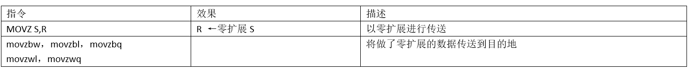
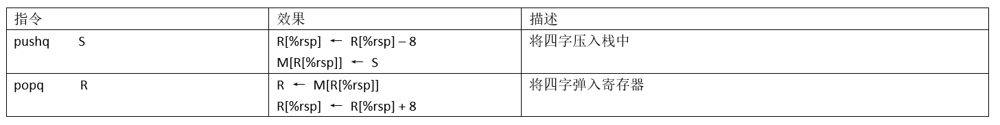
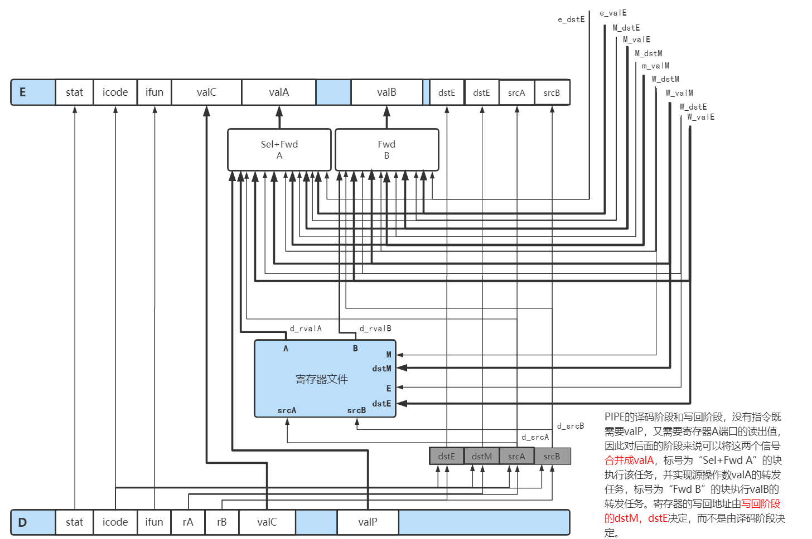

[TOC]

 

# 深入理解计算机系统 

## 一、计算机系统漫游

### 1.1 编译系统：


### 1.2 系统的硬件组成


1、总线：贯穿整个系统的一组电子管道，携带信息字节并负责在各个部件间传递。
字：总线中传送的定长==字节块==，字长：字中的字节数，现在系统通常是8字节64位

2、I/O设备：输入\输出设备是系统与外界世界的联系通道。通过适配器或控制器与总线相连

3、主存：临时存储设备，在处理器执行程序时，用来存放程序==代码==和==数据==

4、处理器(CPU)：中央处理单元，用于处理主存中存放的==指令==的执行引擎。

5、高速缓冲器(cache)：==弥补==CPU与主存之间的速度差异，存放处理器近期执行时==可能==需要的信息

### 1.3 存储器层次体系 ★


### 1.4 操作系统管理硬件


### 1.5 Amdahl定律


a：系统某部分所需执行时间与该时间比例

k：该部分性能提升比例


## 二、信息的表示和处理

### 2.1 信息位的表示

#### 2.1.1 进制表示法


> ==★==假设数字 x = a~0~r^0^ + a~1~r^1^ + a~2~r^2^ + a~3~r^3^ + ……+ a~n~r^n^  ai 表示对应位的系数，r：表示对应进制
>
> 十进制：123 =1 * 10^2^ + 2 * 10^1^ + 3*10^0^
>
> 十六进制：123 = 7 * 16^1^+ 12 * 16^0^   Ox 7B
>
> 二进制：123 = 1 * 2^6^ + 1 * 2^5^ +1 * 2^4^ +1 * 2^3^ + 0 * 2^2^ + 1 * 2^1^ + 1 * 2^0^    0111 1011

#### 2.1.2 字数据大小

1、概念：字长指明==指针==数据的大小，对于字长为 w bit的机器而言，虚拟地址的范围为 0 ~ 2 ^w^ - 1

2、C基本数据类型大小：


> 存储顺序：
>
> * 大端法：最==高==有效字节在最前面
> * 小端法：最==低==有效字节在最前面
>
> 例如：Ox 12 34 56 78
> 小端法：78 56 34 12
> 大端法：12 34 56 78

### 2.2 Bit-level manipulations

#### 2.2.1 C语言中的位级运算

例如：a = 0101 b = 0110

|        | ~a   | ~b   | a & b | a \| b | a ^ b |
| ------ | ---- | ---- | ----- | ------ | ----- |
| a      |      |      | 0101  | 0101   | 0101  |
| b      |      |      | 0110  | 0110   | 0110  |
| result | 1010 | 1001 | 0100  | 0111   | 0011  |

#### 2.2.2 C语言中逻辑运算

例如：a = 0101 b = 0

|        | ！a  | ！b  | a && b | a \|\| b | ！！a |
| ------ | ---- | ---- | ------ | -------- | ----- |
| a      |      |      | 0101   | 0101     |       |
| b      |      |      | 0      | 0        |       |
| result | 0    | 1    | 0      | 1        | 1     |

#### 2.2.3 C语言中的移位运算（与 ==java== 不同）

1、左移操作 <<

* 算术左移 = 逻辑左移

2、右移操作 >>

* 无符号数 算术右移 = 逻辑右移
* 有符号数，
  * 如果数 x > 0 算术右移 = 逻辑右移
  * 如果数 x < 0 算术右移 ≠ 逻辑右移，例如：x = 1001 1001       x >> 4 = 1111 1001

### 2.3 数据表示★:

#### 2.3.1 整数定义

1、无符号定义：
$$
\begin{array}{c}
对向量 \vec{x} = [x_{w-1},x_{w-2},x_{w-3},……,x_{1},x_{0}];\qquad\qquad\qquad\qquad\qquad\qquad\qquad\qquad\qquad\qquad\qquad\qquad\qquad\qquad\qquad\qquad\qquad\qquad\qquad\qquad\qquad\\
{\bf{B2U_w}}(\vec{x})\; \vec{=}\sum_{i=0}^{w-1} x_i2^i
\end{array}
$$
2、有符号：有符号数计算机通过==补码(Two's-complement)==表示
$$
\begin{array}{c}
对向量 \vec{x} = [x_{w-1},x_{w-2},x_{w-3},……,x_{1},x_{0}];\qquad\qquad\qquad\qquad\qquad\qquad\qquad\qquad\qquad\qquad\qquad\qquad\qquad\qquad\qquad\qquad\qquad\qquad\qquad\qquad\qquad\\
{\bf{B2T_w}}(\vec{x})\; \vec{=}-x_{w-1}2^{w-1}+\sum_{i=0}^{w-2} x_i2^i
\end{array}
$$
3、重要数字表示


> ★注：|TMin~w~| = TMax~w~ + 1

注：还有两种表示方法

反码（Ones' Complement）：
$$
\begin{array}{c}
对向量 \vec{x} = [x_{w-1},x_{w-2},x_{w-3},……,x_{1},x_{0}];\qquad\qquad\qquad\qquad\qquad\qquad\qquad\qquad\qquad\qquad\qquad\qquad\qquad\qquad\qquad\qquad\qquad\qquad\qquad\qquad\qquad\\
{\bf{B2O_w}}(\vec{x})\; \vec{=}-x_{w-1}(2^{w-1} - 1)+\sum_{i=0}^{w-2} x_i2^i 
\end{array}
$$
原码 (Sign-Magnitude)：
$$
\begin{array}{c}
对向量 \vec{x} = [x_{w-1},x_{w-2},x_{w-3},……,x_{1},x_{0}];\qquad\qquad\qquad\qquad\qquad\qquad\qquad\qquad\qquad\qquad\qquad\qquad\qquad\qquad\qquad\qquad\qquad\qquad\qquad\qquad\qquad\\
{\bf{B2S_w}}(\vec{x})\; \vec{=}(-1)^{x_{w-1}} \cdot \sum_{i=0}^{w-2} x_i2^i 
\end{array}
$$
★★推论：无符号数→补码
$$
\begin{array}{c}
对向量 \vec{u} = [u_{w-1},u_{w-2},u_{w-3},……,u_{1},u_{0}];\qquad\qquad\qquad\qquad\qquad\qquad\qquad\qquad\qquad\qquad\qquad\qquad\qquad\qquad\qquad\qquad\qquad\qquad\qquad\qquad\qquad\\
{\bf{U2T_w}}(\vec{u})\; \vec{=} \begin{cases} u, & \text {$u$ ≤  }TMax_w \\ u-2^w, & \text{$u$ ＞}TMax_w \end{cases}
\end{array}
$$

#### 2.3.2 C语言中的有符号数和无符号数

1、C语言创建无符号常量，后缀添加 U 即可

★2、如果执行运算两个数中一个数是有符号数，一个数是无符号数，C语言会默认将有符号数强制转换成无符号数


#### 2.3.3 数据的扩展与截断

1、无符号数的扩展：当无符号数转换为一个==更大==的数时，只需要在开头添加 0 ，这种被称为==零扩展==。
$$
定义宽度为{\bf{w}}的位向量 \vec{u} = [u_{w-1},u_{w-2},……,u_{1},u_{0}]和宽度为{\bf{w'}}位向量\vec{u}' = [0,0,……u_{w-1},u_{w-2},……,u_{1},u_{0}]，其中{\bf{w’}}＞{\bf{w}}，则:\qquad\qquad\qquad\qquad  \\
B2U_w(\vec{u})=B2U_w(\vec{u}')
$$
2、补码数的扩展：当补码数转换为一个更大的数时，可以对最高位执行==符号扩展==
$$
定义宽度为{\bf{w}}的位向量 \vec{x} = [x_{w-1},x_{w-2},……,x_{1},x_{0}]和宽度为{\bf{w'}}位向量\vec{x}' = [x_{w-1},x_{w-1},……,x_{w-1},x_{w-2},……,u_{1},u_{0}]，其中{\bf{w’}}＞{\bf{w}}，则:\qquad\qquad  \\
B2T_w(\vec{x})=B2U_w(\vec{x}')
$$

> 例如：short x = -12345                   Ox CF C7    →   int x = -12345  Ox FF FF CF C7 (符号扩展)
>
> ​         unsigned short ux = 53191     Ox CF C7    →   unsigned x = 53191  Ox 00 00 CF C7 (零扩展)

3、无符号数的截断：将一个w位的数强制截断为一个k位数字时，丢弃高w-k位，即：x' = x mod 2^k^ ，有符号数的截断类似，只不过需要把最高位转换为符号位。

> 例如：int x = 53191               Ox 00 00 CF C7     →  short x = -12345   Ox CF C7
>
> ​          unsigned ux = 53191    Ox 00 00 CF C7     →  unsigned short x = 53191   Ox CF C7

#### 2.3.4 整数运算

1、加法：

①无符号数：

假设 0 ≤ u，v ≤ 2^w^ - 1，则 0 ≤ u+v ≤ 2^w+1^ - 2 ，需要w+1位表示，因此丢弃进位

s = UAdd~w~(u,v) = (u + v) mod 2^w^，(如果 s ＜ u，或者 s < v，则存在溢出)

②有符号数：

假设 -2^w-1^ ≤ x，y ≤ 2^w-1^ - 1，则 -2^w^ ≤ x+y ≤ 2^w^ - 2 ，需要w+1位表示，因此像之前一样截断到w位。

$$
\begin{array}{c}
对满足，-2^{w-1} ≤ x，y ≤ 2^{w-1} - 1;\qquad\qquad\qquad\qquad\qquad\qquad\qquad\qquad\qquad\qquad\qquad\qquad\qquad\qquad\qquad\qquad\qquad\qquad\qquad\qquad\qquad\\
{\bf{x+y_w}'}\; = 
\begin{cases} 
x+y-2^w, & \text {$2^{w-1}$ ≤  }x+y &正溢出\\ 
x+y, & \text{$-2^{w-1}$ ≤}x+y＜2^{w-1} &正常\\
x+y+2^w, & \text{$x+y$ ＜}-2^{w-1} &负溢出
\end{cases}
\end{array}
$$
2、乘法：

①无符号数：

假设 0 ≤ u，v ≤ 2^w^ - 1，则 0 ≤ u*v ≤ 2^2w^ -2^w+1^ + 1 ，需要w+1位表示，因此丢弃进位

s =  (u * v) mod 2^w^

②有符号数：

假设 -2^w-1^ ≤ x，y ≤ 2^w-1^ - 1，则 2^w-1^-2^2w-2^ ≤ x，y ≤ 2^2w-2^ - 2 ，可能需要2w位表示，因此像之前一样截断到w位，再把无符号数转换为补码。
$$
\begin{array}{c}
对满足，-2^{w-1} ≤ x，y ≤ 2^{w-1} - 1;\qquad\qquad\qquad\qquad\qquad\qquad\qquad\qquad\qquad\qquad\qquad\qquad\qquad\qquad\qquad\qquad\qquad\qquad\qquad\qquad\qquad\\
x*y_w' = U2T_w((x\cdot y )mod \;2^w)
\end{array}
$$
3、取非：

①无符号数：

$$
\begin{array}{c}
对满足，0 ≤ x，y ≤ 2^{w-1} 的任意x，其w位的无符号逆元-x^u_w 由下公式给出;\qquad\qquad\qquad\qquad\qquad\qquad\qquad\qquad\qquad\qquad\qquad\qquad\qquad\qquad\qquad\qquad\\
{\bf{-x^u_w}}\; = 
\begin{cases} 
x, & \text {$x$ =  }0\\ 
2^w-x, & \text{$x$ ＞}0
\end{cases}
\end{array}
$$
②有符号数：
$$
\begin{array}{c}
对满足，TMin_w ≤ x，y ≤ TMax_w 的任意x，其w位的无符号逆元-x^t_w 由下公式给出;\quad\qquad\qquad\qquad\qquad\qquad\qquad\qquad\qquad\qquad\qquad\qquad\qquad\qquad\qquad\\
{\bf{-x^t_w}}\; = 
\begin{cases} 
TMin_w, & \text {$x$ =  }TMin_w\\ 
-x, & \text{$x$ ＞}TMin_w
\end{cases}
\end{array}
$$

### 2.4 IEEE 浮点数★

#### 2.4.1 IEEE浮点表示法

IEEE浮点标准用 V = (-1)^s^×M×2^E^ 的形式表示一个数：

* 符号位（sign）：s决定这数是正数（s=0）还是负数（s=1），对于数值0的符号位解释另作处理
* 尾数（significand）：M是一个二进制小数，它的范围是1~ 2- ε，或者0 ~ 1 - ε
* 阶码（exponent）：E的作用是对浮点数加权，这个权重是2的E次幂。

1、C语言中的常见浮点数格式


2、IEEE编码表示：


①情况1：规格化的值

当exp ≠ 0 或者exp ≠ 255 时，这是最普遍的情况

* E = e - Bias     		单精度的Bias = 127 (2^K-1^ - 1)，其中e是无符号数，表示为e~k-1~……e~1~e~0~，K = 阶码位数
* M = 1 + f                二进制表示 1.f~n-1~……f~1~f~0~，由于1是固定位可以省略不写

②情况2：非规格化的值，提供了表示数值0的方法，表示接近数值0的方法

当exp = 0时

* E = 1 - Bias			单精度中，E = -126
* M = f                    不包含1

③情况3：特殊值，当exp = 255时，出现

* 如果f = 0，表示无穷大
* 如果f ≠ 0，表示NaN

注：例子如下，当 e = 0 时 将E 定义为 1 - bias，而不是-bias，可以补偿非规格数的尾数没有隐含的开头的1。


#### 2.4.2 舍入

1、小数舍入方式


2、二进制小数舍入方式


#### 2.4.3 浮点运算


## 三、程序的机器级表示

### 3.1 概论

#### 3.1.1 历史

1、CISI （Complex instruction set computer）Intel，AMD

2、RISI：ARM

#### 3.1.2 机器代码


PC：程序计数器，Program counter

* 下一条指令的地址
* 在X86-64中称为RIP

Register file：寄存器文件，临时保存ALU运算需要的数据

Condition codes：条件码寄存器

* 存储最近一次算术运算的状态
* 应用于条件分支

Memory：（1）可寻址字节数组（2）代码和用户数据（3）栈

### 3.2 汇编基础 ★★★

#### 3.2.1 x86-64中，C语言数据格式

Intel是从16位体系结构扩展成32位，Intel用“字（word）”表示16位数据类型。（★与第二节中字定义的含义不同）


#### 3.2.2 x86-64信息访问

1、x86寄存器★★


2、操作数指示符

★注：Imm(r~b~,r~i~,s) 是最常用模式，r~b~：基址寄存器，r~i~：变址寄存器，寄存器必须是64位，s：比例因子，1，2，4或者8。有效地址被计算为Imm + R[r~b~] + R[r~i~] * s


例子：


3、数据传送指令

> ★★★注：b：字节	w：字（16bit）	l：双字（32bit）q：四字（64bit）

①从源位置复制到另一个位置，不做任何变化


②将较小的数复制到较大的目的地，MOVZ类把目的剩余的字节填充为0，MOVS类则通过符号进行填充。

最后两个字符都是大小指示符，第一个指示源大小，第二个指示目的大小，源包含1个和2个字节，目的包含1字，2字，四字情况

零扩展：



符号扩展：


注：cltq只作用用于%eax和%rax

> 例：
>
> 

4、压入和弹出栈数据



x86-64中，栈是向低地址方向增长


#### 3.2.3 算术和逻辑操作

1、普通的操作

这些操作被分为四类：加载有效地址，一元操作，二元操作，移位操作

注：除了leaq指令外，其他指令都有b，w，l，q四种不同大小数据指令。


> 移位量：可以是一个立即数。或者存放在单字节==%cl==中。在x86-64中，移位操作对w位长的数据值进行操作，由%cl的低m位决定的，这里2^m^ = w ，高位会被忽略，例如%cl中的数是0xFF时，salb会移7bit，salw会移15bit，sall会移动16bit，salq会移动63bit

2、特殊的算术操作


#### 3.2.4 控制指令

1、条件码
CF：进位标志。最近的操作使最高位产生了进位。可用来检测无符号操作的溢出。
ZF：零标志。最近的操作得出的结果为0。
SF：符号标志。最近的操作得出的结果为负数。
OF：溢出标志。最近的操作导致一个补码溢出——正溢出和负溢出

2、比较和测试指令


3、访问条件码


4、分支跳转指令


> 确定分支预测惩罚：预测错误的概论是p，执行代码的时间的T~OK~，而预测错误的处罚是T~MP~
>
> T~avg~(p) = (1-p) T~OK~ + p(T~OK~ + T~MP~) = T~OK~ + pT~MP~ (T~ran~ : p = 0.5的平均时间)

5、条件传送指令（为了减少分支预测失败带来的惩罚）


条件传送指令与条件控制指令对比：


6、转移控制指令

注：在x86-64中末尾会加“q”，这是表示该版本是64位版本，语义没有改变


举例：

```assembly
400563：E8 D8 FF FF FF     callq     400540 <multstone>
400568：48 8B 54 24 08       mov     0x8(%rsp)，%rdx
```


#### 3.2.5 C语言翻译成汇编语言例子

1、if-else语句改写：


例子：


> 注：rep，repz，当ret指令通过跳转指令到达时，处理器不能==正确预测==ret指令的目的，因此这里的rep指令是一种空操作·

2、循环语句改写

①do-while循环：


②while循环：


③for循环：


3、switch开关：使用跳转表


### 3.3 过程（转移控制指令详见3.2.4 6）★

#### 3.3.1 参数传递


如果一个函数超过6个参数需要用栈来传递。

#### 3.3.2 被调用者保存

寄存器%rbx,%rbp,%r12~%r15被划分为被调用者保存寄存器。当P调用Q时，Q必须保存这些值。

* 过程Q要么不更改这些寄存器的值
* 要么就把这些值放入栈中

#### 3.3.3、栈上的局部存储

以下这些情况必须保存在内存中：

* 寄存器不够存放所有的本地数据
* ★对一个局部变量使用“&”，
* 某些局部变量是数组或者结构体，需要通过引用访问

> 例如：
>
> 
> 运行时栈数据：
> 

### 3.4 数据结构

#### 3.4.1 数组的访问：通过地址访问

假设数组 E 起始地址和索引 i 放在%rdx和%rcx，则相关操作如下：


#### 3.4.2 结构(struct)

* 结构体在栈上分配空间
* 元素的起始地址必须按照元素的大小倍数对齐


#### 3.4.3 联合(union)

在union中，各成员变量共享一段内存空间，长度等于各成员中最长的长度，且要为最长元素类型的倍数。

例如：union {
​		int x;
​		char a[5];		
} u
sizeof(u) = 8

### 3.5 机器级程序中控制与数据相结合

#### 3.5.1 指针

* 每个指针都对应一个类型，void * 表示通用指针
* 每个指针都有一个值，表示对应对象的地址
* “&”操作符创建指针，“*”操作符引用指针
* 指针也可以指向函数，==函数指针的值==是该函数机器代码的第一条指令的地址

> int func(int  x, int *p);
> int (*fp)(int , int *);
> fp = func;
> 然后调用这个指针来使用函数
> int y = 1
> int result = fp(y,&y);

#### 3.5.2 缓冲区溢出

1、缓存区溢出：局部变量和状态信息（保存的寄存器值和返回地址）存放在栈中，对越界的数组元素进行写操作会破坏存储在栈上的信息。

对抗缓存区溢出：

①栈随机化：栈的位置在每次程序运行时都有变化。

②栈破坏检测：在局部缓冲区与返回地址之间插入一个哨兵值，在恢复寄存器和函数返回时，检测这个值是否被更改过。★

例如：函数intlen使用了带保护和不带保护者的编译版本

```c
int intlen(long x){
    long v = x;
    char buf[12];
    iptoa(buf,&v);
    return len(buf);
}
```

对应的汇编代码：


栈内存示意图：


③限制可执行代码区域：限制哪些内存区域存放可执行代码（使用硬件支持多种形式的内存保护）

#### 3.5.3 支持变长栈帧

C语言中可能会出现变长数组，编译器无法预先知道具体值，不能预先在栈上分配具体值。因此可以用%rbp记录栈顶的值，然后用%rsp动态分配地址。

### 3.6 浮点机器代码（了解）

## 四、处理器体系结构 ★★（重点，难点）

### 4.1 Y86-64指令集体系结构  ★★★

#### 4.1.1 程序员可见状态

1、寄存器文件 ★


2、条件码：OF，ZF，SF

3、PC：RIP

4、stat：标识程序是否正常运行

#### 4.1.2 Y86-64指令 ★★


* 4个movq指令：irmovq，rrmovq，mrmovq，rmmovq。指令第一个字母表示源，第二个字母表示目的。i：立即数，r：寄存器，m：内存

* 4个OPq指令：addq，subq，andq，xorq。只对寄存器操作，同时还会对3个条件码ZF，SF，OF进行设置

* 7个跳转指令：jmp，jle，jl，je，jne，jge，jg，分支条件和x86-64一样

* 6个条件传送指令：cmovle，cmovl，cmove，cmovne，cmovge，cmovg

* call指令将返回地址入栈，然后跳到目的地址。ret从这样的调用中返回
* pushq和popq实现了入栈和出栈
* halt指令停止指令的执行，会将状态码设置成HLT

> ①每条指令的第一个字节高4位是代码部分，低4位是功能部分。
>
> ②只需要一个寄存器的会将另一个寄存器设置成0xF

### 4.2 逻辑设计和硬件控制语言HCL

#### 4.2.1 组合电路和HCL布尔表达式

将多个逻辑门组合成一个网，这些称为组合电路。如何构建这些网有限制：

* 每个逻辑门的输入必须连接到下述选项之一：1、一个系统输入 2、某个存储器单元的输出 3、某个逻辑门输出
* 两个或多个逻辑门的输出不能连接到一起
* 这个网必须是无环的


练习：使用异或电路设计一个64位字的相等电路。


#### 4.2.2 多路复用函数


* 与C语言switch不同，不要求表达式互斥
* 遇到第一个表达式为1的情况就会被选中
* 最后一个默认为1，表示前面没选中就会选择这种情况

四路复用器：


★算术逻辑单元：


### 4.3 Y-86顺序实现 ★★★

#### 4.3.1 处理组成阶段 ★★

* 取指阶段：从内存中读取指令字节，地址为PC的值。指令分为两个四位部分，icode和ifun，可能读出一个==寄存器指示符==，指明rA或rB，还可能取出一个==四字节常数==valC，并计算当前指令==下一条指令==的valP的值
* 译码阶段：从寄存器文件中最多读取两个操作数，rA和rB
* 执行阶段：根据ifun值执行，ALU执行对应的操作，
  * 计算内存有效引用地址，增加或减少栈指针，这些值称为valE。在此，也可能设置条件码
  * 检验条件码和传送条件
* 访存阶段：将计算的数据写入内存，或者从内存中读数据，读出的值为valM
* 写回阶段：将最多两个结果写回到寄存器文件
* 更新阶段：将PC设置成下一条指令的地址

1、OPq、rrmovq，irmovq


2、rmmovq，mrmovq


3、pushq，popq


4、控制转移指令：jxx，call，ret


#### 4.3.2 SEQ 硬件结构 ★★★


#### 4.3.3 SEQ阶段的实现 ★★★★

1、取指阶段


①取出10个字节，第一个字节分为两个4位 icode : ifun。当地址不合法的时候发出 imem_error信号

②根据icode指令发出三个信号：instr_valid；Need valC；Need regids

* instr valid用来发现不合法的指令
* Need regids 发现这个指令包括寄存器指示符？
* Need valC 发现这个指令包括一个常数吗？

③当指令发生越界时，instr_valid，imem_error在访存阶段产生状态码

> ★对应信号的HCL表达式
>
> bool Need_regids = icode in { IOPQ，IRRMOVQ，IIRMOVQ，IRMMOVQ，IMRMOVQ，IPOPQ，IPUSHQ }
>
> bool Need_valC = icode in { IIRMOVQ，IRMMOVQ，IMRMOVQ，IJXX，ICALL}

> PC增加valP根据当前PC值，need_regids、need_valC信号决定，假设当前PC值为 p，need_regids 为r，need_valC 为i
>
> valP = p + 1 + r + 8i

2、译码和写回阶段


SEQ的译码和写回阶段。指令字段译码，产生寄存器文件使用的四个地址的寄存器标识符。从寄存器文件中读出的值为valA，valB，写回值valM，valE作为写操作的数据。

对应端口的HCL描述：


3、执行阶段


ALU输出是valE，这个单元的功能根据ifun设置：ADD，SUB，AND，EXCLUSIVE-OR

ALU端口HCL描述


4、访存阶段


访存阶段的任务是或者写程序数据，两个控制块产生内存地址和内存输入数据的==值==，两个块产生表明应该执行读操作还是写操作的==控制信号==。

访存最后阶段是根据取值阶段产生的icode，imem_error，instr_valid，dmem_error来计算stat值


5、更新PC


HCL描述：


### 4.4 流水线通用原理

#### 4.4.1 计算流水线吞吐量

1、流水线的重要特性是提高了==系统的吞吐量==


非流水线吞吐量：
$$
吞吐量 =\frac{1条指令}{（20+300）ps} \dot{ \frac{1000ps}{1ns}} ≈ 3.12 GIPS
$$
流水线吞吐量：
$$
吞吐量 =\frac{1条指令}{（20+100）ps} \dot{ \frac{1000ps}{1ns}} ≈ 8.33 GIPS
$$

2、跟踪时间240~360之间的电路活动


#### 4.4.2 流水线的局限性

1、不一致的划分

依然可以将上面计算划分为三阶段，不过依次为50ps到150ps不等，通过所有流水线的延迟依然为300ps。运行的时间由最慢的阶段限制，运行时间图表明，每个A阶段都会处于一段空闲时间，B阶段会一直处于活跃。因此必须设置时钟周期为150+20 = 170ps，得到的吞吐量为5.33GIPS


2、流水线过深，收益反而下降

将上述计算划为6阶段，每阶段50ps，时钟周期设置为70ps，则吞吐量为14.29GIPS，性能提高了14.29/8.33 = 1.71，将计算时钟缩短了两倍，但是由于流水线寄存器的延迟，吞吐量并没有加倍。同时延迟占到了整个时钟周期的120/420 = 28.6%

### 4.5 Y86-64的流水线实现

#### 4.5.1 SEQ+：重新安排计算阶段

移动PC阶段，使它在逻辑时钟开始时，计算当前指令的PC值。在SEQ中PC的指令根据当前周期内计算的信号值得出，而在SEQ+中，PC的计算是通过上一条指令的信号值给出，同时将寄存器标号改为“pIcode”，“pCnd”，“pvalM”，“pvalC”，“pvalP”


#### 4.5.2 插入流水线寄存器


F：保存程序计数器的预测值

D：位于取指和译码阶段之间。保存关于最新取出的指令的信息，即将由译码阶段进行处理

E：位于译码和执行阶段之间。保存关于最新译码的指令和从寄存器文件读出的值的信息，即将由执行阶段进行处理

M：位于执行和访存阶段之间。保存最新执行的结果，还保存用于处理条件转移的分支条件和分支目标的信息

W：位于访存和写回阶段之间。将计算出来的结果写回寄存器文件中，如果是ret指令还需要向PC提供返回地址

> 旁注：信号M_stat和m_stat的差别
>
> 在命名系统中，大写的前缀“D”、“E”，“M”，“W”表示的是==流水线==寄存器，小写字母“e”，“m”，“w”表示的是==流水线阶段==寄存器

“Select A”：这个块会从寄存器文件A端口中读出的值和流水线寄存器DvalP中选择一个，只有在执行call和jxx指令不跳转时才会在执行阶段用到valP，因此合并这两个信号，减少流水线寄存器的状态数量。这样就减少了SEQ+中标号为==数据==的硬件结构

#### 4.5.3  预测下一个PC

1、call和jxx指令

对于call和jmp指令，下一条指令是valC

对于条件跳转来说下一条指令要么是valP，要么是valC，在这里PIPE一中总是预测选择了条件分支，即预测新PC值是valC。

> 分支预测策略：
>
> 在流水线中，我们总是选择条件分支的预测策略。研究表明这个策略的成功率大约为60%，则从不选择（NT）的成功率为40%。
>
> 反向选择、从不正向选择（BTFNT）：当分支地址比下一条地址低时就预测条件分支，而分支地址比较高时就预测不选择。这成功率在65%左右

2、ret指令

ret指令会在访存阶段才知道具体要返回的地址，因此流水线不会对这个地址进行预测。

> 预测栈的返回地址：
>
> 对大多数程序来说，预测返回值很容易，因为过程调用和返回总是==成对==出现的。大多数函数调用会返回到调用后的那条指令。高性能处理器运用了这个特性，在取指单元中放入一个硬件栈，每次执行过程调用指令时，将返回值压入栈中。当取出一个返回指令时就弹出一个地址，作为预测的返回值。这个硬件栈对程序员不可见。

3、Predict PC，Select PC

标号为“Predict PC”的块会从PC增加器中计算的valP和取出指令中得到的valC中进行选择。这个值存放在流水线寄存器F中作为程序计数器的预测值。

标号为“Select PC”的块会从三个值中选择一个作为指令内存的地址：预测的PC值（这里实际为valC），条件跳转不选择分支的valP值（这个存放在M_val中），ret指令到达W阶段时的返回值（这个值存储在valM中）。

#### 4.5.4 流水线冒险

数据相关：下一条指令需要用到这一条指令的计算结果

控制相关：一条指令要确定下一条指令的位置，例如在执行跳转、调用或返回指令时。

这些相关可能会导致流水线产生计算错误，与相关类似，冒险也分成两类。数据冒险和控制冒险。

下面是描述PIPE一处理prog1的情况：

prog1中在周期7初始的时钟上升沿时就将值写入%rax中，在周期7译码阶段开始时就可以获取正确的值。这是由于3条nop指令造成的延迟使得流水线没有发生数据冒险

prog2中在周期6初始的时钟上升沿时%rax的值为0，这是因为指令2的写回阶段还没有结束，valE值并没有写入寄存器文件中，因此在周期6时钟上升沿读取的是默认%rax值，由于前面指令未对%rax进行更改，因此为0。


> 数据冒险类型：
>
> 当一条指令更新，后面指令会读到的那些程序状态值时，就会出现数据冒险。
>
> 程序寄存器：寄存器文件的读写在不同阶段进行时，就有可能出现
>
> 程序计数器：更新和读取程序计数器之间的冲突导致了控制冒险
>
> 内存：假设程序不会自我修改。在一条读指令到达这个阶段前，前面写内存的指令完成就会发生数据冒险
>
> 条件码寄存器：这里不会发生数据冒险
>
> 状态码寄存器：每条指令都与一个状态码寄存器相关，因此不会发生数据冒险

1、用暂停来避免数据冒险

暂停时，处理器会停止流水线中一条或多条指令，直到冒险条件不再满足。暂停技术就是让一组指令阻塞在它们所处在的阶段，而允许前面运行的指令继续通过流水线，类似于自动产生的nop指令。


当插入bubble后，add指令一直处于译码阶段，halt指令一直重复取指令阶段

2、用转发来避免数据冒险

将结果直接从一个流水线阶段传到较早阶段的技术称为数据转发，或称为旁路技术。


在译码阶段发现，寄存器%rax是valB的值，而在dstE处有一个对%rax未进行的写。因此，这里只需要将W_valE作为操作数valB的值，就能避免数据冒险。


当访存阶段和执行阶段有数据暂停时也可以使用转发技术，避免程序的暂停，例如prog4。译码阶段访存阶段有对%rdx未进行的写，执行阶段ALU正计算的值稍后也会写入%rax，因此可以使用转发技术，对访存阶段的值M_valE作为操作数A，执行阶段的值e_valE作为操作数B。

根据以上分析，获得最终的PIPE硬件结构：


Sel+FwdA：这个块是SelectA+FwdA的结合，它允许从寄存器端口A读出的值，流水线寄存器EvalP已增加的值，某个转发过来的值

FwdB：这个块实现是源操作数valB的转发逻辑。

3、加载/使用数据冒险

这类数据冒险不能单纯的用转发解决，因为内存的读在流水线发生的比较晚。这里可以将暂停+转发结合起来使用。


4、避免控制冒险

> 异常处理：
>
> 当流水线中有一个或多个阶段出现异常时，信息只是简单地存放在流水线寄存器的状态中。异常事件不会对流水线中的指令流有任何影响，除了会禁止流水线中后面的指令更新程序员可见的状态，直到异常指令到达最后的流水线状态。因为指令到达写回阶段的顺序与它们在非流水化的处理器执行顺序相同，所以可以保证第一条遇到异常的指令第一个到达写回阶段，此时程序会执行停止，流水中W状态码会被记录

#### 4.5.7 PIPE各阶段的实现

1、PC选择和取指阶段


2、译码和写回阶段



合并信号valA和valP的依据是，只有call和jxx指令在后面阶段会使用valP，而这些指令不需要从寄存器A端口读出的值，这个选择是有译码阶段的icode控制的。当信号D_icode与call和jxx指令匹配时，这个块就会把D_valP作为它的输出。剩余复杂的部分主要是转发逻辑：


目前还不关心实现条件传送的逻辑


3、执行阶段


这个阶段与SEQ阶段非常相似，使用的信号适当的做重命名。e_valE，e_dstE作为转发源，标号为“Set CC”的块以信号m_stat和W_stat作为输入。

